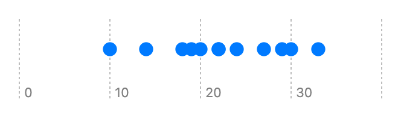

> Navigation: [Technologies](../../technologies.md) · [Swift Charts](../../charts.md) · [PointMark](../pointmark.md)

# init(x:y:)

<sub>Initializer</sub>

Creates a point mark that plots a value on x with fixed y position.

<sub>iOS, iPadOS, Mac Catalyst, macOS, tvOS, visionOS, watchOS</sub>

```swift
nonisolated init<X>(x: PlottableValue<X>, y: CGFloat? = nil) where X : Plottable
```

## Parameters

- `x` — The value plotted with x.

- `y` — The y position.  If `y` is `nil`, the bar will be centered vertically by default.

### Discussion

Use this initializer to plot a property with x:

```swift
Chart(data) {
    PointMark(
        x: .value("Weight", $0.weight)
    )
}
```



For more background, see the first example used in [PointMark](../pointmark.md) which shows the structure that contains the `weight` property.

## See Also

### Creating a point mark

- [init(x:y:)](<init(x_y_)-44ke9.md>) — Creates a point mark that plots values to x and y.
- [init(x:y:)](<init(x_y_)-9dswq.md>) — Creates a point mark with fixed x position and plots values with y.
- [init(x:y:z:)](<init(x_y_z_).md>) — Creates a 3D point mark that plots values to x, y and z.
