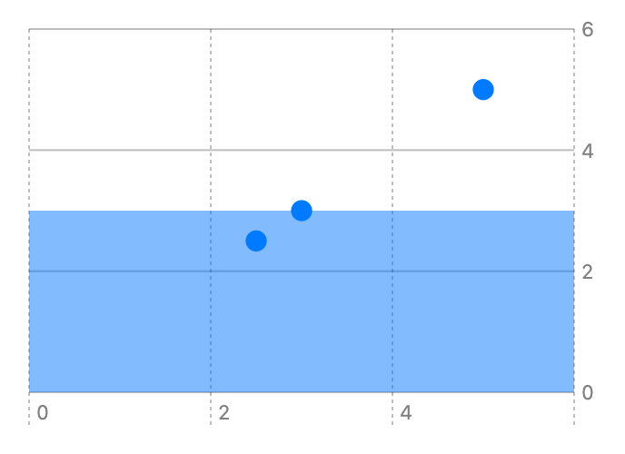

> Navigation: [Technologies](../../technologies.md) · [Swift Charts](../../charts.md) · [RectangleMark](../rectanglemark.md)

# init(xStart:xEnd:y:height:)

<sub>Initializer</sub>

Creates a rectangle mark with a fixed x interval and y encoding.

<sub>iOS, iPadOS, Mac Catalyst, macOS, tvOS, visionOS, watchOS</sub>

```swift
nonisolated init<Y>(xStart: CGFloat? = nil, xEnd: CGFloat? = nil, y: PlottableValue<Y>, height: MarkDimension = .automatic) where Y : Plottable
```

## Discussion

- xStart: The x start position. If `xStart` is `nil` then the rectangle will start at the leading edge of the plotting area.
- xEnd: The x end position. If `xEnd` is `nil` then the rectangle will end at the trailing edge of the plotting area.
- y: The value plotted with y.
- height: The rectangle height.  If `height` is not specified, then 70% of the step size will be used. If there is no step size a default height (in pts) will be used.

### Discussion

Use this initializer to map a y position to a rectangle for each data element. Optionally, specify the height, xStart position, or xEnd position, of the rectangles.

The example below omits the optional `x`, `width`, and `height` parameters and uses a number scale starting at (0,0) and ending at (6,6). The rectangle has the coordinates: (0,0), (0,3), (6,3), (6,0).

```swift
Chart(data) {
    RectangleMark(
        y: .value("Rect Y", 3)
    )
    .opacity(0.2)

    PointMark(
        x: .value("X", $0.x),
        y: .value("Y", $0.y)
    )
}
```



<sub>Scatter plot chart with a rectangle mark annotation. 3 points on the chart at: (5, 5), (2.5, 2.5), (3, 3) the rectangle highlights a rectangular area with coordinates: (0,0), (0,3), (6,3), (6,0).</sub>

## See Also

### Creating a rectangle mark

- [init(x:yStart:yEnd:width:)](<init(x_ystart_yend_width_)-vh2x.md>) — Creates a rectangle mark with an y interval encoding and an x encoding.
- [init(x:yStart:yEnd:width:)](<init(x_ystart_yend_width_)-xhqp.md>) — Creates a rectangle mark that plots values on x and has a fixed y interval.
- [init(xStart:xEnd:y:height:)](<init(xstart_xend_y_height_)-27222.md>) — Creates a rectangle mark with an x interval encoding and a y encoding.
- [init(xStart:xEnd:yStart:yEnd:)](<init(xstart_xend_ystart_yend_)-1qbzg.md>) — Creates a rectangle mark with x and y interval encodings.
- [init(xStart:xEnd:yStart:yEnd:)](<init(xstart_xend_ystart_yend_)-5682c.md>) — Creates a rectangle mark with fixed x and y intervals.
- [init(xStart:xEnd:yStart:yEnd:)](<init(xstart_xend_ystart_yend_)-5cbgh.md>) — Creates a rectangle mark with a y interval encoding and a fixed x interval.
- [init(xStart:xEnd:yStart:yEnd:)](<init(xstart_xend_ystart_yend_)-6jeka.md>) — Creates a rectangle mark with an x interval encoding and a fixed y interval.
- [init(x:y:width:height:)](<init(x_y_width_height_).md>) — Creates a rectangle that plots values with x and y.
- [init(x:y:z:)](<init(x_y_z_).md>) — Creates a rectangle mark for a 3D chart.
