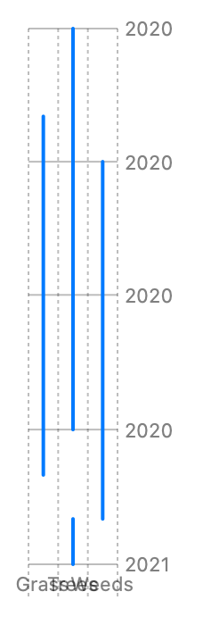

> Navigation: [Technologies](../../technologies.md) · [Swift Charts](../../charts.md) · [RuleMark](../rulemark.md)

# init(x:yStart:yEnd:)

<sub>Initializer</sub>

Creates a vertical rule mark with an x encoding and y interval encoding.

<sub>iOS, iPadOS, Mac Catalyst, macOS, tvOS, visionOS, watchOS</sub>

```swift
nonisolated init<X, Y>(x: PlottableValue<X>, yStart: PlottableValue<Y>, yEnd: PlottableValue<Y>) where X : Plottable, Y : Plottable
```

## Parameters

- `x` — The value plotted with x.

- `yStart` — The value plotted with y start.

- `yEnd` — The value plotted with y end.

### Discussion

Use this initializer to create a vertical line at y positions from `yStart` to `yEnd` to an x position:

```swift
Chart(data) {
    RuleMark(
        x: .value("Pollen Source", $0.source),
        yStart: .value("Start Date", $0.startDate),
        yEnd: .value("End Date", $0.endDate)
    )
}
```



<sub>Vertical rule chart with y-axis showing the month in the year 2020 starting with January and ending with December, and with x-axis showing a pollen source: Trees, Grass, and Weeds. There are 4 rules. 2 for Trees 1 starting in January and going until the end of September and 1 spanning December, 1 for Grass starting in March and going until the end of August, and 1 for Weeds starting in April and going until the end of November.</sub>

See [RuleMark](../rulemark.md) for the setup of the structure that contains the `startDate`, `endDate`, and `source` properties.
