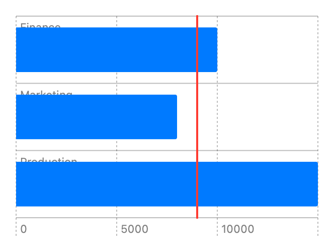

> Navigation: [Technologies](../../technologies.md) · [Swift Charts](../../charts.md) · [RuleMark](../rulemark.md)

# init(x:yStart:yEnd:)

<sub>Initializer</sub>

Creates a vertical rule mark with value plotted with x.

<sub>iOS, iPadOS, Mac Catalyst, macOS, tvOS, visionOS, watchOS</sub>

```swift
nonisolated init<X>(x: PlottableValue<X>, yStart: CGFloat? = nil, yEnd: CGFloat? = nil) where X : Plottable
```

## Parameters

- `x` — The value plotted with x.

- `yStart` — The y start position. If `yStart` is `nil` the rule will start at the leading edge of the plotting area.

- `yEnd` — The y end position. If `yEnd` is `nil` the rule will end at the trailing edge of the plotting area.

### Discussion

Use this initializer to create a vertical rule across a chart’s plotting area at an x position:

```swift
Chart {
    ForEach(data) {
        BarMark(
            x: .value("Profit", $0.profit),
            y: .value("Department", $0.department)
        )
    }
    RuleMark(x: .value("Break Even Threshold", 9000))
        .foregroundStyle(.red)
}
```



<sub>Horizontal bar chart with y-axis showing department categories Production, Marketing, Finance, and R&D, and with x-axis ranging from 0 to 15000. There are 3 bars: Production 15000, Marketing 8000, Finance 10000. A vertical rule mark at 9000 shows the break even threshold.</sub>

See the first code example in [RuleMark](../rulemark.md) for the setup of the structure that contains `department` and `profit` properties.
