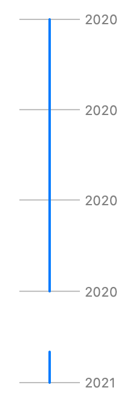

> Navigation: [Technologies](../../technologies.md) · [Swift Charts](../../charts.md) · [RuleMark](../rulemark.md)

# init(x:yStart:yEnd:)

<sub>Initializer</sub>

Creates a vertical rule mark with a fixed x position and y interval encoding.

<sub>iOS, iPadOS, Mac Catalyst, macOS, tvOS, visionOS, watchOS</sub>

```swift
nonisolated init<Y>(x: CGFloat? = nil, yStart: PlottableValue<Y>, yEnd: PlottableValue<Y>) where Y : Plottable
```

## Parameters

- `x` — The x position.   If `x` is `nil`, the rule will be centered horizontally by default.

- `yStart` — The value plotted with y start.

- `yEnd` — The value plotted with y end.

### Discussion

Use this initializer to create a vertical rule at y positions from `yStart` to `yEnd` for a single x position:

```swift
Chart(data) {
    RuleMark(
        yStart: .value("Start Date", $0.startDate),
        yEnd: .value("End Date", $0.endDate)
    )
}
```



<sub>Vertical rule chart with y-axis showing the month in the year 2020 starting with January and ending with December, and with x-axis showing a pollen source: Trees. There are 2 rules. 1 starting in January and going until the end of September and 1 spanning December.</sub>

See [RuleMark](../rulemark.md) for the setup of the structure containing the `startDate`, `endDate`, and `source` properties.
