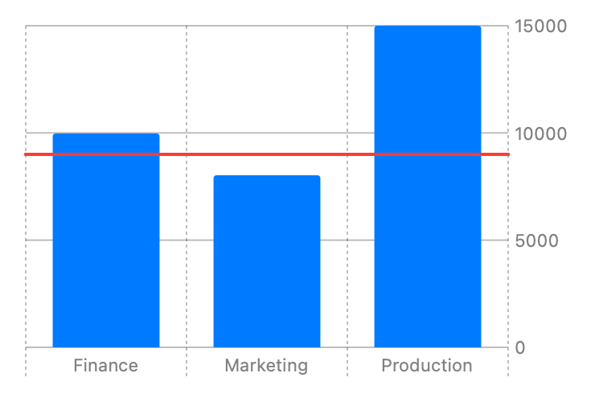

> Navigation: [Technologies](../../technologies.md) · [Swift Charts](../../charts.md) · [RuleMark](../rulemark.md)

# init(xStart:xEnd:y:)

<sub>Initializer</sub>

Creates a horizontal rule mark that plots a value on y.

<sub>iOS, iPadOS, Mac Catalyst, macOS, tvOS, visionOS, watchOS</sub>

```swift
nonisolated init<Y>(xStart: CGFloat? = nil, xEnd: CGFloat? = nil, y: PlottableValue<Y>) where Y : Plottable
```

## Parameters

- `xStart` — The x start position. If `xStart` is `nil` the rule will start at the leading edge of the plotting area.

- `xEnd` — The x end position. If `xEnd` is `nil` the rule will end at the trailing edge of the plotting area.

- `y` — The value plotted with y.

### Discussion

Use this initializer to create a horizontal rule across a chart’s plotting area at a y position:

```swift
Chart {
    ForEach(data) {
        BarMark(
            x: .value("Department", $0.department),
            y: .value("Profit", $0.profit)
        )
    }
    RuleMark(y: .value("Break Even Threshold", 9000))
        .foregroundStyle(.red)
}
```



<sub>Vertical bar chart with x-axis showing department categories Production, Marketing, Finance, and R&D, and with y-axis ranging from 0 to 15000. There are 3 bars: Production 15000, Marketing 8000, Finance 10000. A horizontal rule mark at 9000 shows the break even threshold.</sub>

See the first code example in [RuleMark](../rulemark.md) for the setup of the structure that contains the `department` and `profit` properties.
