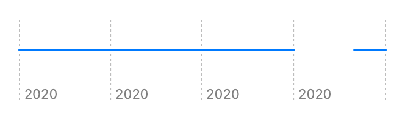

> Navigation: [Technologies](../../technologies.md) · [Swift Charts](../../charts.md) · [RuleMark](../rulemark.md)

# init(xStart:xEnd:y:)

<sub>Initializer</sub>

Creates a horizontal rule mark that plots values on its x interval.

<sub>iOS, iPadOS, Mac Catalyst, macOS, tvOS, visionOS, watchOS</sub>

```swift
nonisolated init<X>(xStart: PlottableValue<X>, xEnd: PlottableValue<X>, y: CGFloat? = nil) where X : Plottable
```

## Parameters

- `xStart` — The value plotted with x start.

- `xEnd` — The value plotted with x end.

- `y` — The y position.   If `y` is `nil`, the rule will be centered vertically by default.

### Discussion

Use this initializer to create a horizontal rule at x positions from `xStart` to `xEnd` for a single y position:

```swift
Chart(data) {
    RuleMark(
        xStart: .value("Start Date", $0.startDate),
        xEnd: .value("End Date", $0.endDate)
    )
}
```



<sub>Horizontal rule chart with x-axis showing the month in the year 2020 starting with January and ending with December, and with y-axis showing a pollen source: Trees. There are 2 rules. 1 starting in January and going until the end of September and 1 spanning December.</sub>

See the second code example in [RuleMark](../rulemark.md) for the setup of the structure that contains the `startDate`, `endDate`, and `source` properties.
