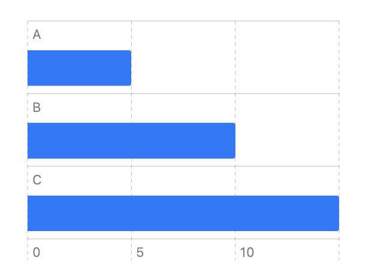
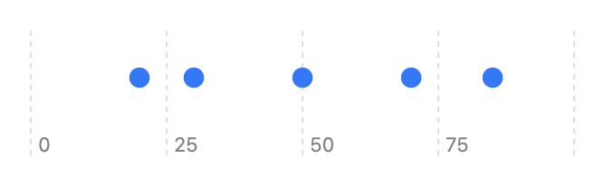
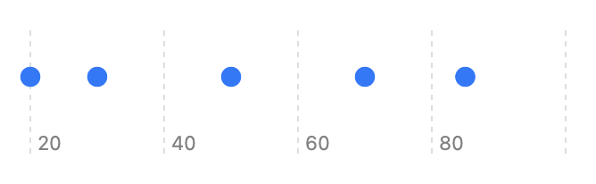
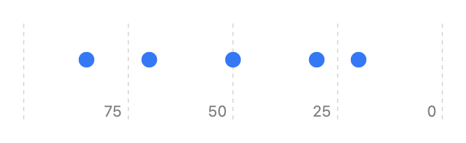

> Navigation: [Technologies](../technologies.md) · [Swift Charts](../charts.md)

# ScaleDomain

<sub>Protocol</sub>

A type that you can use to configure the domain of a chart.

<sub>iOS, iPadOS, Mac Catalyst, macOS, tvOS, visionOS, watchOS</sub>

```swift
protocol ScaleDomain
```

## Overview

A type you use to configure the domain of a chart scale.

## Including zero in number scales

By default, number scales include zero in the domain to ensure charts follow the best practice to include a zero baseline in bar charts.



<sub>Horizontal bar chart with y-axis showing categories A, B, and C and x-axis ranging from 0 to 15. There are three bars: A 5, B 10, C 15.</sub>

For other marks, this zero baseline isn’t as important, but the framework includes zero by default so the domain inference logic is consistent and deterministic.  Changing the mark type won’t suddenly affect scale domain.



If you don’t want to include the zero baseline in certain cases, use `automatic(includeszero:reversed:)` to customize the scale domain and disable the automatic zero inclusion.

```swift
Chart([20, 30, 50, 70, 85], id: \.self) {
    PointMark(
        x: .value("Value", $0)
    )
}
.chartXScale(domain: .automatic(includesZero: false))
```



## Reversing the order of inferred domain

You can also reverse the order of the inferred domain:

```swift
Chart([20, 30, 50, 70, 85], id: \.self) {
    PointMark(
        x: .value("Value", $0)
    )
}
.chartXScale(domain: .automatic(reversed: true))
```



## Relationships

- **Conforming Types**: [AutomaticScaleDomain](automaticscaledomain.md)

## Topics

### Type Properties

- [automatic](scaledomain/automatic.md) — Creates a scale domain configuration that infers the scale domain from data.

### Type Methods

- [automatic(includesZero:reversed:)](<scaledomain/automatic(includeszero_reversed_).md>) — Creates a scale domain configuration that infers the scale domain from data.
- [automatic(includesZero:reversed:dataType:modifyInferredDomain:)](<scaledomain/automatic(includeszero_reversed_datatype_modifyinferreddomain_).md>) — Creates a scale domain configuration that infers the scale domain from data.

## See Also

### Scales

- [ScaleRange](scalerange.md) — A type that you can use to configure the range of a chart.
- [PositionScaleRange](positionscalerange.md) — A type that configures the x-axis and y-axis values.
- [PlotDimensionScaleRange](plotdimensionscalerange.md) — A range that represents the plot area’s width or height.
- [AutomaticScaleDomain](automaticscaledomain.md) — A domain that the chart infers from its data.
- [ScaleType](scaletype.md) — The ways you can scale the domain or range of a plot.
