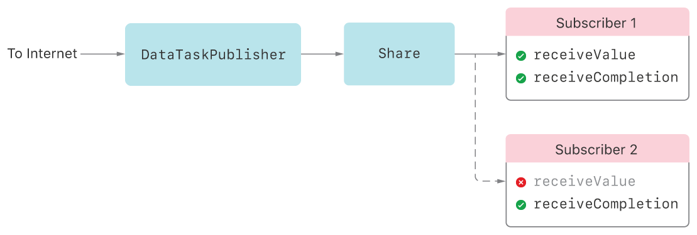
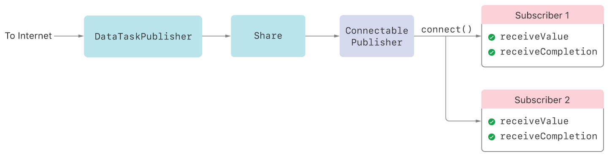

> Navigation: [Technologies](../technologies.md) · [Combine](../combine.md)

# Controlling Publishing with Connectable Publishers

<sub>Article</sub>

Coordinate when publishers start sending elements to subscribers.

## Overview

Sometimes, you want to configure a publisher before it starts producing elements, such as when a publisher has properties that affect its behavior. But commonly used subscribers like [sink(receiveValue:)](<publisher/sink(receivevalue_).md>) demand unlimited elements immediately, which might prevent you from setting up the publisher the way you like. A publisher that produces values before you’re ready for them can also be a problem when the publisher has two or more subscribers. This multi-subscriber scenario creates a race condition: the publisher can send elements to the first subscriber before the second even exists.

Consider the scenario in the following figure. You create a [URLSession.DataTaskPublisher](../foundation/urlsession/datataskpublisher.md) and attach a sink subscriber to it (Subscriber 1) which causes the data task to start fetching the URL’s data. At some later point, you attach a second subscriber (Subscriber 2). If the data task completes its download before the second subscriber attaches, the second subscriber misses the data and only sees the completion.



### Hold Publishing by Using a Connectable Publisher

To prevent a publisher from sending elements before you’re ready, Combine provides the [ConnectablePublisher](connectablepublisher.md) protocol. A connectable publisher produces no elements until you call its [connect()](<connectablepublisher/connect().md>) method. Even if it’s ready to produce elements and has unsatisfied demand, a connectable publisher doesn’t deliver any elements to subscribers until you explicitly call [connect()](<connectablepublisher/connect().md>).

The following figure shows the [URLSession.DataTaskPublisher](../foundation/urlsession/datataskpublisher.md) scenario from above, but with a [ConnectablePublisher](connectablepublisher.md) ahead of the subscribers. By waiting to call [connect()](<connectablepublisher/connect().md>) until both subscribers attach, the data task doesn’t start downloading until then. This eliminates the race condition and guarantees both subscribers can receive the data.



To use a [ConnectablePublisher](connectablepublisher.md) in your own Combine code, use the [makeConnectable()](<publisher/makeconnectable().md>) operator to wrap an existing publisher with a [MakeConnectable](publishers/makeconnectable.md) instance. The following code shows how [makeConnectable()](<publisher/makeconnectable().md>) fixes the data task publisher race condition described above. Typically, attaching a sink — identified here by the [AnyCancellable](anycancellable.md) it returns, `cancellable1` — would cause the data task to start immediately. In this scenario, the second sink, identified as `cancellable2`, doesn’t attach until one second later, and the data task publisher might complete before the second sink attaches. Instead, explicitly using a [ConnectablePublisher](connectablepublisher.md) causes the data task to start only after the app calls [connect()](<connectablepublisher/connect().md>), which it does after a two-second delay.

```swift
let url = URL(string: "https://example.com/")!
let connectable = URLSession.shared
    .dataTaskPublisher(for: url)
    .map() { $0.data }
    .catch() { _ in Just(Data() )}
    .share()
    .makeConnectable()

cancellable1 = connectable
    .sink(receiveCompletion: { print("Received completion 1: \($0).") },
          receiveValue: { print("Received data 1: \($0.count) bytes.") })

DispatchQueue.main.asyncAfter(deadline: .now() + 1) {
    self.cancellable2 = connectable
        .sink(receiveCompletion: { print("Received completion 2: \($0).") },
              receiveValue: { print("Received data 2: \($0.count) bytes.") })
}

DispatchQueue.main.asyncAfter(deadline: .now() + 2) {
    self.connection = connectable.connect()
}
```

> [!important] Important
> [connect()](<connectablepublisher/connect().md>) returns a [Cancellable](cancellable.md) instance that you need to retain. You can use this instance to cancel publishing, either by explicitly calling [cancel()](<cancellable/cancel().md>) or allowing it to deinitialize.

### Use the Autoconnect Operator If You Don’t Need to Explicitly Connect

Some Combine publishers already implement [ConnectablePublisher](connectablepublisher.md), such as [Multicast](publishers/multicast.md) and [Timer.TimerPublisher](../foundation/timer/timerpublisher.md). Using these publishers can cause the opposite problem: having to explicitly [connect()](<connectablepublisher/connect().md>) could be burdensome if you don’t need to configure the publisher or attach multiple subscribers.

For cases like these, [ConnectablePublisher](connectablepublisher.md) provides the [autoconnect()](<connectablepublisher/autoconnect().md>) operator. This operator immediately calls [connect()](<connectablepublisher/connect().md>) when a [Subscriber](subscriber.md) attaches to the publisher with the [subscribe(_:)](<publisher/subscribe(__)-3fk20.md>) method.

The following example uses [autoconnect()](<connectablepublisher/autoconnect().md>), so a subscriber immediately receives elements from a once-a-second [Timer.TimerPublisher](../foundation/timer/timerpublisher.md). Without [autoconnect()](<connectablepublisher/autoconnect().md>), the example would need to explicitly start the timer publisher by calling [connect()](<connectablepublisher/connect().md>) at some point.

```swift
let cancellable = Timer.publish(every: 1, on: .main, in: .default)
    .autoconnect()
    .sink() { date in
        print ("Date now: \(date)")
     }
```

## See Also

### Connectable Publishers

- [ConnectablePublisher](connectablepublisher.md) — A publisher that provides an explicit means of connecting and canceling publication.
