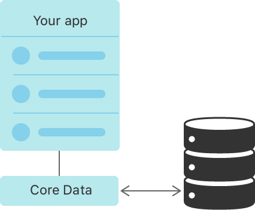
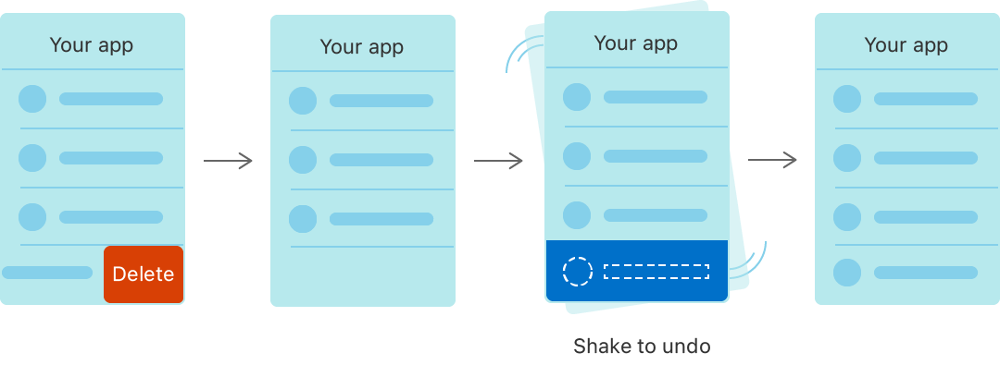
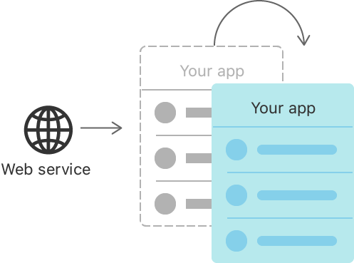

> Navigation: [Technologies](technologies.md)

# Core Data

Framework

Persist or cache data on a single device, or sync data to multiple devices with CloudKit.

## Overview

Use Core Data to save your application’s permanent data for offline use, to cache temporary data, and to add undo functionality to your app on a single device. To sync data across multiple devices in a single iCloud account, Core Data automatically mirrors your schema to a CloudKit container.

Through Core Data’s Data Model editor, you define your data’s types and relationships, and generate respective class definitions. Core Data can then manage object instances at runtime to provide the following features.

### Persistence

Core Data abstracts the details of mapping your objects to a store, making it easy to save data from Swift and Objective-C without administering a database directly.

### Undo and redo of individual and batched changes

Core Data’s undo manager tracks changes and can roll them back individually, in groups, or all at once, making it easy to add undo and redo support to your app.

### Background data tasks

Perform potentially UI-blocking data tasks, like parsing JSON into objects, in the background. You can then cache or store the results to reduce server roundtrips.

### View synchronization

Core Data also helps keep your views and data synchronized by providing data sources for table and collection views.

### Versioning and migration

Core Data includes mechanisms for versioning your data model and migrating user data as your app evolves.

## Topics

### Essentials

- [Creating a Core Data model](coredata/creating-a-core-data-model.md) — Define your app’s object structure with a data model file.
- [Setting up a Core Data stack](coredata/setting-up-a-core-data-stack.md) — Set up the classes that manage and persist your app’s objects.
- [Core Data stack](coredata/core-data-stack.md) — Manage and persist your app’s model layer.
- [Handling Different Data Types in Core Data](coredata/handling-different-data-types-in-core-data.md) — Create, store, and present records for a variety of data types.
- [Linking Data Between Two Core Data Stores](coredata/linking-data-between-two-core-data-stores.md) — Organize data in two different stores and implement a link between them.

### Data modeling

- [Modeling data](coredata/modeling-data.md) — Configure the data model file to contain your app’s object graph.
- [Core Data model](coredata/core-data-model.md) — Describe your app’s object structure.

### Fetch requests

- [NSFetchRequest](coredata/nsfetchrequest.md) — A description of search criteria used to retrieve data from a persistent store.
- [NSAsynchronousFetchRequest](coredata/nsasynchronousfetchrequest.md) — A fetch request that retrieves results asynchronously and supports progress notification.
- [NSAsynchronousFetchResult](coredata/nsasynchronousfetchresult.md) — A fetch result object that encompasses the response from an executed asynchronous fetch request.
- [NSFetchedResultsController](coredata/nsfetchedresultscontroller.md) — A controller that you use to manage the results of a Core Data fetch request and to display data to the user.

### SwiftData migration and coexistence

- [Adopting SwiftData for a Core Data app](coredata/adopting-swiftdata-for-a-core-data-app.md) — Persist data in your app intuitively with the Swift native persistence framework.

### CloudKit mirroring

- [Mirroring a Core Data store with CloudKit](coredata/mirroring-a-core-data-store-with-cloudkit.md) — Back user interfaces with a local replica of a CloudKit private database.
- [Synchronizing a local store to the cloud](coredata/synchronizing-a-local-store-to-the-cloud.md) — Share data between a user’s devices and other iCloud users.
- [NSPersistentCloudKitContainer](coredata/nspersistentcloudkitcontainer.md) — A container that encapsulates the Core Data stack in your app, and mirrors select persistent stores to a CloudKit private database.
- [NSPersistentCloudKitContainerOptions](coredata/nspersistentcloudkitcontaineroptions.md) — An object that customizes how a store description aligns with a CloudKit database.
- [Sharing Core Data objects between iCloud users](coredata/sharing-core-data-objects-between-icloud-users.md) — Use Core Data and CloudKit to synchronize data between devices of an iCloud user and share data between different iCloud users.

### Change processing

- [Accessing data when the store changes](coredata/accessing-data-when-the-store-changes.md) — Guarantee that a context won’t see store changes until you tell it to look.
- [Consuming relevant store changes](coredata/consuming-relevant-store-changes.md) — Filter store transactions for changes relevant to the current view.
- [Persistent history](coredata/persistent-history.md) — Use persistent history tracking to determine what changes have occurred in the store since the enabling of persistent history tracking.

### Background tasks

- [Using Core Data in the background](coredata/using-core-data-in-the-background.md) — Use Core Data in both a single-threaded and multithreaded app.
- [Loading and displaying a large data feed](swiftui/loading-and-displaying-a-large-data-feed.md) — Consume data in the background, and lower memory use by batching imports and preventing duplicate records.
- [Conflict resolution](coredata/conflict-resolution.md) — Detect and resolve conflicts that occur when data is changed on multiple threads.
- [Batch processing](coredata/batch-processing.md) — Use batch processes to manage large data changes.

### Data model migration

- [Migrating your data model automatically](coredata/migrating-your-data-model-automatically.md) — Enable lightweight migrations to keep your data model and the underlying data in a consistent state.
- [Staged migrations](coredata/staged-migrations.md) — Migrate complex data models containing changes that are incompatible with lightweight migrations.
- [Manual migrations](coredata/manual-migrations.md) — Migrate elaborate data models with changes that go beyond the capabilities of both lightweight and staged migrations.

### Related types

- [Core Data Constants](coredata/core-data-constants.md) — Keys to use with persistent stores and notifications from Core Data.
