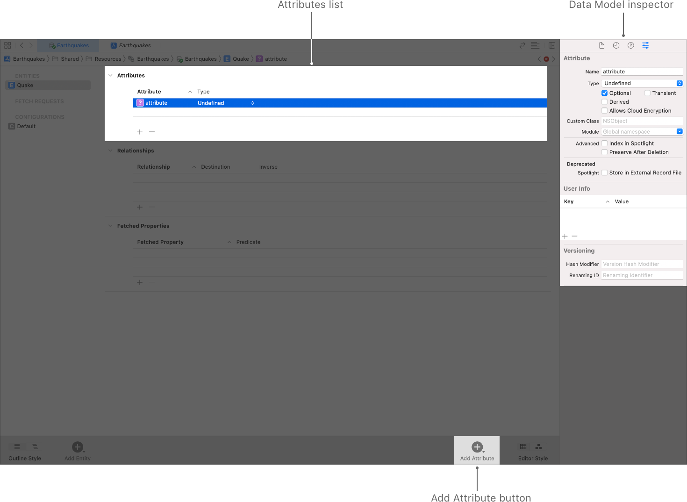
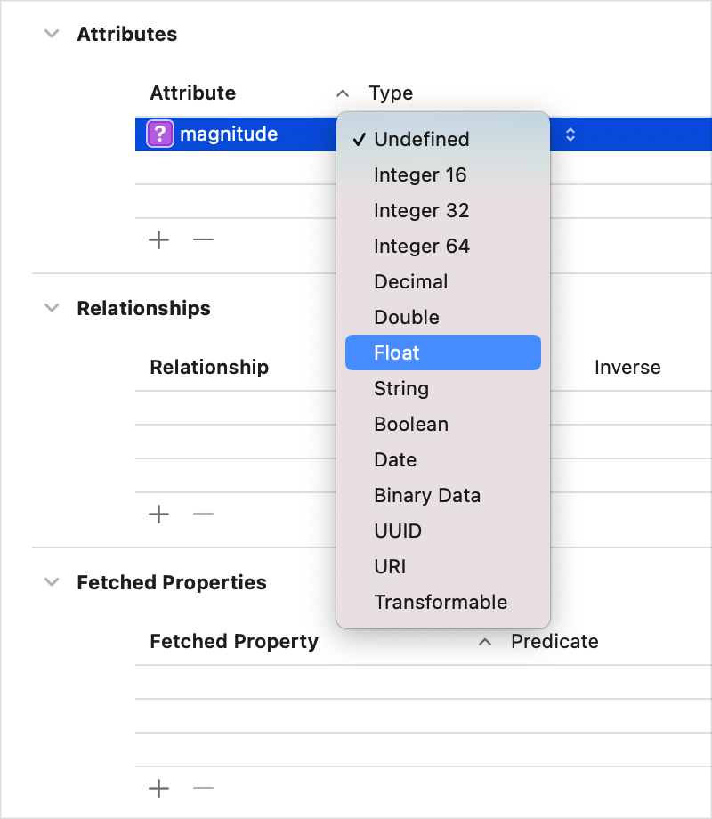
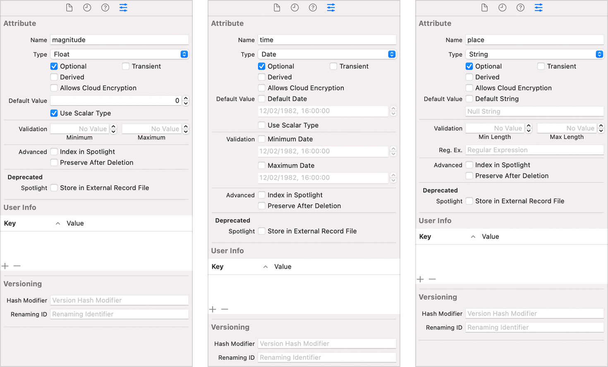

> Navigation: [Technologies](../technologies.md) · [Core Data](../coredata.md) · [Modeling data](modeling-data.md)

# Configuring Attributes

Article

Describe the properties that compose an entity.

## Overview

After you create an entity as described in [Configuring Entities](configuring-entities.md), you can add attributes to that entity.

An attribute describes a property of an entity. At minimum, you need to specify the property’s name and data type, whether it must be saved in the store, and whether it’s required to have a value when it’s saved.

For some attribute types, you can also choose whether to use a scalar type to represent the attribute in generated classes, as well as configure the attribute to have a default value, or to apply data validation rules.

### Add Attributes

Add an attribute as indicated in the screenshot and the steps that follow:

A screenshot of Xcode’s Data Model editor, highlighting the Attributes list in the middle, the Data Model inspector on the right, and the Add Attribute button in the toolbar at the bottom.

1. With an entity selected, click Add Attribute at the bottom of the editor area. A new attribute with the placeholder name `attribute`, of type `Undefined`, appears in the Attributes list.
2. In the Attributes list, double-click the newly added attribute, and rename it.
3. In the Attributes list, as shown in the second screenshot, click `Undefined` and choose the attribute’s data type from the Type pop-up menu.

### Configure Attributes

Use the data model inspector (choose View \> Inspectors \> Show Data Model Inspector) to configure attributes.

Three screenshots of the Data Model inspector showing how the options vary depending on the attribute’s data type. The left screenshot displays the options for the Float data type, the middle screenshot displays the options for the Date data type, and the screenshot on the right displays the options for the String data type.

- **Attribute Type** — The attribute’s data type. This field reflects the selection made in the Attributes list’s Type pop-up menu.

For the full list of types, see [NSAttributeType](nsattributetype.md).

- **Optional** — Optional attributes aren’t required to have a value when saved to the persistent store. Attributes are optional by default.

Core Data optionals aren’t the same as Swift optionals. You can use a Swift optional to represent a required attribute, for example, if you need flexibility to set its value during the time between the object’s initialization and its first save.

- **Transient** — Transient attributes aren’t saved to the persistent store. By default, attributes are saved to the store. Transient attributes are a useful place to temporarily store calculated or derived values. Core Data does track changes to transient property values for undo purposes.
- **Allows Cloud Encryption** — For persistent stores that write to a CloudKit database, this option instructs the system to encrypt the attribute’s value before it’s sent to iCloud. For more information, see [allowsCloudEncryption](nsattributedescription/allowscloudencryption.md).
- **Default Value** — Most types allow you to supply a default value. New object instances set the attribute to this default value on initialization, unless you specify another value at that time.

Supplying a default value, in combination with making the type non-optional, can provide performance benefits.

- **Use Scalar Type** — Optionally, for some types, choose between scalar and nonscalar representations during code generation. For a `Double`, selecting the Use Scalar checkbox produces a [Double](../swift/double.md), while leaving it unselected produces an [NSNumber](../foundation/nsnumber.md).

For the full list of types, including scalar variants, see [NSAttributeType](nsattributetype.md).

- **Validation** — Optionally, set validation rules, such as the minimum and maximum values for a numeric type, or regular expressions requirements for strings. The data model inspector shows validation options specific to the selected attribute’s type.
- **Index in Spotlight** — Adds the field to the Spotlight index for instances created from this entity.

For more information, see [Core Spotlight](../corespotlight.md).

- **Preserve After Deletion** — Includes the attribute in this entity’s tombstone. When persistent history tracking is enabled and a context deletes a managed object, Core Data records an identifying marker, known as its tombstone, in the relevant transaction.
- **User Info** — A dictionary in which you can store any application-specific information related to the attribute.
- **Versioning Hash Modifier** — Provide a hash modifier when maintaining multiple model versions if the structure of an attribute is the same, but the format or content of its data has changed.
- **Versioning Renaming ID** — If you rename an attribute between model versions, set the renaming identifier in the new model to the name of the corresponding attribute in the previous model.

For more information, see [Migrating your data model automatically](migrating-your-data-model-automatically.md).

## See Also

### Configuring a Core Data Model

- [Configuring Entities](configuring-entities.md) — Model your app’s objects.
- [Configuring Relationships](configuring-relationships.md) — Specify how entities relate and how change propagates between them.
- [Generating code](generating-code.md) — Automatically or manually generate managed object subclasses from entities.
