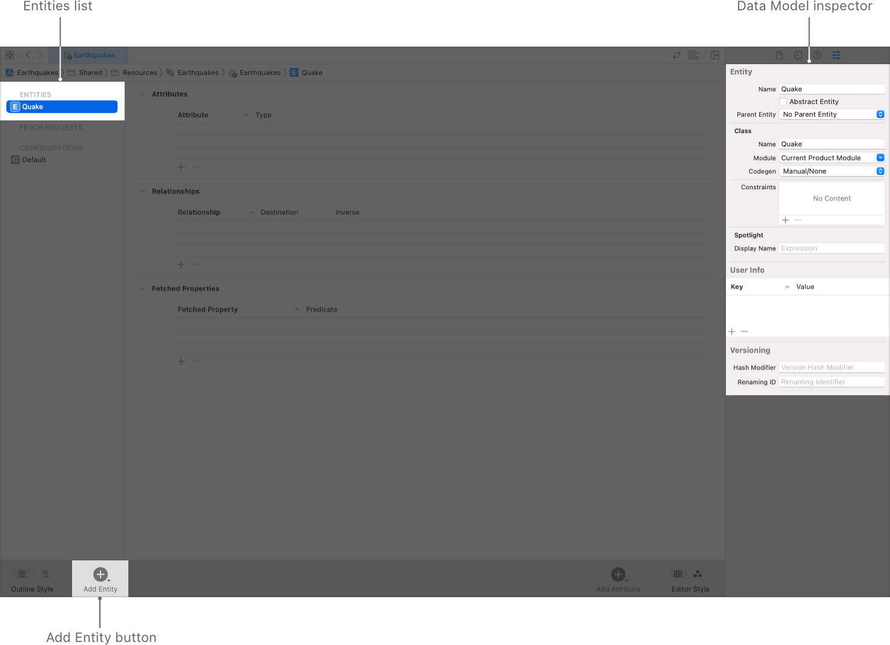

> Navigation: [Technologies](../technologies.md) · [Core Data](../coredata.md) · [Modeling data](modeling-data.md)

# Configuring Entities

Article

Model your app’s objects.

## Overview

An entity describes an object, including its name, attributes, and relationships. Create an entity for each of your app’s objects.

### Add Entities

After you create a Core Data model as described in [Creating a Core Data model](creating-a-core-data-model.md), add an entity to your project’s `.xcdatamodeld` file:

1. Click Add Entity at the bottom of the editor area. A new entity with placeholder name `Entity` appears in the Entities list.
2. In the Entities list, double-click the newly added entity and rename it. This step updates both the entity name and class name visible in the Data Model inspector.

A screenshot of Xcode’s Data Model editor, highlighting the Entities list on the left, the Data Model inspector on the right, and the Add Entity button in the toolbar at the bottom.

In addition to the required name and class name fields, entities have a default setting for the required code generation field. If you need to add inheritance, unique constraints, versioning, or other optional information, configure your entity as described below. Otherwise, add the properties that compose your entity as described in [Configuring Attributes](configuring-attributes.md).

### Configure Entities

Use the data model inspector (choose View \> Inspectors \> Show Data Model Inspector) to configure your entity.

- **Entity Name** — The name of the entity in the managed object model. This field reflects the name shown in the Entities list.
- **Abstract Entity** — Select the Abstract Entity checkbox if you won’t create any instances of the entity—for example, if it exists only as a parent entity that must never be instantiated directly. By default, this option is unselected, resulting in a concrete entity.
- **Parent Entity** — If you have a number of similar entities, you can define the common properties in a parent entity, and have child entities inherit those properties. By default, this field is blank.
- **Class Name** — The name of the class you’ll use when creating managed object instances from this entity. By default, the class name mirrors the entity name; however, if you change the class name, the entity name doesn’t reflect the changes.
- **Module** — The module where the class for this entity resides. By default, Core Data locates class files in the global namespace.
- **Codegen** — Choose a code generation option for generating managed object subclass and properties files to support your entity. By default, this option is set to Class Definition, and Core Data generates both files for you automatically.

For information about the options for code generation, see [Generating code](generating-code.md).

- **Constraints** — After adding attributes as shown in [Configuring Attributes](configuring-attributes.md), optionally enter the name of an attribute (or comma-separated list of attributes) to serve as unique constraints on the entity.

Unique constraints prevent duplicate records in the store. When saving a new record, the store checks whether any record already exists with the same value for the constrained attribute. In the case of a conflict, [NSMergeByPropertyObjectTrumpMergePolicyType](nsmergepolicytype/mergebypropertyobjecttrumpmergepolicytype.md) causes the new record to overwrite all fields in the existing record.

- **Spotlight Display Name** — An [NSExpression](../foundation/nsexpression.md) that Core Spotlight uses to display an instance of this entity. This expression may include keypaths,  language functions like [lowercased()](<../swift/string/lowercased().md>) and [uppercased()](<../swift/string/uppercased().md>), and custom functions.

For more information, see [Core Spotlight](../corespotlight.md).

- **User Info** — A dictionary in which you can optionally store any application-specific information related to the entity.
- **Versioning Hash Modifier** — Provide a hash modifier when maintaining multiple model versions if the structure of an entity is the same, but the format or content of its data has changed.
- **Versioning Renaming ID** — Provide a renaming ID if you rename an entity between model versions. Set the renaming identifier in the new model to the name of the corresponding entity in the previous model.

For more information, see [Migrating your data model automatically](migrating-your-data-model-automatically.md).

## See Also

### Configuring a Core Data Model

- [Configuring Attributes](configuring-attributes.md) — Describe the properties that compose an entity.
- [Configuring Relationships](configuring-relationships.md) — Specify how entities relate and how change propagates between them.
- [Generating code](generating-code.md) — Automatically or manually generate managed object subclasses from entities.
