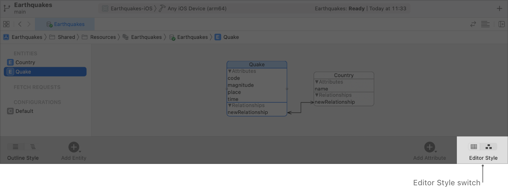
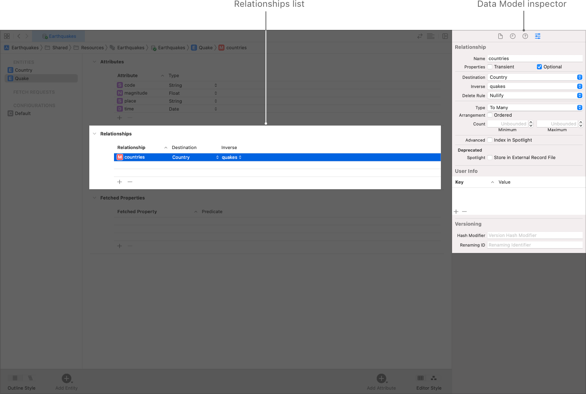
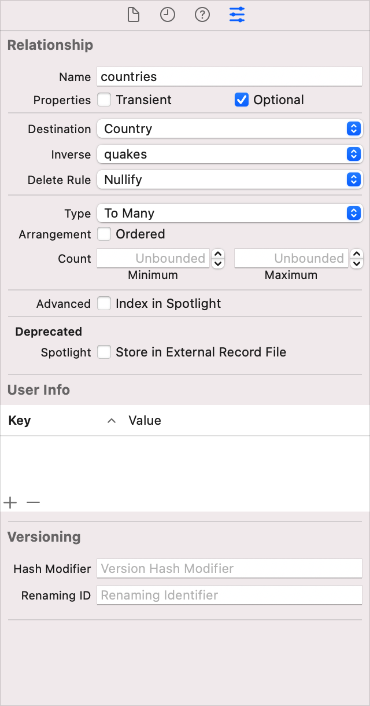

> Navigation: [Technologies](../technologies.md) · [Core Data](../coredata.md) · [Modeling data](modeling-data.md)

# Configuring Relationships

Article

Specify how entities relate and how change propagates between them.

## Overview

After you define at least two entities as described in [Configuring Entities](configuring-entities.md), you can add a relationship between the entities.

A relationship describes how an entity affects another entity. At minimum, a relationship specifies a name, a destination entity, a delete rule, a cardinality type (To One or To Many), settings for whether the relationship must be saved in the store (transient), and whether it is required to have a value when saved (optional). You must also configure every relationship with an inverse relationship.

### Add Relationships

To add a relationship, do the following:

1. Select the graph editor style to view all your app’s entities.
2. Control-drag from one entity to another to create a pair of relationships. An arrow appears between the entities to indicate a relationship, and the editor creates a placeholder relationship with the name `newRelationship` in each entity.

A screenshot showing two entities side-by-side in the Data Model editor when the Graph editor style is in a selected state. An arrow that represents a relationship joins the two entities.

### Configure Relationships

After creating a pair of relationships, configure each relationship as indicated in the screenshot and the steps that follow:

A screenshot of Xcode’s Data model editor. The Quake entity is in a selected state, and the screenshot highlights the entity’s relationships. The Data Model inspector shows the attributes of a relationship with the name countries.

1. Select the table editor style to edit one entity at a time.
2. Open the Data Model inspector (choose View \> Inspectors \> Show Data Model Inspector).
3. Select the source entity from the Entities list, then select the new relationship in the Relationships list. Use the Data Model inspector to configure its name, destination, inverse, delete rule, and cardinality type, and to indicate if it is transient or optional.
4. Select the destination entity from the Entities list, then select the new relationship in the Relationships list. Use the Data Model inspector to configure its name, destination, inverse, delete rule, and cardinality type, and to indicate if it is transient or optional.

A screenshot showing the countries relationship in the Data Model inspector. The destination is Country, the inverse is quakes, the delete rule is Nullify, and the relationship type is To Many.

The above example shows a `Quake` entity’s `countries` relationship, referring to one or more countries a given earthquake affects. It has an inverse relationship on the `Country` entity called `quakes`, referring to any earthquakes affecting that country.

- **Transient** — Transient relationships aren’t saved to the persistent store. So transient relationships are useful to temporarily store calculated or derived values. Core Data does track changes to transient property values for undo purposes.
- **Optional** — Optional relationships aren’t required to have any instances of their destination type. A required relationship must point to one or more instances of the destination type.
- **Destination** — Each relationship points from a source entity (the entity whose relationships you’re editing) to a destination entity. The destination entity is a related type that affects and is affected by the source type.

Setting the same source and destination types creates a reflexive relationship. For example, an `Employee` may manage another `Employee`.

- **Inverse** — Inverse relationships enable Core Data to propagate change in both directions when an instance of either the source or destination type changes. Every relationship must have an inverse.

When creating relationships in the Graph editor, you add inverse relationships between entities in a single step. When creating relationships in the Table editor, you add inverse relationships to each entity individually.

- **Delete Rule** — A relationship’s delete rule specifies how changes propagate across relationships when Core Data deletes a source instance.

Select No Action to delete the source object instance, but leave references to it in any destination object instances, which you update manually.

Select** **Nullify to delete the source object instance, and nullify references to it in any destination object instances.

Select Cascade to delete the source object instance, and with it, all of the destination object instances.

Select Deny to delete the source object only if it doesn’t point to any destination object instances.

- **Cardinality Type** — Specify a relationship as being To One or To Many, which is known as its cardinality.

Use To One relationships to connect the source with a single instance of the destination type.

Use To Many relationships to connect the source with a mutable set of the destination type, and to optionally specify an arrangement and count:

Arrangement—Select the Ordered checkbox to specify that the relationship has an inherent ordering, and to generate an _ordered_ mutable set.

Count—You can also place upper and lower limits on the number of destination instances. For optional relationships, the number of instances can be zero or within these bounds.

- **Index in Spotlight** — Includes the field in the Spotlight index. For more information, see [Core Spotlight](../corespotlight.md).

## See Also

### Related Documentation

- [NSDeleteRule](nsdeleterule.md) — Constants that determine what happens when you delete a relationship’s owning managed object.

### Configuring a Core Data Model

- [Configuring Entities](configuring-entities.md) — Model your app’s objects.
- [Configuring Attributes](configuring-attributes.md) — Describe the properties that compose an entity.
- [Generating code](generating-code.md) — Automatically or manually generate managed object subclasses from entities.
