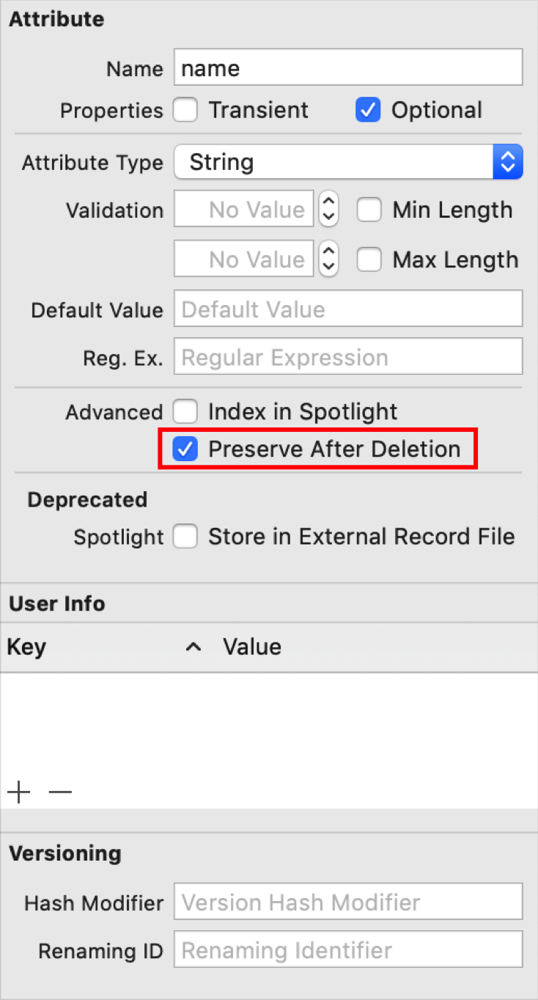

> Navigation: [Technologies](../technologies.md) · [Core Data](../coredata.md)

# Consuming relevant store changes

<sub>Article</sub>

Filter store transactions for changes relevant to the current view.

## Overview

Use persistent history tracking to determine what changes have occurred in the store, and to update your view context only as needed.

For example, consider an app that sometimes shows a list of shopping items, and sometimes shows a list of stores. As the user views the `ShoppingItem` objects from the view context, a background context may download additional `Store` data from a remote source. If the import happens through a batch operation, the save to the store doesn’t generate an [NSManagedObjectContextDidSave](../foundation/nsnotification/name-swift.struct/nsmanagedobjectcontextdidsave.md) notification, and the view misses these relevant updates. Alternatively, the background context may save changes to the store that don’t affect the current view—for example, inserting, modifying, or deleting `Store` objects. These changes _do_ generate context save events, so your view context processes them even though it doesn’t need to.

Persistent history solves the problem by keeping track of every transaction on the store. You can filter this history for relevant changes and decide how or whether to update a view.

### Enable history tracking for your local store

When you create a persistent container, set the [NSPersistentHistoryTrackingKey](nspersistenthistorytrackingkey.md) option on the store description to [true](../swift/true.md) to enable history tracking.

```swift
// Pass the data model filename to the container’s initializer.
let container = PersistentContainer(name: "DataModel")

// Get the persistent store description.
let description = container.persistentStoreDescriptions.first

// Set the persistent history tracking key option.
description?.setOption(true as NSNumber, forKey: NSPersistentHistoryTrackingKey)
```

Core Data tracks all changes to your local store.

### Listen for remote changes

In the persistent container, set the [NSPersistentStoreRemoteChangeNotificationPostOptionKey](nspersistentstoreremotechangenotificationpostoptionkey.md) option to [true](../swift/true.md) to enable listening for remote change notifications.

```swift
description?.setOption(true as NSNumber, forKey: NSPersistentStoreRemoteChangeNotificationPostOptionKey)
```

In your view, add an observer to listen for remote change notifications.

```swift
.onReceive(NotificationCenter.default.publisher(for: .NSPersistentStoreRemoteChange)
    .receive(on: DispatchQueue.main)) { _ in
        fetchRemoteChanges()
        
        viewContext.perform {
            do {
                try viewContext.save()
            } catch {
                print("Failed to save changes: \(error.localizedDescription)")
            }
        }
    }
```

### Provide details about a transaction’s source

Each history transaction automatically includes the originating [storeID](nspersistenthistorytransaction/storeid.md), [bundleID](nspersistenthistorytransaction/bundleid.md) and [processID](nspersistenthistorytransaction/processid.md). You can supply additional information about the source of a change by setting each managed object context’s [name](nsmanagedobjectcontext/name.md) and [transactionAuthor](nsmanagedobjectcontext/transactionauthor.md).

Provide a unique [name](nsmanagedobjectcontext/name.md) for each context to identify it in the persistent history. The context’s [name](nsmanagedobjectcontext/name.md) becomes the persistent history transaction’s [contextName](nspersistenthistorytransaction/contextname.md). You only need to set this once per context.

```swift
class PersistentContainer: NSPersistentContainer {
    override init(name: String, managedObjectModel model: NSManagedObjectModel) {
        super.init(name: name, managedObjectModel: model)
        
        // Set the context's name.
        viewContext.name = "viewContext"
    }
}
```

You can also set a [transactionAuthor](nsmanagedobjectcontext/transactionauthor.md) before each context save to differentiate among multiple call sites that modify the same context. The context’s [transactionAuthor](nsmanagedobjectcontext/transactionauthor.md) becomes the [author](nspersistenthistorytransaction/author.md) of subsequent persistent history transactions.

```swift
let newItem = ShoppingItem(context: viewContext)

// Set newItem properties.

// Set the transaction author.
viewContext.transactionAuthor = "addItem"

// Perform a save.
viewContext.perform {
    do {
        try viewContext.save()
        
        // Reset the transaction author to prevent misattribution of
        // future transactions.
        viewContext.transactionAuthor = nil
    } catch {
        print("Failed to save changes:", error.localizedDescription)
    }
}
```

Reset the context’s [transactionAuthor](nsmanagedobjectcontext/transactionauthor.md) to `nil` after saving the context to prevent misattribution of future transactions.

### Keep track of the most recent history

Create an instance of [NSPersistentHistoryToken](nspersistenthistorytoken.md) to keep track of the most recent history.

```swift
var lastToken: NSPersistentHistoryToken?
```

Save the token to disk so you can track history across app launches and fetch history based on the token.

```swift
var lastToken: NSPersistentHistoryToken? = nil {
    didSet {
        // Encode the token.
        guard let lastToken,
              let data = try? NSKeyedArchiver.archivedData(withRootObject: lastToken,
                                                           requiringSecureCoding: true) else {
            return
        }
        
        do {
            // Write the token to disk.
            try data.write(to: tokenFileURL)
        } catch {
            print("Failed to write token data:", error.localizedDescription)
        }
    }
}

lazy var tokenFileURL: URL = {
    // Get the URL to the persistent store directory.
    let url = NSPersistentContainer.defaultDirectoryURL().appendingPathComponent("ShoppingList",
                                                                                 isDirectory: true)
    
    // Create the directory if it doesn't already exist.
    if FileManager.default.fileExists(atPath: url.path) == false {
        do {
            try FileManager.default.createDirectory(at: url,
                                                    withIntermediateDirectories: true)
        } catch {
            print("Failed to create persistent container URL:", error.localizedDescription)
        }
    }
    
    // Append the name of the token data file and return the URL.
    return url.appendingPathComponent("token.data", isDirectory: false)
}()
```

### Request history

To request history, use the [+ fetchHistoryAfterToken:](<nspersistenthistorychangerequest/fetchhistory(after_)-3rmfm.md>) type method on [NSPersistentHistoryChangeRequest](nspersistenthistorychangerequest.md).

> [!important] Important
> Execute the fetch request on a background context to avoid blocking the main thread.

The following example shows a request to fetch new history since the last time you fetched history and convert the [NSPersistentHistoryResult](nspersistenthistoryresult.md) to an array of [NSPersistentHistoryTransaction](nspersistenthistorytransaction.md):

```swift
// Create a fetch history request with the last token.
let fetchHistoryRequest = NSPersistentHistoryChangeRequest.fetchHistory(after: lastToken)

// Get a background context.
let backgroundContext = persistentContainer.newBackgroundContext()

// Perform the fetch.
guard let historyResult = await backgroundContext.perform({
    let historyResult = try? backgroundContext.execute(fetchHistoryRequest) as? NSPersistentHistoryResult
    return historyResult?.result
}) else {
    fatalError("Failed to fetch history")
}

// Cast the result as an array of history transactions.
guard let historyTransactions = historyResult as? [NSPersistentHistoryTransaction] else {
    fatalError("Failed to convert history result to history transactions")
}
```

Alternatively you can use [+ fetchHistoryAfterDate:](<nspersistenthistorychangerequest/fetchhistory(after_)-qi5b.md>) to get history after a particular date, or after a particular a transaction.

### Read history transactions

Each transaction represents a set of changes. Iterate through the array of transactions to learn their details. The following code loops through the results of the `fetchHistoryRequest` to inspect the properties of each transaction.

```swift
for transaction in history.reversed() {
    // Token, date, and transaction number.
    let token = transaction.token
    let timestamp = transaction.timestamp
    let transactionNumber = transaction.transactionNumber
    
    // Transaction source details.
    let store = transaction.storeID
    let bundle = transaction.bundleID
    let process = transaction.processID
    let context = transaction.contextName ?? "Unknown context"
    let author = transaction.author ?? "Unknown author"
    
    // Get the transaction's changes.
    guard let changes = transaction.changes else { continue }
}
```

A transaction’s [changes](nspersistenthistorytransaction/changes.md) array includes information about multiple changes. A single [NSPersistentHistoryChange](nspersistenthistorychange.md) represents the insertion, update, or deletion of an object.

Iterate through a transaction’s changes to identify each object that changed, the type of change that occurred, and any details about the change.

In the case of an update, the [updatedProperties](nspersistenthistorychange/updatedproperties.md) set includes any updated attributes and relationships. In the case of a deletion, the [tombstone](nspersistenthistorychange/tombstone.md) dictionary includes key-value pairs for any attributes marked for preservation after deletion.

```swift
for change in changes {
    let objectID = change.changedObjectID
    let changeID = change.changeID
    let transaction = change.transaction
    let changeType = change.changeType
    var changedAttributes = [String]()
    
    // Iterate over the change type to get updated or deleted attributes.
    switch changeType {
    case .update:
        guard let updatedProperties = change.updatedProperties else { break }
        for property in updatedProperties {
            changedAttributes.append(property.name)
        }
    case .delete:
        guard let tombstone = change.tombstone else { break }
        changedAttributes.append(tombstone["name"] as? String ?? "Unknown name")
    default:
        break
    }
}
```

### Filter for relevant transactions

Filter the history to narrow it to changes that affect the current view. The following code filters for changes to `ShoppingItem` instances, and it updates the last transaction token as it goes.

```swift
var filteredTransactions = [NSPersistentHistoryTransaction]()
for transaction in transactions {
    guard let changes = transaction.changes else { continue }
    
    let filteredChanges = changes.filter { change -> Bool in
        ShoppingItem.entity().name == change.changedObjectID.entity.name
    }
    
    if filteredChanges.isEmpty == false {
        filteredTransactions.append(transaction)
    }
    
    lastToken = transaction.token
}
```

Relevant changes may include all changes to a given entity, or more selectively, only changes to those properties that are visible on the screen.

### Merge relevant transactions

To merge the relevant changes into your view context, first obtain a notification by calling [- objectIDNotification](<nspersistenthistorytransaction/objectidnotification().md>) on the transaction. Then, pass the notification to [- mergeChangesFromContextDidSaveNotification:](<nsmanagedobjectcontext/mergechanges(fromcontextdidsave_).md>).

```swift
if filteredTransactions.isEmpty == false {
    // Iterate over filtered transactions and merge the changes in the
    // object ID notification that you specify.
    for transaction in filteredTransactions {
        await persistentContainer.viewContext.perform {
            self.persistentContainer.viewContext.mergeChanges(
                fromContextDidSave: transaction.objectIDNotification()
            )
        }
    }
}
```

### Access attributes of deleted objects

After you delete an object from the store, its [objectID](nsmanagedobject/objectid.md) is no longer relevant. Identify a deleted object by recording select properties in its tombstone.

In the Core Data model editor, select an attribute. In the data model editor, select the Preserve After Deletion checkbox.



In the persistent history, [NSPersistentHistoryChangeTypeDelete](nspersistenthistorychangetype/delete.md) changes include a [tombstone](nspersistenthistorychange/tombstone.md) dictionary with key-value pairs for any attributes marked for preservation after deletion.

```swift
var deletedAttributes = [String]()

for transaction in history.reversed() {
    guard let changes = transaction.changes else { continue }
    
    for change in changes where change.changeType == .delete {
        if let tombstone = change.tombstone {
            deletedAttributes.append(tombstone["name"] as? String ?? "Unknown attribute")
        }
    }
}
```

### Purge History

Because persistent history tracking transactions take up space on disk, determine a clean-up strategy to remove them when you no longer need them. Before you purge history, ensure that your app and its clients have consumed the history they need.

Similar to fetching history, you can use [+ deleteHistoryBeforeToken:](<nspersistenthistorychangerequest/deletehistory(before_)-5kghb.md>) to delete history older than a token, a transaction, or a date. For example, you can delete all transactions older than seven days:

```swift
// Get the point in time seven days ago.
let sevenDaysAgo = Calendar.current.date(byAdding: .day,
                                         value: -7,
                                         to: Date())!

// Create a purge history request to delete history before seven days ago.
let purgeHistoryRequest = NSPersistentHistoryChangeRequest.deleteHistory(before: sevenDaysAgo)

// Get a background context.
let backgroundContext = persistentContainer.newBackgroundContext()

// Execute the request.
await backgroundContext.perform {
    do {
        try backgroundContext.execute(purgeHistoryRequest)
    } catch {
        print("Failed to purge history:", error.localizedDescription)
    }
}
```

> [!important] Important
> If you attempt to fetch purged history, Core Data throws an expired token error.

## See Also

### Change processing

- [Accessing data when the store changes](accessing-data-when-the-store-changes.md) — Guarantee that a context won’t see store changes until you tell it to look.
- [Persistent history](persistent-history.md) — Use persistent history tracking to determine what changes have occurred in the store since the enabling of persistent history tracking.
