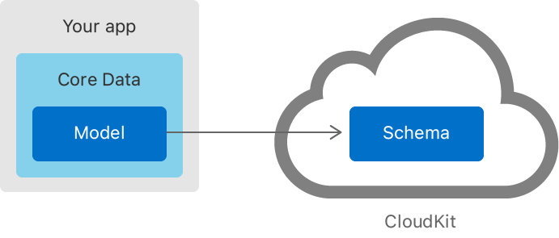

> Navigation: [Technologies](../technologies.md) · [Core Data](../coredata.md) · [Mirroring a Core Data store with CloudKit](mirroring-a-core-data-store-with-cloudkit.md)

# Creating a Core Data Model for CloudKit

<sub>Article</sub>

Design a CloudKit-compatible data model and initialize your CloudKit schema.

## Overview

To pass records between a Core Data store and a CloudKit database, they both require a shared understanding of the data structure. You define this in the Core Data model and then use that to generate a CloudKit schema.



### Create a Data Model

Use Xcode’s Core Data model editor to define your app’s entities and their attributes, or construct your model in code. For more information, see [Creating a Core Data model](creating-a-core-data-model.md) and the articles under [Modeling data](modeling-data.md).

CloudKit doesn’t support all the features of a Core Data model. As you design your model, be aware of the following limitations and make sure you create a compatible data model.

| Core Data model element | CloudKit schema limitation |
|---|---|
| **Entities** | Unique constraints aren’t supported. |
| **Attributes** | `Undefined` and [objectID](nsmanagedobject/objectid.md) attribute types aren’t supported. |
| **Relationships** | All relationships must be optional. Due to operation size limitations, CloudKit may not save relationship changes atomically.  All relationships must have an inverse, in case the records synchronize out of order.  CloudKit doesn’t support the Deny deletion rule. |
| **Configurations** | Entities in a configuration must not have relationships to entities in another configuration. |

For more information about how Core Data translates managed objects to CloudKit records, see [Reading CloudKit Records for Core Data](reading-cloudkit-records-for-core-data.md).

### Initialize Your CloudKit Schema During Development

After creating your Core Data model, inform CloudKit about the types of records it contains by initializing a development schema. This is a draft schema that you can rewrite as often as necessary during development. You can’t delete a record type or modify any existing attributes after you promote a development schema to production.

Use the persistent container to initialize the development schema, which you can do during app launch or from within one or more integration tests. To exclude schema initialization from your production builds, use the following:

```swift
let container = NSPersistentCloudKitContainer(name: "Earthquakes")

// Only initialize the schema when building the app with the 
// Debug build configuration.        
#if DEBUG
do {
    // Use the container to initialize the development schema.
    try container.initializeCloudKitSchema(options: [])
} catch {
    // Handle any errors.
}
#endif
```

After initializing the schema, the console contains an entry similar to the following:

```
<NSCloudKitMirroringDelegate: 0x7f9699d29a90>: Successfully set up CloudKit 
    integration for store
```

While initializing the schema, Core Data creates a temporary instance of each distinct record type in each of the container’s stores that mirror to a CloudKit database and uploads them to the iCloud servers. After completing the upload, the schema is visible in the CloudKit dashboard and Core Data removes the temporary records.

For more information about configuring a CloudKit persistent container, see [Setting Up Core Data with CloudKit](setting-up-core-data-with-cloudkit.md).

### Reset the Environment

As you change the model during development, periodically visit the CloudKit dashboard to reset the development environment and delete the existing development schema, before initializing a new one. For more information about resetting the development environment, see [Using CloudKit Dashboard to Manage Databases](https://developer.apple.com/library/archive/documentation/DataManagement/Conceptual/CloudKitQuickStart/EditingSchemesUsingCloudKitDashboard/EditingSchemesUsingCloudKitDashboard.html#//apple_ref/doc/uid/TP40014987-CH5).

### Promote the Schema to Production

When you’re happy with your data model, have a fully tested app, and are ready to submit it to the App Store, it’s time to promote your schema from development to production.

> [!important] Important
> After you promote your schema to production, the record types and their fields are immutable and exist for all time. You can add new record types, and additional fields to existing record types, but you can’t modify or delete existing record types.

Initialize your schema one last time, then promote it from the CloudKit dashboard. For more information about promoting a schema from development to production, see [Deploying the Schema](https://developer.apple.com/library/archive/documentation/DataManagement/Conceptual/CloudKitQuickStart/DeployingYourCloudKitApp/DeployingYourCloudKitApp.html#//apple_ref/doc/uid/TP40014987-CH10).

### Update the Production Schema

Plan carefully for how your app handles forward compatibility and major changes to the data model, because you can’t rename or delete CloudKit record types and fields in production. Consider these strategies:

- Migrate users to a completely new store, using [NSPersistentCloudKitContainerOptions](nspersistentcloudkitcontaineroptions.md) to associate the new store with a new container.
- Incrementally add new fields to existing record types. If you adopt this approach, older versions of your app have access to every record a user creates, but not every field.
- Version your entities by including a `version` attribute from the outset, and use a fetch request to select only those records that are compatible with the current version of the app. If you adopt this approach, older versions of your app won’t fetch records that a user creates with a more recent version, effectively hiding them on that device.

For example, consider a `Post` entity with a `version` attribute that stores the version of the app that creates the record. You can use a predicate to fetch only the records that are compatible with the current version of the app.

```swift
// The current version of the app's data model.
let maxCompatibleVersion = 3

let context = NSManagedObjectContext(
    concurrencyType: .privateQueueConcurrencyType
)

context.performAndWait {
    let fetchRequest = NSFetchRequest<NSManagedObject>(entityName: "Post")
    
    // Create a predicate that matches against the version attribute.
    fetchRequest.predicate = NSPredicate(
        format: "version <= %d",
        argumentArray: [maxCompatibleVersion]
    )
    
    // Fetch all posts with a version less than or equal to maxCompatibleVersion.
    let results = context.fetch(fetchRequest)
}
```

Along with these choices, consider your timelines for supporting multiple versions of your app, and for migrating users to newer app versions.

For tips on migrating records to a new schema, see [Designing for CloudKit](https://developer.apple.com/library/archive/documentation/General/Conceptual/iCloudDesignGuide/DesigningforCloudKit/DesigningforCloudKit.html#//apple_ref/doc/uid/TP40012094-CH9). For more information about Core Data model migration, see [Migrating your data model automatically](migrating-your-data-model-automatically.md). For heavyweight migrations, see the [Core Data Model Versioning and Data Migration](https://developer.apple.com/library/archive/documentation/Cocoa/Conceptual/CoreDataVersioning/Articles/Introduction.html#//apple_ref/doc/uid/TP40004399-CH1) guide.

## See Also

### Configuring CloudKit Mirroring

- [Setting Up Core Data with CloudKit](setting-up-core-data-with-cloudkit.md) — Set up the classes and capabilities that sync your store to CloudKit.
- [Syncing a Core Data Store with CloudKit](syncing-a-core-data-store-with-cloudkit.md) — Synchronize objects between devices, and handle store changes in the user interface.
- [Reading CloudKit Records for Core Data](reading-cloudkit-records-for-core-data.md) — Access CloudKit records created from Core Data managed objects.
