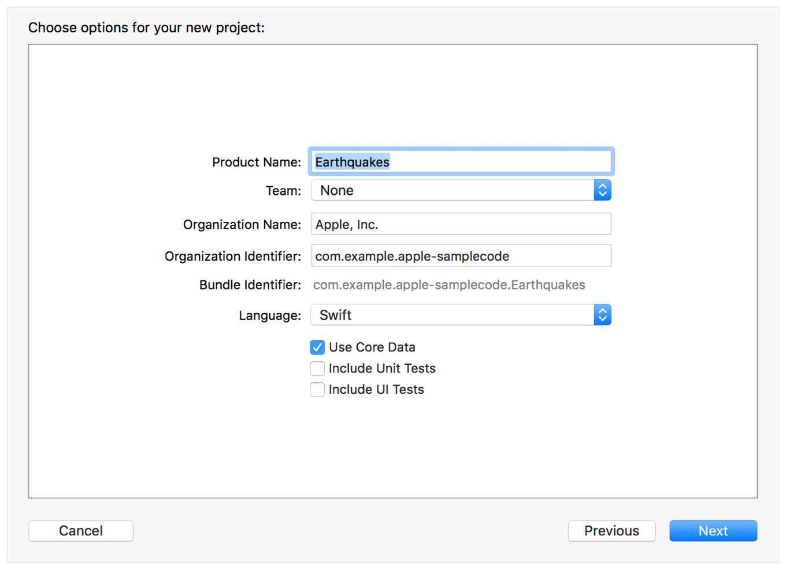
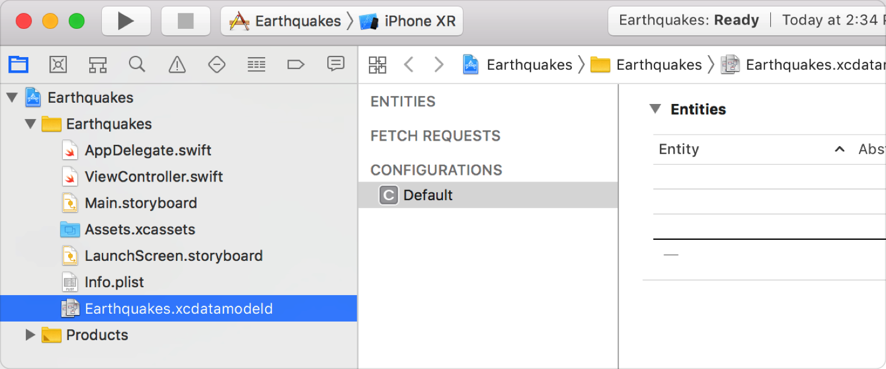
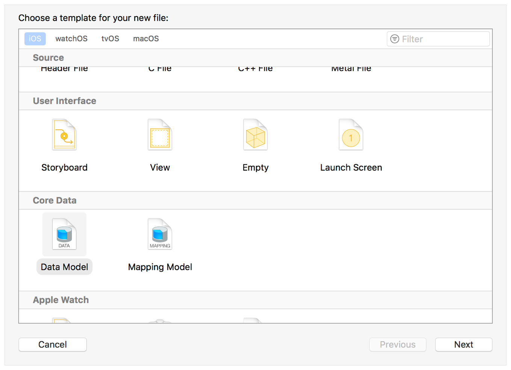
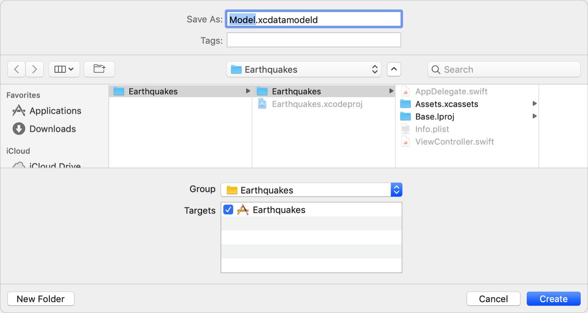
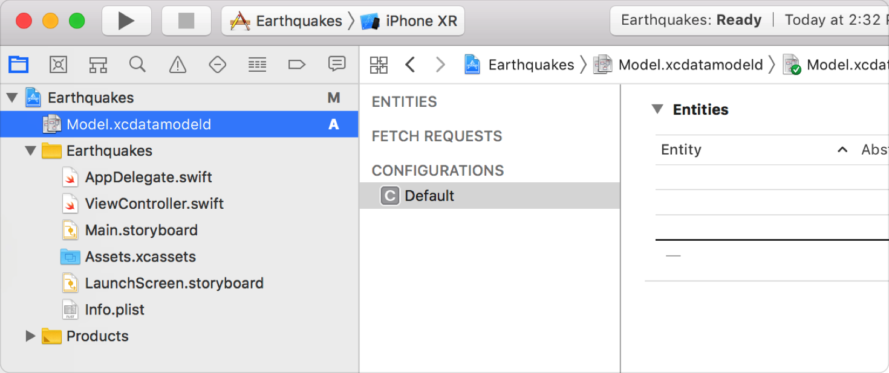

> Navigation: [Technologies](../technologies.md) · [Core Data](../coredata.md)

# Creating a Core Data model

Article

Define your app’s object structure with a data model file.

## Overview

The first step in working with Core Data is to create a data model file to define the structure of your app’s objects, including their object types, properties, and relationships.

You can add a Core Data model file to your Xcode project when you create the project, or you can add it to an existing project.

### Add Core Data to a New Xcode Project

In the dialog for creating a new project, select the Use Core Data checkbox, and click Next.

Screenshot showing the Use Core Data checkbox in the options for creating a new Xcode project. The checkbox appears after the language dropdown, and before the checkboxes for including Unit Tests and UI Tests.

The resulting project includes an `.xcdatamodeld` file.

### Add a Core Data Model to an Existing Project

Choose File \> New \> File and select the iOS platform tab. Scroll down to the Core Data section, select Data Model, and click Next.

Name your model file, select its group and targets, and click Create.

Xcode adds an `.xcdatamodeld` file with the specified name to your project.

## See Also

### Related Documentation

- [Configuring Attributes](configuring-attributes.md) — Describe the properties that compose an entity.
- [Configuring Relationships](configuring-relationships.md) — Specify how entities relate and how change propagates between them.
- [Generating code](generating-code.md) — Automatically or manually generate managed object subclasses from entities.

### Essentials

- [Setting up a Core Data stack](setting-up-a-core-data-stack.md) — Set up the classes that manage and persist your app’s objects.
- [Core Data stack](core-data-stack.md) — Manage and persist your app’s model layer.
- [Handling Different Data Types in Core Data](handling-different-data-types-in-core-data.md) — Create, store, and present records for a variety of data types.
- [Linking Data Between Two Core Data Stores](linking-data-between-two-core-data-stores.md) — Organize data in two different stores and implement a link between them.
