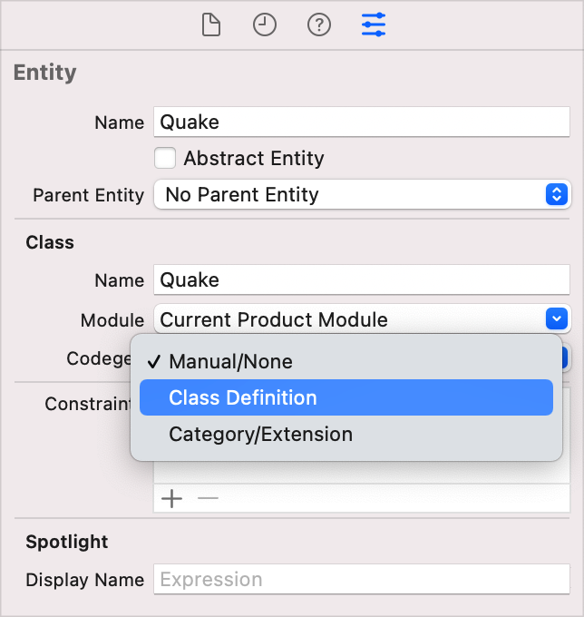
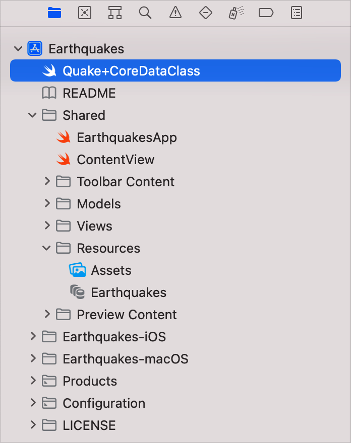
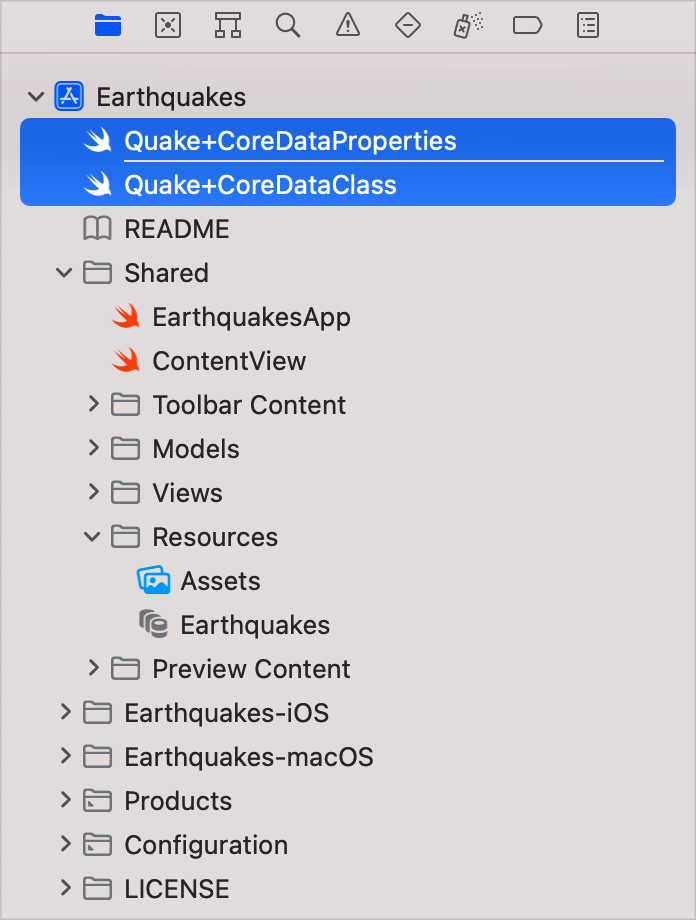

> Navigation: [Technologies](../technologies.md) · [Core Data](../coredata.md) · [Modeling data](modeling-data.md)

# Generating code

<sub>Article</sub>

Automatically or manually generate managed object subclasses from entities.

## Overview

After you define your entities, their attributes, and relationships as described in Configuring a Core Data Model, specify the classes that you’ll use to create instances of your entities. Core Data optionally generates two files to support your class: a class file and a properties file.

The class file declares the class as a subclass of [NSManagedObject](nsmanagedobject.md):

```swift
//
//  Store+CoreDataClass.swift
//  
//  This file was automatically generated and should not be edited.
//

import Foundation
import CoreData

@objc(Store)
public class Store: NSManagedObject {

}
```

The properties file declares an extension to hold the `@NSManaged` properties that represent attributes and relationships, their accessors, and helper functionality for fetching instances of this type:

```swift
//
//  Store+CoreDataProperties.swift
//
//  This file was automatically generated and should not be edited.
//

import Foundation
import CoreData

extension Store {

    @nonobjc public class func fetchRequest() -> NSFetchRequest<Store> {
        return NSFetchRequest<Store>(entityName: "Store")
    }

    @NSManaged public var name: String?
    @NSManaged public var shoppingItems: NSSet?

}

// MARK: Generated accessors for shoppingItems
extension Store {

    @objc(addShoppingItemsObject:)
    @NSManaged public func addToShoppingItems(_ value: ShoppingItem)

    @objc(removeShoppingItemsObject:)
    @NSManaged public func removeFromShoppingItems(_ value: ShoppingItem)

    @objc(addShoppingItems:)
    @NSManaged public func addToShoppingItems(_ values: NSSet)

    @objc(removeShoppingItems:)
    @NSManaged public func removeFromShoppingItems(_ values: NSSet)

}

extension Store : Identifiable {

}
```

Core Data takes care of generating managed object subclasses for you, but you can take control when you need to add logic or edit properties.

### Select a Code Generation Option

To select a code generation option:

1. Select an entity from the Entities list.
2. In the Data Model inspector, below Class, the Codegen pop-up menu offers three options: Manual/None, Class Definition, and Category/Extension.



The sections that follow describe circumstances for choosing each option.

#### Automatically Generate Both Files

Choose Class Definition when you don’t need to edit the properties or functionality of the managed object subclass and properties files that Core Data generates for you.

The generated source code doesn’t appear in your project’s source list. Xcode produces the class and properties files as part of the build process and places them in your project’s build directory.

These files regenerate whenever the related entity changes in the data model.

#### Generate the Properties File Only

Choose Category/Extension to add additional convenience methods or business logic inside your managed object subclass.

This option allows you take full control of the class file, while continuing to automatically generate the properties file to keep it up-to-date with the model editor. It’s up to you to create and maintain your class manually.

To generate the class file initially, do the following:

1. From the Xcode menu bar, choose Editor \> Create NSManagedObject Subclass.
2. Select your data model, then the appropriate entity, and choose where to save the files. Xcode places both class and properties files into your project.
3. Because the build process continues to generate the properties file, move this duplicate file from your project source list to the Trash.

You can now see and edit the class file in your project source list.



#### Manage Both Files Manually

Choose Manual/None to edit the properties in your managed object subclass, for example, to alter access modifiers, and to add additional convenience methods or business logic.

Using this option, Core Data doesn’t generate any files to support your managed object. You create and maintain your class, including its properties, manually. Core Data then locates these files using the values you supply in the class name and module fields.

To generate the class and properties files initially:

1. From the Xcode menu bar, choose Editor \> Create NSManagedObject Subclass.
2. Select your data model, then the appropriate entity, and choose where to save the files. Xcode places both a class and a properties file into your project.

You can now see and edit both the class and properties files in your project source list.



> [!note] Note
> To regenerate class and properties files at any time, choose Editor \> Create NSManagedObject Subclass. Be aware that the new files overwrite any existing files at the target location.

## See Also

### Configuring a Core Data Model

- [Configuring Entities](configuring-entities.md) — Model your app’s objects.
- [Configuring Attributes](configuring-attributes.md) — Describe the properties that compose an entity.
- [Configuring Relationships](configuring-relationships.md) — Specify how entities relate and how change propagates between them.
