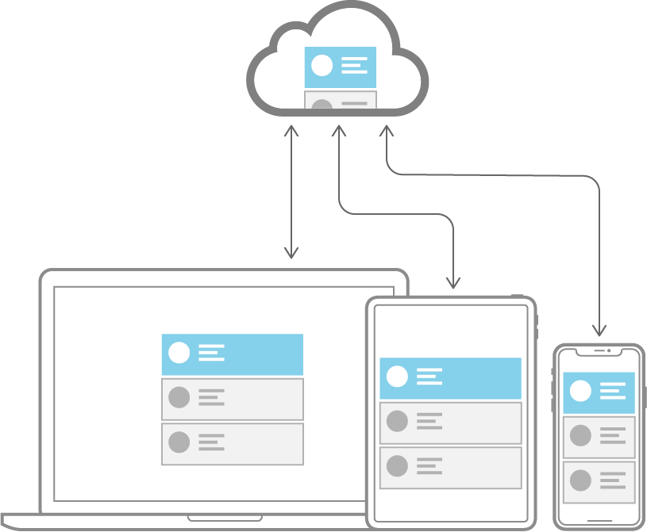

> Navigation: [Technologies](../technologies.md) · [Core Data](../coredata.md)

# Mirroring a Core Data store with CloudKit

Article

Back user interfaces with a local replica of a CloudKit private database.

## Overview

Use Core Data with CloudKit to give users seamless access to the data in your app across all their devices.

Core Data with CloudKit combines the benefits of local persistence with cloud backup and distribution. Core Data provides powerful object graph management features for developing an app with structured data. CloudKit lets users access their data across every device on their iCloud account, while serving as an always-available backup service.

### Determine If Your App Is Eligible for Core Data with CloudKit

Apps adopting Core Data can use Core Data with CloudKit as long as the persistent store is an [NSSQLiteStoreType](nssqlitestoretype.md) store, and the data model is compatible with CloudKit limitations. For example, CloudKit does not support unique constraints, undefined attributes, or required relationships.

Apps using CloudKit cannot use Core Data with CloudKit with existing CloudKit containers. To fully manage all aspects of data mirroring, Core Data owns the CloudKit schema created from the Core Data model. Existing CloudKit containers aren’t compatible with this schema. If your app already uses CloudKit, you can add Core Data with CloudKit when synchronizing a Core Data store with a new container. For more information about working with multiple stores, see [Manage multiple stores](setting-up-core-data-with-cloudkit.md#Manage-multiple-stores).

For more information about data model requirements, see [Create a Data Model](creating-a-core-data-model-for-cloudkit.md#Create-a-Data-Model).

### Set Up Your Development Environment

You need an [Apple Developer Program](https://developer.apple.com/programs/) account to access the CloudKit service and your team’s CloudKit containers during development.

You also need an iCloud account to save records to a CloudKit container. Core Data with CloudKit uses a specific record zone in the CloudKit private database, which is accessible only to the current user.

You can run and test Core Data with CloudKit apps using Simulator. You may also test with multiple physical devices logged into the same iCloud account. Connect all devices to a stable wireless internet connection to avoid network problems that could hinder synchronization.

For more information, see [Create an iCloud Account for Development](https://developer.apple.com/library/archive/documentation/DataManagement/Conceptual/CloudKitQuickStart/EnablingiCloudandConfiguringCloudKit/EnablingiCloudandConfiguringCloudKit.html#//apple_ref/doc/uid/TP40014987-CH2-SW7).

### Configure Core Data with CloudKit

Add Core Data with CloudKit to your project as follows:

1. Set up your Xcode project’s capabilities to enable CloudKit, and modify your Core Data stack setup to use [NSPersistentCloudKitContainer](nspersistentcloudkitcontainer.md). See [Setting Up Core Data with CloudKit](setting-up-core-data-with-cloudkit.md).
2. Design your Core Data model, and use it to initialize the CloudKit schema. See [Creating a Core Data Model for CloudKit](creating-a-core-data-model-for-cloudkit.md).
3. Modify your views to incorporate remote store changes at appropriate times. See [Syncing a Core Data Store with CloudKit](syncing-a-core-data-store-with-cloudkit.md).

Finally, if you are building custom features or writing a web app, discover how to work with the generated CloudKit schema in [Reading CloudKit Records for Core Data](reading-cloudkit-records-for-core-data.md).

## Topics

### Configuring CloudKit Mirroring

- [Setting Up Core Data with CloudKit](setting-up-core-data-with-cloudkit.md) — Set up the classes and capabilities that sync your store to CloudKit.
- [Creating a Core Data Model for CloudKit](creating-a-core-data-model-for-cloudkit.md) — Design a CloudKit-compatible data model and initialize your CloudKit schema.
- [Syncing a Core Data Store with CloudKit](syncing-a-core-data-store-with-cloudkit.md) — Synchronize objects between devices, and handle store changes in the user interface.
- [Reading CloudKit Records for Core Data](reading-cloudkit-records-for-core-data.md) — Access CloudKit records created from Core Data managed objects.

## See Also

### CloudKit mirroring

- [Synchronizing a local store to the cloud](synchronizing-a-local-store-to-the-cloud.md) — Share data between a user’s devices and other iCloud users.
- [NSPersistentCloudKitContainer](nspersistentcloudkitcontainer.md) — A container that encapsulates the Core Data stack in your app, and mirrors select persistent stores to a CloudKit private database.
- [NSPersistentCloudKitContainerOptions](nspersistentcloudkitcontaineroptions.md) — An object that customizes how a store description aligns with a CloudKit database.
- [Sharing Core Data objects between iCloud users](sharing-core-data-objects-between-icloud-users.md) — Use Core Data and CloudKit to synchronize data between devices of an iCloud user and share data between different iCloud users.
