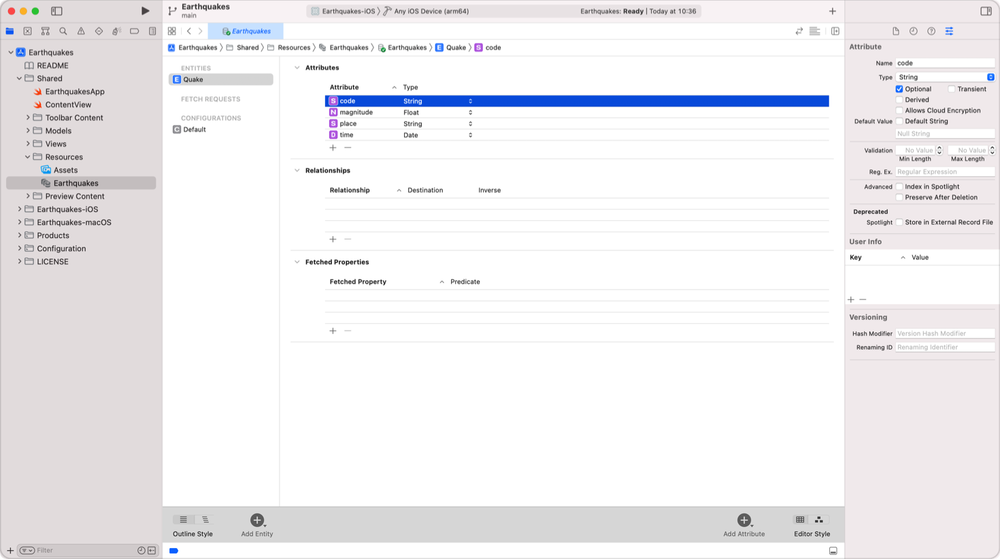

> Navigation: [Technologies](../technologies.md) · [Core Data](../coredata.md)

# Modeling data

Article

Configure the data model file to contain your app’s object graph.

## Overview

A data model holds information about your application’s objects and the graph of how objects relate to each other. You provide this information in your project’s `.xcdatamodeld` file package. To add a data model to your project, see [Creating a Core Data model](creating-a-core-data-model.md).

This screenshot shows the data model for an app that displays a feed of earthquake data.

Model your data by describing your objects as entities, adding their properties as attributes and relationships, and finally generating respective [NSManagedObject](nsmanagedobject.md) subclasses to inherit change tracking and life cycle management.

## Topics

### Configuring a Core Data Model

- [Configuring Entities](configuring-entities.md) — Model your app’s objects.
- [Configuring Attributes](configuring-attributes.md) — Describe the properties that compose an entity.
- [Configuring Relationships](configuring-relationships.md) — Specify how entities relate and how change propagates between them.
- [Generating code](generating-code.md) — Automatically or manually generate managed object subclasses from entities.

## See Also

### Data modeling

- [Core Data model](core-data-model.md) — Describe your app’s object structure.
