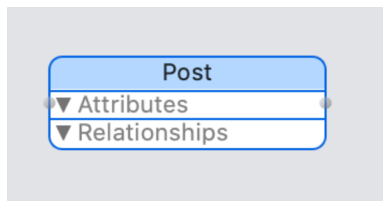
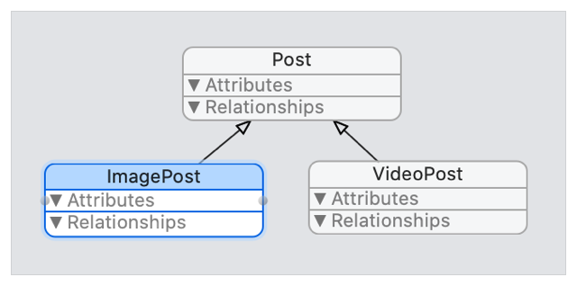
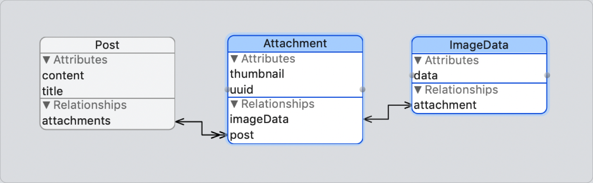
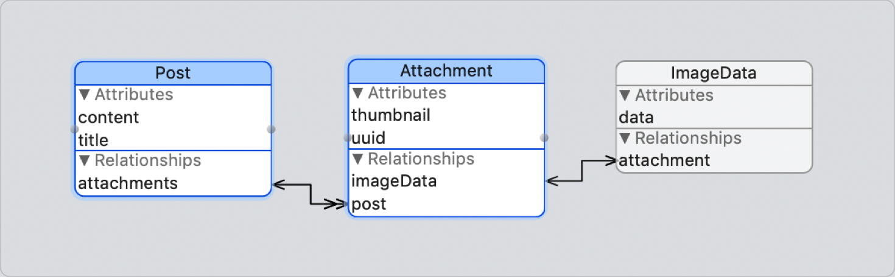
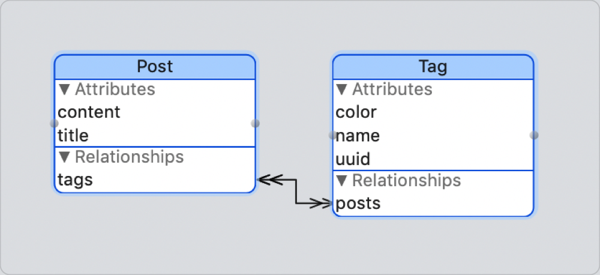

> Navigation: [Technologies](../technologies.md) · [Core Data](../coredata.md) · [Mirroring a Core Data store with CloudKit](mirroring-a-core-data-store-with-cloudkit.md)

# Reading CloudKit Records for Core Data

<sub>Article</sub>

Access CloudKit records created from Core Data managed objects.

## Overview

Although your Core Data app interacts primarily with managed objects, you can access a managed object’s [CKRecord](../cloudkit/ckrecord.md) directly. This is useful if you’re leveraging CloudKit to add features like sharing. You can also use [CloudKit JS](../cloudkitjs.md) to access CloudKit records from your web app.

To prevent collision with existing CloudKit record types and reserved names, CloudKit prefixes the [CKRecord](../cloudkit/ckrecord.md) types and fields it creates for your Core Data entities with `CD_`.

To work with records directly, you need to understand the mappings between entities and record types, attributes and fields, and the ways a record stores relationships.

> [!note] Note
> Core Data doesn’t use CloudKit’s native support for relationships, [CKRecord.Reference](../cloudkit/ckrecord/reference.md), because this field limits the number of references to 750, and cannot represent many-to-many relationships. Core Data stores the relationship in CloudKit according to its cardinality (one-to-one, one-to-many, or many-to-many), as described in this article.

### Read Entities from Record Types

CloudKit doesn’t typically support inheritance, so it provides only a single system field, [recordType](../cloudkit/ckrecord/recordtype-6v7au.md), to hold type information. Core Data stores the name of the _root entity_ from the inheritance hierarchy in [recordType](../cloudkit/ckrecord/recordtype-6v7au.md).

When you initialize a schema, Core Data adds a custom field to the record type, `CD_entityName`, to store the name of the _current entity_.



For example, an entity named `Post` generates the following structure (before adding its attributes), with its `CD_entityName` set to `Post`, and its `recordType` set to `CD_Post`.

```swift
<CKRecord: 0x7fbae9e19510; recordID=CD_Post_UUID:
(com.apple.coredata.cloudkit.zone:__defaultOwner__), values={
    "CD_entityName" = Post;
}, recordType=CD_Post>
```

Consider a second entity, `ImagePost`, that inherits from Post.



<sub>Layout diagram showing an ImagePost entity that inherits from Post to add an imageData attribute, and a VideoPost entity that inherits from Post to add a VideoPost attribute.</sub>

`ImagePost` generates the following structure (before adding its attributes), with its `CD_entityName` set to `ImagePost`, and its `recordType` set to `CD_Post`.

```swift
<CKRecord: 0x7f9c9fe17780; recordID=CD_ImagePost_UUID:
(com.apple.coredata.cloudkit.zone:__defaultOwner__), values={
    "CD_entityName" = ImagePost;
}, recordType=CD_Post>
```

Query against [recordType](../cloudkit/ckrecord/recordtype-9s09b.md) when searching against an entity’s inheritance hierarchy. Query against `CD_entityName` when searching for instances of a specific type.

For more information about CloudKit queries, see [CKQuery](../cloudkit/ckquery.md).

### Read Attributes from Fields

When you initialize a schema, Core Data creates fields for each of an entity’s attributes, mapping the attribute name to a field with a key in the form `CD_[attribute.name]`. The field’s type may vary between Core Data and CloudKit.

| Core Data attribute type | `NSManagedObject` attribute type | `CKRecord` attribute type |
|---|---|---|
| `Integer 16` | [NSNumber](../foundation/nsnumber.md) | [NSNumber](../foundation/nsnumber.md) |
| `Integer 32` | [NSNumber](../foundation/nsnumber.md) | [NSNumber](../foundation/nsnumber.md) |
| `Integer 64` | [NSNumber](../foundation/nsnumber.md) | [NSNumber](../foundation/nsnumber.md) |
| `Double` | [NSNumber](../foundation/nsnumber.md) | [NSNumber](../foundation/nsnumber.md) |
| `Float` | [NSNumber](../foundation/nsnumber.md) | [NSNumber](../foundation/nsnumber.md) |
| `Boolean` | [NSNumber](../foundation/nsnumber.md) | [NSNumber](../foundation/nsnumber.md) |
| `Date` | [NSDate](../foundation/nsdate.md) | [NSDate](../foundation/nsdate.md) |
| `Decimal` | [NSDecimalNumber](../foundation/nsdecimalnumber.md) | [NSNumber](../foundation/nsnumber.md) |
| `UUID` | [NSUUID](../foundation/nsuuid.md) | [NSString](../foundation/nsstring.md) |
| `URI` | [NSURL](../foundation/nsurl.md) | [NSString](../foundation/nsstring.md) |
| `String` | [NSString](../foundation/nsstring.md) | [NSString](../foundation/nsstring.md) or [CKAsset](../cloudkit/ckasset.md) |
| `Binary Data` | [NSData](../foundation/nsdata.md) | [NSData](../foundation/nsdata.md) or [CKAsset](../cloudkit/ckasset.md) |
| `Transformable` | [NSData](../foundation/nsdata.md) | [NSData](../foundation/nsdata.md) or [CKAsset](../cloudkit/ckasset.md) |
| `Undefined` | — | not supported |
| `Object ID` | — | not supported |

All variable length attribute types—String, Binary Data, and Transformable—generate an additional field with a key in the form `CD_[attribute.name]_ckAsset`. If a field’s value grows too large to store within the record size limit of 1MB, Core Data automatically converts the value to an external asset. Core Data transitions between the original field and its asset counterpart transparently during serialization. When inspecting a CloudKit record directly, check the length of the original field’s value; if it is zero, look in the asset field.


For example, an entity named `Post` with String `content` and `title` attributes would generate the following fully materialized record, with pairs of fields for `CD_content and` `CD_content_ckAsset`, and for `CD_title` and `CD_title_ckAsset`.

```swift
<CKRecord: 0x7f9c9fd0f870; recordID=CD_Post_UUID:
(com.apple.coredata.cloudkit.zone:__defaultOwner__), values={
    "CD_content" = "An example core data string";
    "CD_content_ckAsset" = "<CKAsset: 0x7f9c9fe1db50; 
path=/var/folders/*/C9EDC901-385B-4778-9D78-03E9C740AD89.fxd, 
UUID=C37985B7-F959-4174-AA93-C404F9DCC6A5>";
    "CD_entityName" = Post;
    "CD_title" = "An example core data string";
    "CD_title_ckAsset" = "<CKAsset: 0x7f9c9fd10140; 
path=/var/folders/*/C7977A3A-623E-441E-9086-66F2F5B7B746.fxd, 
UUID=81800071-ECBD-46E1-B4F9-2F7168269497>";
}, recordType=CD_Post
```

### Read One-to-One Relationships from Fields

One-to-one relationships store foreign keys in both related records, mapping the relationship name to a field with a key in the form `CD_[relationship.name]`. This field stores the foreign key of the related object in the form `CKRecord.recordID.recordName`.

For example, consider a one-to-one relationship between an `ImageData` entity and an `Attachment` entity. In Core Data, the `Attachment` has an `imageData` relationship, and the `ImageData` has an `attachment` relationship.



<sub>Flow diagram showing a one-to-one relationship between an ImageData entity with a data attribute and attachment relationship, to an Attachment entity with thumbnail and uuid attributes and an imageData relationship.</sub>

This one-to-one relationship between `ImageData` and `Attachment` would generate the following CloudKit records.

```swift
<CKRecord: 0x7f9ca1300f50; recordID=CD_Attachment_UUID:
(com.apple.coredata.cloudkit.zone:__defaultOwner__), values={
    "CD_entityName" = Attachment;
    "CD_imageData" = "CD_ImageData_UUID";
}, recordType=CD_Attachment>
<CKRecord: 0x7f9c9fc18610; recordID=CD_ImageData_UUID:
(com.apple.coredata.cloudkit.zone:__defaultOwner__), values={
    "CD_attachment" = "CD_Attachment_UUID";
    "CD_entityName" = ImageData;
}, recordType=CD_ImageData>
```

The `CD_imageData` field on the `CD_Attachment` contains the foreign key of the image, and the `CD_attachment` field on the `CD_ImageData` contains the foreign key of the attachment.

### Read One-to-Many Relationships from Fields

One-to-many relationships store a foreign key on each record on the many side of the relationship, mapping the relationship name to a field with a key in the form `CD_[relationship name]`. This field stores the foreign key of the related object in the form `CKRecord.recordID.recordName`.



<sub>Flow diagram showing a one-to-many relationship between an Post entity with content and title attributes and an attachments relationship; to an Attachment entity with thumbnail and uuid attributes and a post relationship.</sub>

For example, a one-to-many relationship between a single `Post` and multiple `Attachment` instances would generate multiple `CD_Attachment` records. Each record contains the foreign key of the `Post` it belongs to in their `CD_post` field.

```swift
<CKRecord: 0x7f9ca1300f50; recordID=CD_Attachment_UUID:
(com.apple.coredata.cloudkit.zone:__defaultOwner__), values={
    "CD_entityName" = Attachment;
    "CD_post" = "CD_VideoPost_UUID";
}, recordType=CD_Attachment>
```

Generated `Post` records don’t contain a reference to their attachments.

### Read Many-to-Many Relationships from CDMR Records

Many-to-many relationships model the join table using a custom Core Data Mirrored Relationship (CDMR) record type.

CloudKit doesn’t support the notion of a join, and it’s inefficient to encode arrays on both records and keep them in sync. Instead, Core Data constructs a CDMR record to accurately and succintly capture all of the criteria of the join.

CDMR records have the following fields.

| CDMR Field | Description |
|---|---|
| `CD_entityNames` | An alphabetically sorted, semicolon-separated list of the entities in the relationship, for example, `“Post:Tag”`. The ordering of this field determines the ordering for all other fields. |
| `CD_recordNames` | The record names of the two related objects, for example, `“CD_Post_F587C290-BC2F-441B-98FC-1357BA89C411:CD_Tag_215FA1E0-6A16-4A2B-BFA2-C13202BE6D50”`, sorted according to the CD_entityNames order. |
| `CD_relationships` | The relationship names, for example, `“tags:posts”`, sorted according to the CD_entityNames order. |

For example, consider a many-to-many relationship between `Tag` and `Post` entities.



<sub>Flow diagram showing a many-to-many relationship between a Post entity with content and title attributes and a tags relationship; to a Tag entity with color, name, and uuid attributes and a posts relationship.</sub>

The individual `Tag` and `Post` records don’t contain fields for the relationship.

```swift
<CKRecord: 0x7f9c9fd0f870; recordID=CD_Post_UUID:
(com.apple.coredata.cloudkit.zone:__defaultOwner__), values={
    "CD_content" = "An example core data string";
    "CD_content_ckAsset" = "<CKAsset: 0x7f9c9fe1db50; 
path=/var/folders/*/C9EDC901-385B-4778-9D78-03E9C740AD89.fxd, 
UUID=C37985B7-F959-4174-AA93-C404F9DCC6A5>";
    "CD_entityName" = Post;
    "CD_title" = "An example core data string";
    "CD_title_ckAsset" = "<CKAsset: 0x7f9c9fd10140; 
path=/var/folders/*/C7977A3A-623E-441E-9086-66F2F5B7B746.fxd, 
UUID=81800071-ECBD-46E1-B4F9-2F7168269497>";
}, recordType=CD_Post>
<CKRecord: 0x7f9ca10188d0; recordID=CD_Tag_UUID:
(com.apple.coredata.cloudkit.zone:__defaultOwner__), values={
    "CD_color" = {length = 17, bytes = 0x536f6d65206578616d706c652064617461};
    "CD_color_ckAsset" = "<CKAsset: 0x7f9c9fd07790; 
path=/var/folders/*/5D5DF5B2-DB27-4F01-B311-52A274374F59.fxd, 
UUID=787F4868-1F4D-4BF7-86D4-3867BEA65172>";
    "CD_entityName" = Tag;
    "CD_name" = "An example core data string";
    "CD_name_ckAsset" = "<CKAsset: 0x7f9ca1300af0; 
path=/var/folders/*/C40A1E1F-C2F5-4BA1-A6ED-F5977301A1F7.fxd, 
UUID=A4C4B698-55FC-4C87-BA8A-D6DD0011DD90>";
    "CD_uuid" = "51BAFD98-D1F7-472F-95D6-BBF40D7CBD75";
}, recordType=CD_Tag>
```

The relationship between any two `Tag` and `Post` records exists in a third CDMR record. The CDMR record describes the entity type, record name, and Core Data relationship between the `Tag` and `Post`.

```swift
<CKRecord: 0x7f9ca1301780; recordID=EE64F478-A761-4049-B559-853457ABA997:
(com.apple.coredata.cloudkit.zone:__defaultOwner__), values={
    "CD_entityNames" = "Post:Tag";
    "CD_recordNames" = "CD_Post_UUID:CD_Tag_UUID";
    "CD_relationships" = "tags:posts";
}, recordType=CDMR>
```

The structure of a CDMR record is carefully designed to occupy the minimum necessary footprint, and to require the least effort to decode and work with, making it usable outside the Core Data framework.

### Access CloudKit Objects

You can access a managed object’s [CKRecord](../cloudkit/ckrecord.md) directly through its associated context using `record(for:)` for a single record, or `records(for:)` for multiple records. To retrieve the record ID only, use `recordID(for:)`, or `recordIDs(for:)`.

Alternatively, use the class functions [recordForManagedObjectID:](nspersistentcloudkitcontainer/recordformanagedobjectid_.md), [recordsForManagedObjectIDs:](nspersistentcloudkitcontainer/recordsformanagedobjectids_.md), [recordIDForManagedObjectID:](nspersistentcloudkitcontainer/recordidformanagedobjectid_.md), and `recordIDs(for:)` on [NSPersistentCloudKitContainer](nspersistentcloudkitcontainer.md).

## See Also

### Configuring CloudKit Mirroring

- [Setting Up Core Data with CloudKit](setting-up-core-data-with-cloudkit.md) — Set up the classes and capabilities that sync your store to CloudKit.
- [Creating a Core Data Model for CloudKit](creating-a-core-data-model-for-cloudkit.md) — Design a CloudKit-compatible data model and initialize your CloudKit schema.
- [Syncing a Core Data Store with CloudKit](syncing-a-core-data-store-with-cloudkit.md) — Synchronize objects between devices, and handle store changes in the user interface.
