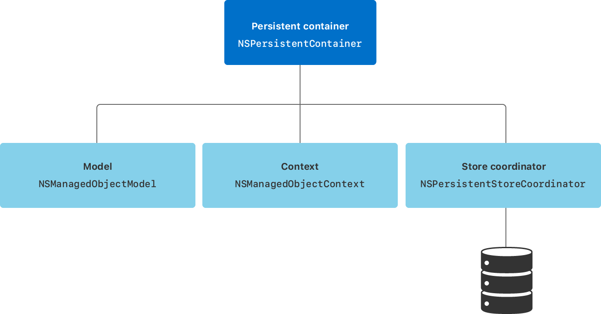

> Navigation: [Technologies](../technologies.md) · [Core Data](../coredata.md)

# Setting up a Core Data stack

<sub>Article</sub>

Set up the classes that manage and persist your app’s objects.

## Overview

After you create a data model file as described in [Creating a Core Data model](creating-a-core-data-model.md), set up the classes that collaboratively support your app’s model layer. These classes are collectively referred to as the Core Data stack.



<sub>Diagram showing that a persistent container instance contains references to a a managed object model, a managed object context, and a persistent store coordinator that connects to your app’s stores.</sub>

- An instance of [NSManagedObjectModel](nsmanagedobjectmodel.md) represents your app’s model file describing your app’s types, properties, and relationships.
- An instance of [NSManagedObjectContext](nsmanagedobjectcontext.md) tracks changes to instances of your app’s types.
- An instance of [NSPersistentStoreCoordinator](nspersistentstorecoordinator.md) saves and fetches instances of your app’s types from stores.
- An instance of [NSPersistentContainer](nspersistentcontainer.md) sets up the model, context, and store coordinator all at once.

### Initialize a Persistent Container

Typically, you initialize a Core Data stack as a singleton:

```swift
// Define an observable class to encapsulate all Core Data-related functionality.
class CoreDataStack: ObservableObject {
    static let shared = CoreDataStack()
    
    // Create a persistent container as a lazy variable to defer instantiation until its first use.
    lazy var persistentContainer: NSPersistentContainer = {
        
        // Pass the data model filename to the container’s initializer.
        let container = NSPersistentContainer(name: "DataModel")
        
        // Load any persistent stores, which creates a store if none exists.
        container.loadPersistentStores { _, error in
            if let error {
                // Handle the error appropriately. However, it's useful to use
                // `fatalError(_:file:line:)` during development.
                fatalError("Failed to load persistent stores: \(error.localizedDescription)")
            }
        }
        return container
    }()
        
    private init() { }
}
```

Once created, the persistent container holds references to the model, context, and store coordinator instances in its [managedObjectModel](nspersistentcontainer/managedobjectmodel.md), [viewContext](nspersistentcontainer/viewcontext.md), and [persistentStoreCoordinator](nspersistentcontainer/persistentstorecoordinator.md) properties, respectively.

You can now use the Core Data stack througout your app.

### Inject the managed object context

Create an instance of the Core Data stack and inject its managed object context into your app environment:

```swift
@main
struct ShoppingListApp: App {
    // Create an observable instance of the Core Data stack.
    @StateObject private var coreDataStack = CoreDataStack.shared
    
    var body: some Scene {
        WindowGroup {
            ContentView()
            // Inject the persistent container's managed object context
            // into the environment.
                .environment(\.managedObjectContext,
                              coreDataStack.persistentContainer.viewContext)
        }
    }
}
```

Use an environment property wrapper to access the managed object context in your views:

```swift
//#-code-listing(AccessManagedObjectContext) [Access the managed object context]
struct ContentView: View {
    // Get a reference to the managed object context from the environment.
    @Environment(\.managedObjectContext) private var viewContext

    // Remaining implementation of the user interface.
}
```

### Add functionality to the stack

Your Core Data stack is a convenient place to put related code, such as methods to save changes and delete managed objects in the persistent store:

```swift
extension CoreDataStack {
    // Add a convenience method to commit changes to the store.
    func save() {
        // Verify that the context has uncommitted changes.
        guard persistentContainer.viewContext.hasChanges else { return }
        
        do {
            // Attempt to save changes.
            try persistentContainer.viewContext.save()
        } catch {
            // Handle the error appropriately.
            print("Failed to save the context:", error.localizedDescription)
        }
    }
    
    func delete(item: ShoppingItem) {
        persistentContainer.viewContext.delete(item)
        save()
    }
}
```

The `save` method improves performance by saving the context only when there are changes.

## Topics

### Legacy Stack Setup

- [Setting up a Core Data stack manually](setting-up-a-core-data-stack-manually.md) — Create the individual components that Core Data requires manually, to support earlier versions of Apple operating systems.

## See Also

### Essentials

- [Creating a Core Data model](creating-a-core-data-model.md) — Define your app’s object structure with a data model file.
- [Core Data stack](core-data-stack.md) — Manage and persist your app’s model layer.
- [Handling Different Data Types in Core Data](handling-different-data-types-in-core-data.md) — Create, store, and present records for a variety of data types.
- [Linking Data Between Two Core Data Stores](linking-data-between-two-core-data-stores.md) — Organize data in two different stores and implement a link between them.
