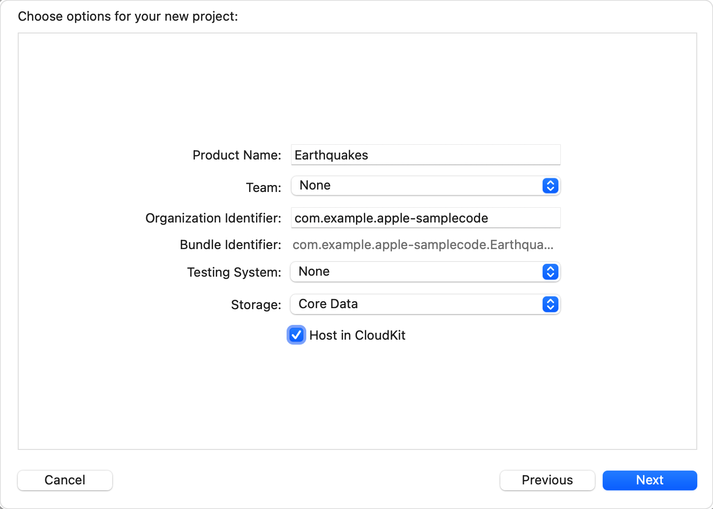
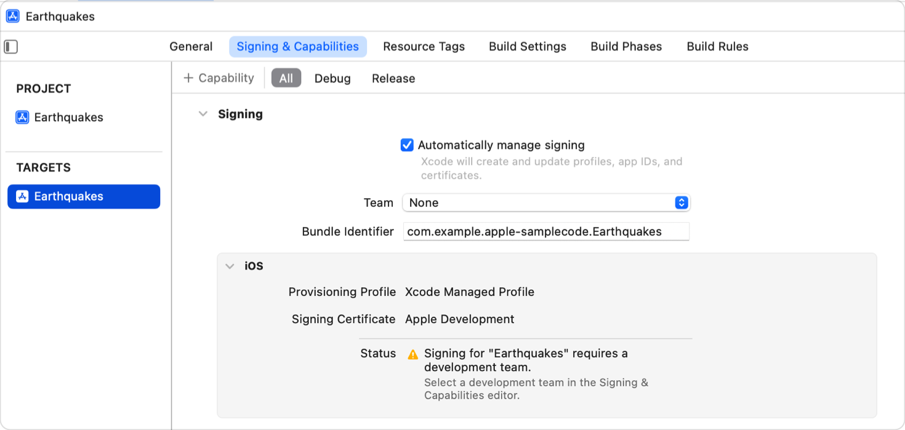
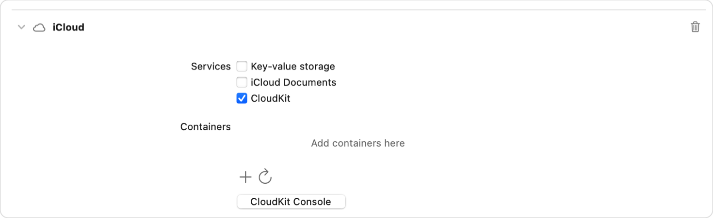
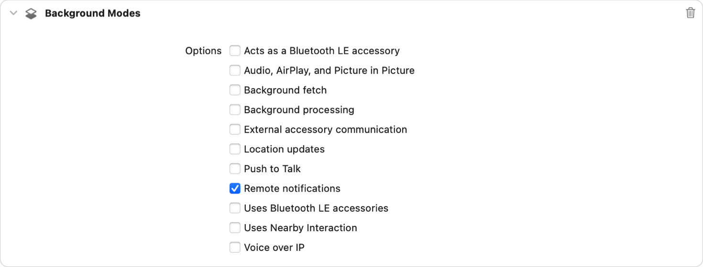
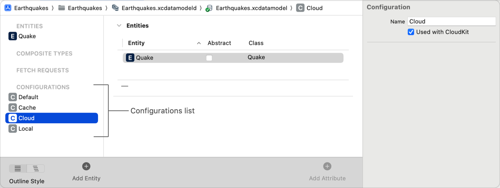

> Navigation: [Technologies](../technologies.md) · [Core Data](../coredata.md) · [Mirroring a Core Data store with CloudKit](mirroring-a-core-data-store-with-cloudkit.md)

# Setting Up Core Data with CloudKit

<sub>Article</sub>

Set up the classes and capabilities that sync your store to CloudKit.

## Overview

To sync your Core Data store to CloudKit, you enable the CloudKit capability for your app. You also set up the Core Data stack with a persistent container that is capable of managing one or more local persistent stores that are backed by a CloudKit private database.

### Configure a new Xcode project

When you create a new project, you specify whether you want to add support for Core Data with CloudKit directly from the project setup interface. The resulting project contains an [NSPersistentCloudKitContainer](nspersistentcloudkitcontainer.md). Once you enable CloudKit in your project, you use this container to manage one or more local stores that are backed with a CloudKit database.

1. Choose File \> New \> Project to create a new project.
2. Select a project template to use as the starting point for your project, and click Next.
3. Select the Core Data option for Storage.
4. Select the Host in Cloudkit checkbox.
5. Enter any other project details and click Next.
6. Specify a location for your project and click Create.



<sub>Screenshot showing the new project creation dialog with the Core Data Storage option and Host in CloudKit checkbox selected.</sub>

Not all project templates support Core Data. If the template you want to use doesn’t currently support Core Data, add Core Data to the project as described in [Setting up a Core Data stack](setting-up-a-core-data-stack.md). Then add Core Data with CloudKit as described in [Update an existing Xcode project](setting-up-core-data-with-cloudkit.md#Update-an-existing-Xcode-project).

### Enable iCloud

Core Data with CloudKit requires specific entitlements for your app to communicate with the server. If you have created a new template following the steps above, this will be done for you. For an existing app, begin by adding the iCloud capability to your Xcode project.

1. In Project Settings, select the Signing & Capabilities tab.
2. Make sure that “Automatically manage signing” is selected.
3. Specify your development team.
4. Click the + Capability button, then do a search for iCloud in the Add Capability editor and select that capability.



<sub>Screenshot showing the locations of the Add Capability button, Automatically manage signing checkbox, and Team dropdown in the Signing & Capabilities tab in Project Settings.</sub>

An iCloud section appears on your app’s Signing & Capabilities page.

### Enable CloudKit and push notifications

Core Data with CloudKit uses the CloudKit service to access your team’s containers. To enable CloudKit, configure the iCloud capability.

1. In Project Settings, select the Signing & Capabilities tab and find the iCloud section.
2. Select the CloudKit checkbox. This selection also adds push notifications that notify your app when remote content changes.
3. Under Containers, add or select a container. For more information about working with CloudKit containers and setting up profiles, see [Enabling CloudKit in Your App](https://developer.apple.com/library/archive/documentation/DataManagement/Conceptual/CloudKitQuickStart/EnablingiCloudandConfiguringCloudKit/EnablingiCloudandConfiguringCloudKit.html#//apple_ref/doc/uid/TP40014987-CH2).



Xcode checks that your development team supports the Push Notification and iCloud capabilities, then registers your app’s bundle identifier and manages provisioning profiles.

### Enable Remote notifications in the background

For CloudKit to silently notify your app when new content is available, without presenting a user notification such as an alert, sound, or badge, you need to enable the Remote notifications Background Mode.

1. In Project Settings, select the Signing & Capabilities tab.
2. Click the + Capability button, then do a search for Background Modes in the Add Capability editor and select that capability.
3. Select the “Remote notifications” checkbox.



<sub>Screenshot showing the Background Modes section of the Signing & Capabilities tab with the Remote notifications checkbox selected.</sub>

For more information about silent notifications, see [Pushing background updates to your App](../usernotifications/pushing-background-updates-to-your-app.md).

### Update an existing Xcode project

If you want to add Core Data with CloudKit to an app that already uses Core Data, you need to modify both your project’s configuration and some of its code.

First, enable iCloud, CloudKit, Push notifications, and Remote notifications in the background as described in the preceding sections. Then, replace your persistent container with an instance of [NSPersistentCloudKitContainer](nspersistentcloudkitcontainer.md).

For example, if you created a project from the Multiplatform App template, with the Use Core Data checkbox selected, the following code appeared in the `PersistenceController`:

```swift
init(inMemory: Bool = false) {
    container = NSPersistentContainer(name: "Earthquakes")
    if inMemory {
        container.persistentStoreDescriptions.first!.url = URL(fileURLWithPath: "/dev/null")
    }
    container.loadPersistentStores(completionHandler: { (storeDescription, error) in
        if let error = error as NSError? {
            fatalError("Unresolved error \(error), \(error.userInfo)")
        }
    })
    container.viewContext.automaticallyMergesChangesFromParent = true
}
```

[NSPersistentContainer](nspersistentcontainer.md) supports only local persistent stores. To add the ability to sync a local store to a CloudKit database, replace [NSPersistentContainer](nspersistentcontainer.md) with the subclass [NSPersistentCloudKitContainer](nspersistentcloudkitcontainer.md).

```swift
    let container = NSPersistentCloudKitContainer(name: "Earthquakes")
```

### Manage multiple stores

You might need to mirror a subset of your data using CloudKit, while keeping other data completely local. You can add configurations to your model to organize your data in separate stores, then choose which stores to sync to CloudKit.

1. Open your project’s `.xcdatamodeld` file.
2. Choose Editor \> Add Configuration.
3. Drag each entity into a configuration.
4. Select a configuration that you want to sync to CloudKit, then select the “Used with CloudKit” checkbox in the data model editor. Repeat for each configuration that you want to sync.



<sub>Screenshot showing the .xcdatamodeld file with the Configuration list at left containing Default, Cache, Cloud, and Local configurations. The Cloud configuration is selected and its “Used with CloudKit” checkbox is selected in the Data Model inspector.</sub>

For an app without configurations, [NSPersistentCloudKitContainer](nspersistentcloudkitcontainer.md) matches the first store description with the first CloudKit container identifier in the entitlements.

For an app with configurations, you need to tell it which CloudKit container, if any, to use with each store. For each of your configurations, make the following changes to your container setup:

1. Create an [NSPersistentStoreDescription](nspersistentstoredescription.md).
2. Set the store description’s configuration.
3. If this configuration needs to synchronize to CloudKit, set the store description’s [cloudKitContainerOptions](nspersistentstoredescription/cloudkitcontaineroptions.md) to an instance of [NSPersistentCloudKitContainerOptions](nspersistentcloudkitcontaineroptions.md). Provide the container identifier of your CloudKit container in the initializer.
4. Add the store description to the persistent container before loading the store.

The following example code creates two store descriptions: one for the “Local” configuration, and one for the “Cloud” configuration. It then sets the cloud store description’s [cloudKitContainerOptions](nspersistentstoredescription/cloudkitcontaineroptions.md) to match the store with its CloudKit container. Finally, it updates the container’s list of persistent store descriptions to include all local and cloud-backed store descriptions, and loads both stores.

```swift
lazy var persistentContainer: NSPersistentCloudKitContainer = {
    let container = NSPersistentCloudKitContainer(name: "Earthquakes")
    
    // Create a store description for a local store.
    let localStoreLocation = URL(fileURLWithPath: "/path/to/local.store")
    let localStoreDescription =
        NSPersistentStoreDescription(url: localStoreLocation)
    localStoreDescription.configuration = "Local"
    
    // Create a store description for a CloudKit-backed local store.
    let cloudStoreLocation = URL(fileURLWithPath: "/path/to/cloud.store")
    let cloudStoreDescription =
        NSPersistentStoreDescription(url: cloudStoreLocation)
    cloudStoreDescription.configuration = "Cloud"

    // Set the container options on the cloud store.
    cloudStoreDescription.cloudKitContainerOptions = 
        NSPersistentCloudKitContainerOptions(
            containerIdentifier: "com.my.container")
    
    // Update the container's list of store descriptions.
    container.persistentStoreDescriptions = [
        cloudStoreDescription,
        localStoreDescription
    ]
    
    // Load both stores.
    container.loadPersistentStores { storeDescription, error in
        guard error == nil else {
            fatalError("Could not load persistent stores. \(error!)")
        }
    }
    
    return container
}()
```

## See Also

### Configuring CloudKit Mirroring

- [Creating a Core Data Model for CloudKit](creating-a-core-data-model-for-cloudkit.md) — Design a CloudKit-compatible data model and initialize your CloudKit schema.
- [Syncing a Core Data Store with CloudKit](syncing-a-core-data-store-with-cloudkit.md) — Synchronize objects between devices, and handle store changes in the user interface.
- [Reading CloudKit Records for Core Data](reading-cloudkit-records-for-core-data.md) — Access CloudKit records created from Core Data managed objects.
