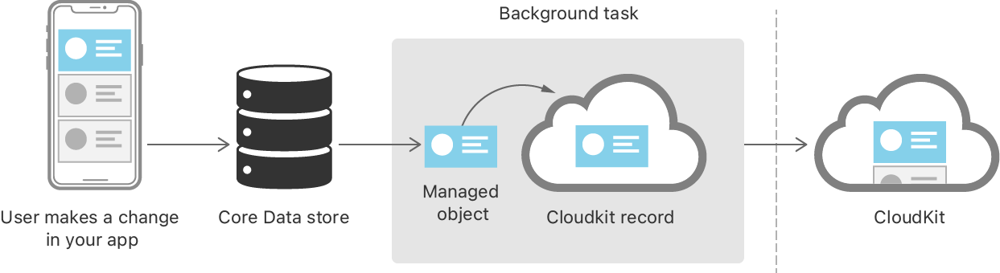
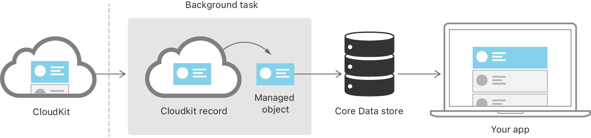
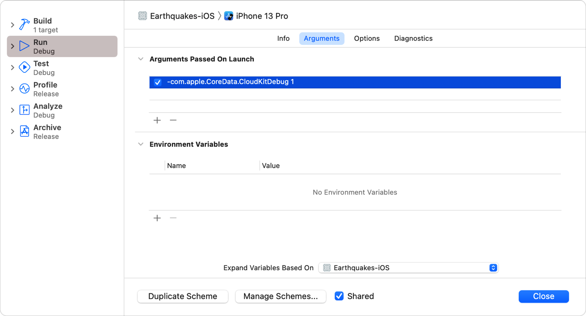

> Navigation: [Technologies](../technologies.md) · [Core Data](../coredata.md) · [Mirroring a Core Data store with CloudKit](mirroring-a-core-data-store-with-cloudkit.md)

# Syncing a Core Data Store with CloudKit

<sub>Article</sub>

Synchronize objects between devices, and handle store changes in the user interface.

## Overview

Once you set up your Xcode project (see [Setting Up Core Data with CloudKit](setting-up-core-data-with-cloudkit.md)) and initialize your development schema (see [Creating a Core Data Model for CloudKit](creating-a-core-data-model-for-cloudkit.md)), you’re ready to sync a Core Data store to CloudKit.

### Run Your App and Create Managed Object Instances

Run your app and begin creating [NSManagedObject](nsmanagedobject.md) instances. The objects automatically synchronize with the CloudKit database and propagate to other devices logged into the same iCloud account. The tasks that send changes to the cloud and receive remote changes in the local store happen on the system in the background. You don’t need to add any code to your project to synchronize records across devices.

It can be helpful to think of this process as similar to the water cycle. Water evaporates up and rains down on a natural cadence. Similarly, changes move from Core Data up to CloudKit and across to other devices on a natural rhythm within the system event loop.

Generally, you can expect data to synchronize a local change within about a minute of the change. Core Data also occasionally syncs CloudKit data in scenarios such as when the app hasn’t synced in a long time.

### Upload Core Data Changes to CloudKit

When the user makes a change on one device, Core Data uploads the change to CloudKit before sending it to the user’s other devices.



First, the user creates, updates, or deletes a managed object, such as adding a post or editing a tag. When its managed object context saves changes to the store, Core Data creates a background task for the system to convert the [NSManagedObject](nsmanagedobject.md) to a [CKRecord](../cloudkit/ckrecord.md). The system executes the task, creating the record and uploading it to CloudKit.

For more information about background tasks, see [UIApplication](../uikit/uiapplication.md).

### Download CloudKit Changes into Core Data

After CloudKit receives a change and saves it to the CloudKit store, it notifies the user’s other devices about the change.



First, CloudKit periodically sends push notifications to other devices on a user’s account. Then, on each device, the system creates a background task to download all of the changed records since the last fetch and converts them into instances of [NSManagedObject](nsmanagedobject.md). Finally, Core Data saves these managed objects into the local store.

For more information about push notifications, see [User Notifications](../usernotifications.md).

### Isolate the Current View from Store Changes

Consider what happens if a user deletes a record from their phone. This change uploads to CloudKit, and later downloads to a laptop and an iPad. The iPad’s current view may still show the record if the UI hasn’t updated with the changes yet. The user taps on the now-deleted record, which is no longer available in the store. This may lead to inconsistent representation of the record, such as missing data, in your UI.

For this reason, you need to isolate the current view from changes to the store by ensuring that the records the view expects continue to exist. Using query generations, you pin the persistent container’s [viewContext](nspersistentcontainer/viewcontext.md) to a specific generation of store data. This allows the context to fulfill faults — placeholder objects whose values haven’t yet been fetched — that existed at the time the view loaded, even if the store changes underneath.

Pin a context to a query generation before its first read from the store.

```swift
try? persistentContainer.viewContext.setQueryGenerationFrom(.current)
```

Any time you save, merge, or reset the context, it automatically updates its pin to the current query generation.

For more information about faults, see [Faulting and Uniquing](https://developer.apple.com/library/archive/documentation/Cocoa/Conceptual/CoreData/FaultingandUniquing.html#//apple_ref/doc/uid/TP40001075-CH18).

For more information about query generations, see [Accessing data when the store changes](accessing-data-when-the-store-changes.md).

### Integrate Store Changes Relevant to the Current View

Your app receives remote change notifications when the local store updates from CloudKit. However, it’s unnecessary to update your UI in response to every notification, because some changes may not be relevant to the current view.

Analyze the persistent history to determine whether the changes are relevant to the current view before consuming them in the user interface. Inspect the details of each transaction, such as the entity name, its updated properties, and the type of change, to decide whether to act.

For more information about persistent history tracking, see [Consuming relevant store changes](consuming-relevant-store-changes.md).

### Debug Errors in Core Data with CloudKit

Most errors, like those that result from a network failure or a user not being signed in, are transient and don’t require action. You can choose the level of detail that Core Data with CloudKit logs to the system log.

Choose Product \> Scheme \> Edit Scheme. Select an action such as Run, and select the Arguments tab. Pass the `com.apple.CoreData.CloudKitDebug` user default setting with a debug level value as an argument to the application.



<sub>Screenshot showing passing the -com.apple.CoreData.CloudKitDebug 3 user default setting as a launch argument in the scheme editor.</sub>

Higher argument values produce more information; start at `1` and increase if you need more detail. For more information about handling errors, see [Troubleshooting Core Data](https://developer.apple.com/library/archive/documentation/Cocoa/Conceptual/CoreData/TroubleshootingCoreData.html#//apple_ref/doc/uid/TP40001075-CH26).

If you observe persistent errors that don’t automatically recover, file a bug. For more information about bug reporting, see [Submitting Bugs and Feedback](https://developer.apple.com/bug-reporting/).

### Inspect Logs to See What Happened

If Core Data with CloudKit doesn’t appear to be syncing, confirm that you’re testing on two unlocked devices logged into the same iCloud account, with good wireless internet connections.

Push notifications may get dropped or deferred, so don’t rely on them for testing. Watch system logs to observe the status and result of expected activity. Run the `log stream` command from the terminal, filtering by process and container ID. If the logs don’t include the operation, your push may have been dropped. Check the originating device for export activity.

Filter CloudKit logs to see operations on the `cloudd` process for your container.

```swift
$ log stream --info --debug --predicate 'process = "cloudd" and message
contains[cd] "containerID=com.mycontainer"'
```

Filter Core Data logs to see information about the mirroring delegate’s setup, exports, and imports for your process.

```swift
$ log stream --info --debug --predicate 'process = "myprocess" and 
(subsystem = "com.apple.coredata" or subsystem = "com.apple.cloudkit")'
```

Or monitor both CloudKit and Core Data logs at the same time.

```swift
$ log stream --info --debug --predicate '(process = "myprocess" and
(subsystem = "com.apple.coredata" or subsystem = "com.apple.cloudkit")) or
(process = "cloudd" and message contains[cd] "container=com.mycontainer")'
```

For more information about logging, see [Viewing Log Messages](../os/viewing-log-messages.md).

## See Also

### Configuring CloudKit Mirroring

- [Setting Up Core Data with CloudKit](setting-up-core-data-with-cloudkit.md) — Set up the classes and capabilities that sync your store to CloudKit.
- [Creating a Core Data Model for CloudKit](creating-a-core-data-model-for-cloudkit.md) — Design a CloudKit-compatible data model and initialize your CloudKit schema.
- [Reading CloudKit Records for Core Data](reading-cloudkit-records-for-core-data.md) — Access CloudKit records created from Core Data managed objects.
