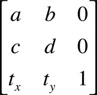

> Navigation: [Technologies](../technologies.md) · [Core Graphics](../coregraphics.md)

# CGAffineTransformMake(_:_:_:_:_:_:)

<sub>Function</sub>

Returns an affine transformation matrix constructed from values you provide.

<sub>iOS, iPadOS, Mac Catalyst, macOS, tvOS, visionOS, watchOS</sub>

```swift
func CGAffineTransformMake(_ a: CGFloat, _ b: CGFloat, _ c: CGFloat, _ d: CGFloat, _ tx: CGFloat, _ ty: CGFloat) -> CGAffineTransform
```

## Parameters

- `a` — The value at position [1,1] in the matrix.

- `b` — The value at position [1,2] in the matrix.

- `c` — The value at position [2,1] in the matrix.

- `d` — The value at position [2,2] in the matrix.

- `tx` — The value at position [3,1] in the matrix.

- `ty` — The value at position [3,2] in the matrix.

## Return Value

A new affine transform matrix constructed from the values you specify.

## Discussion

This function creates a `CGAffineTransform` structure that represents a new affine transformation matrix, which you can use (and reuse, if you want) to transform a coordinate system. The matrix takes the following form:



Because the third column is always `(0,0,1)`, the `CGAffineTransform` data structure returned by this function contains values for only the first two columns.

If you want only to transform an object to be drawn, it is not necessary to construct an affine transform to do so. The most direct way to transform your drawing is by calling the appropriate `CGContext` function to adjust the current transformation matrix. For a list of functions, see [CGContext](cgcontext.md).

## See Also

### Creating an Affine Transformation Matrix

- [CGAffineTransformMakeRotation](<cgaffinetransformmakerotation(__).md>) — Returns an affine transformation matrix constructed from a rotation value you provide.
- [CGAffineTransformMakeScale](<cgaffinetransformmakescale(____).md>) — Returns an affine transformation matrix constructed from scaling values you provide.
- [CGAffineTransformMakeTranslation](<cgaffinetransformmaketranslation(____).md>) — Returns an affine transformation matrix constructed from translation values you provide.
