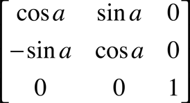
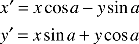

> Navigation: [Technologies](../technologies.md) · [Core Graphics](../coregraphics.md)

# CGAffineTransformMakeRotation(_:)

<sub>Function</sub>

Returns an affine transformation matrix constructed from a rotation value you provide.

<sub>iOS, iPadOS, Mac Catalyst, macOS, tvOS, visionOS, watchOS</sub>

```swift
func CGAffineTransformMakeRotation(_ angle: CGFloat) -> CGAffineTransform
```

## Parameters

- `angle` — The angle, in radians, by which this matrix rotates the coordinate system axes. In iOS, a positive value specifies counterclockwise rotation and a negative value specifies clockwise rotation. In macOS, a positive value specifies clockwise rotation and a negative value specifies counterclockwise rotation.

## Return Value

A new affine transformation matrix.

## Discussion

This function creates a `CGAffineTransform` structure, which you can use (and reuse, if you want) to rotate a coordinate system. The matrix takes the following form:



The actual direction of rotation is dependent on the coordinate system orientation of the target platform, which is different in iOS and macOS. Because the third column is always `(0,0,1)`, the `CGAffineTransform` data structure returned by this function contains values for only the first two columns.

These are the resulting equations used to apply the rotation to a point (x, y):



If you want only to rotate an object to be drawn, it is not necessary to construct an affine transform to do so. The most direct way to rotate your drawing is by calling the function [CGContextRotateCTM](<cgcontext/rotate(by_).md>).

## See Also

### Creating an Affine Transformation Matrix

- [CGAffineTransformMake](<cgaffinetransformmake(____________).md>) — Returns an affine transformation matrix constructed from values you provide.
- [CGAffineTransformMakeScale](<cgaffinetransformmakescale(____).md>) — Returns an affine transformation matrix constructed from scaling values you provide.
- [CGAffineTransformMakeTranslation](<cgaffinetransformmaketranslation(____).md>) — Returns an affine transformation matrix constructed from translation values you provide.
