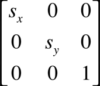
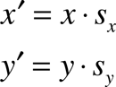

> Navigation: [Technologies](../technologies.md) · [Core Graphics](../coregraphics.md)

# CGAffineTransformMakeScale(_:_:)

<sub>Function</sub>

Returns an affine transformation matrix constructed from scaling values you provide.

<sub>iOS, iPadOS, Mac Catalyst, macOS, tvOS, visionOS, watchOS</sub>

```swift
func CGAffineTransformMakeScale(_ sx: CGFloat, _ sy: CGFloat) -> CGAffineTransform
```

## Parameters

- `sx` — The factor by which to scale the x-axis of the coordinate system.

- `sy` — The factor by which to scale the y-axis of the coordinate system.

## Return Value

A new affine transformation matrix.

## Discussion

This function creates a `CGAffineTransform` structure, which you can use (and reuse, if you want) to scale a coordinate system. The matrix takes the following form:



Because the third column is always `(0,0,1)`, the `CGAffineTransform` data structure returned by this function contains values for only the first two columns.

These are the resulting equations used to scale the coordinates of a point (x,y):



If you want only to scale an object to be drawn, it is not necessary to construct an affine transform to do so. The most direct way to scale your drawing is by calling the function [CGContextScaleCTM](<cgcontext/scaleby(x_y_).md>).

## See Also

### Creating an Affine Transformation Matrix

- [CGAffineTransformMake](<cgaffinetransformmake(____________).md>) — Returns an affine transformation matrix constructed from values you provide.
- [CGAffineTransformMakeRotation](<cgaffinetransformmakerotation(__).md>) — Returns an affine transformation matrix constructed from a rotation value you provide.
- [CGAffineTransformMakeTranslation](<cgaffinetransformmaketranslation(____).md>) — Returns an affine transformation matrix constructed from translation values you provide.
