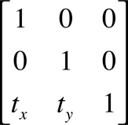
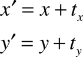

> Navigation: [Technologies](../technologies.md) · [Core Graphics](../coregraphics.md)

# CGAffineTransformMakeTranslation(_:_:)

<sub>Function</sub>

Returns an affine transformation matrix constructed from translation values you provide.

<sub>iOS, iPadOS, Mac Catalyst, macOS, tvOS, visionOS, watchOS</sub>

```swift
func CGAffineTransformMakeTranslation(_ tx: CGFloat, _ ty: CGFloat) -> CGAffineTransform
```

## Parameters

- `tx` — The value by which to move the x-axis of the coordinate system.

- `ty` — The value by which to move the y-axis of the coordinate system.

## Return Value

A new affine transform matrix.

## Discussion

This function creates a `CGAffineTransform` structure. which you can use (and reuse, if you want) to move a coordinate system. The matrix takes the following form:



Because the third column is always `(0,0,1)`, the `CGAffineTransform` data structure returned by this function contains values for only the first two columns.

These are the resulting equations used to apply the translation to a point (x,y):



If you want only to move the location where an object is drawn, it is not necessary to construct an affine transform to do so. The most direct way to move your drawing is by calling the function [CGContextTranslateCTM](<cgcontext/translateby(x_y_).md>).

## See Also

### Creating an Affine Transformation Matrix

- [CGAffineTransformMake](<cgaffinetransformmake(____________).md>) — Returns an affine transformation matrix constructed from values you provide.
- [CGAffineTransformMakeRotation](<cgaffinetransformmakerotation(__).md>) — Returns an affine transformation matrix constructed from a rotation value you provide.
- [CGAffineTransformMakeScale](<cgaffinetransformmakescale(____).md>) — Returns an affine transformation matrix constructed from scaling values you provide.
