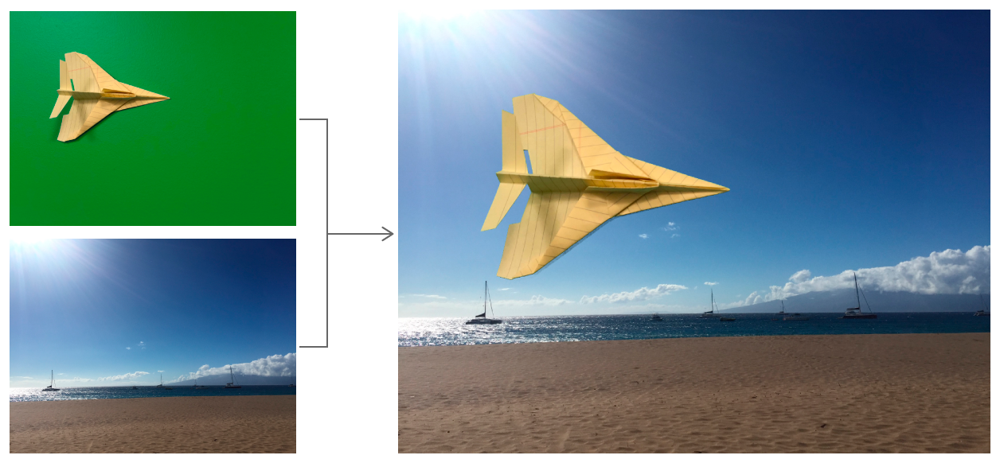
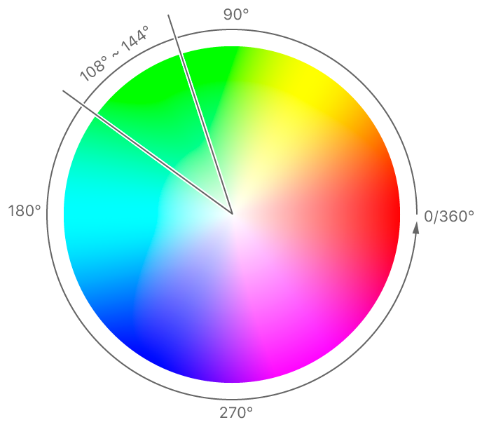

> Navigation: [Technologies](../technologies.md) · [Core Image](../coreimage.md)

# Applying a Chroma Key Effect

<sub>Article</sub>

Replace a color in one image with the background from another.

## Overview

Use the chroma key effect, also known as bluescreening or greenscreening, to replace the background of an image by setting a color or range of colors to transparent.



<sub>The chroma key effect replaces the greenscreen background behind a paper airplane foreground with the image of a beach landscape to show paper airplane flying on a beach.</sub>

You apply this technique in three steps:

1. Create a cube map for the [+ colorCubeFilter](<cifilter-swift.class/colorcube().md>) filter to determine which colors to set transparent.
2. Apply the [+ colorCubeFilter](<cifilter-swift.class/colorcube().md>) filter to the image to make pixels transparent.
3. Use the [+ sourceOverCompositingFilter](<cifilter-swift.class/sourceovercompositing().md>) filter to place the image over the background image.

### Create a Cube Map

A color cube is a 3D color-lookup table that uses the R, G, and B values from the image to lookup a color. To filter out green from the image, create a color map with the green portion set to transparent pixels.

A simple way to construct a color map with these characteristics is to model colors using an HSV (hue-saturation-value) representation. HSV represents hue as an angle around the central axis, as in a color wheel. In order to make a chroma key color from the source image transparent, set its lookup table value to `0` when its hue is in the correct color range.



The value for green in the source image falls within the slice beginning at 108° (`108/360` = `0.3`) and ending at 144° (`144/360` = `0.4`). You’ll set transparency to `0` for this range in the color cube.

To create the color cube, iterate across all values of red, green, and blue, entering a value of 0 for combinations that the filter wiill set to transparent. Refer to the numbered list for details on each step to the routine.

```swift
- (CIFilter<CIColorCube> *) chromaKeyFilterHuesFrom:(CGFloat)minHue to:(CGFloat)maxHue {
    // 1
    const unsigned int size = 64;
    const size_t cubeDataSize = size * size * size * 4;
    NSMutableData* cubeData = [[NSMutableData alloc] initWithCapacity:(cubeDataSize * sizeof(float))];
    
    // 2
    for (int z = 0; z < size; z++) {
        CGFloat blue = ((double)z)/(size-1);
        for (int y = 0; y < size; y++) {
            CGFloat green = ((double)y)/(size-1);
            for (int x = 0; x < size; x++) {
                CGFloat red = ((double)x)/(size-1);
                
                // 3
                CGFloat hue = [self hueFromRed:red green:green blue:blue];
                float alpha = (hue >= minHue && hue <= maxHue) ? 0 : 1;
                // 4
                float premultipliedRed = red * alpha;
                float premultipliedGreen = green * alpha;
                float premultipliedBlue = blue * alpha;
                [cubeData appendBytes:&premultipliedRed length:sizeof(float)];
                [cubeData appendBytes:&premultipliedGreen length:sizeof(float)];
                [cubeData appendBytes:&premultipliedBlue length:sizeof(float)];
                [cubeData appendBytes:&alpha length:sizeof(float)];
            }
        }
    }

    // 5
    CIFilter<CIColorCube> *colorCubeFilter = CIFilter.colorCubeFilter;
    colorCubeFilter.cubeDimension = size;
    colorCubeFilter.cubeData = cubeData;
    return colorCubeFilter;
}
```

1. Allocate memory. The color cube has three dimensions, each with four elements of data (RGBA).
2. Use a for-loop to iterate through each color combination of red, green, and blue, simulating a color gradient.
3. Convert RGB to HSV, as in the `hueFromRed` function. Even though the color cube exists in RGB color space, it’s easier to isolate and remove color based on hue. Input `0` for green hues to indicate complete removal; use `1` for other hues to leave those colors intact. To specify green as a hue value, convert its angle in the hue pie chart to a range of `0` to `1`. The green in the sample image has hue between `0.3` (`108` out of `360` degrees`)` and `0.4` (`144` out of `360` degrees). Your shade of green may differ, so adjust the range accordingly.
4. The [+ colorCubeFilter](<cifilter-swift.class/colorcube().md>) filter requires premultiplied alpha values, meaning that the values in the lookup table have their transparency baked into their stored entries rather than applied when accessed.
5. Create a [+ colorCubeFilter](<cifilter-swift.class/colorcube().md>) filter with the cube data.

> [!note] Note
> The framework doesn’t have built-in direct conversion between color spaces, but you can access the hue of a [UIColor](../uikit/uicolor.md) created with RGB values. Create a [UIColor](../uikit/uicolor.md) from the raw RGB values and then read the hue from it.

```swift
- (CGFloat) hueFromRed:(CGFloat)red green:(CGFloat)green blue:(CGFloat)blue {
    UIColor* color = [UIColor colorWithRed:red green:green blue:blue alpha:1];
    
    CGFloat hue, saturation, brightness;
    [color getHue:&hue saturation:&saturation brightness:&brightness alpha:nil];
    
    return hue;
}
```

### Remove Green from the Source Image

Apply the color cube filter to a foreground image by setting its `inputImage` parameter and then accessing the `outputImage`.

```swift
CIFilter<CIColorCube>* chromaKeyFilter = [self chromaKeyFilterHuesFrom:0.3 to:0.4];
chromaKeyFilter.inputimage = foregroundCIImage
CIImage* sourceCIImageWithoutBackground = chromaKeyFilter.outputImage;
```

The output image contains the foreground with all green pixels made transparent.

The filter passes through each pixel in the input image, looks up its color in the color cube, and replaces the source color with the color in the color cube at the nearest position.

### Composite over a Background Image

Chain a [+ sourceOverCompositingFilter](<cifilter-swift.class/sourceovercompositing().md>) filter to the color cube filter to composite a background image to the greenscreened output. The transparency in the colorcube-filtered image allows the composited background image to show through.

```swift
CIFilter<CICompositeOperation> *compositor = CIFilter.sourceOverCompositingFilter
compositor.inputImage = sourceCIImageWithoutBackground
compositor.backgroundImage = backgroundCIImage
CIImage* compositedCIImage = compositor.outputImage;
```

The foreground of the source image now appears in front of the background landscape without any trace of the green screen.

## See Also

### Filter Recipes

- [Selectively Focusing on an Image](selectively-focusing-on-an-image.md) — Focus on a part of an image by applying Gaussian blur and gradient masks.
- [Customizing Image Transitions](customizing-image-transitions.md) — Transition between images in creative ways using Core Image filters.
- [Simulating Scratchy Analog Film](simulating-scratchy-analog-film.md) — Degrade the quality of an image to make it look like dated, analog film.
