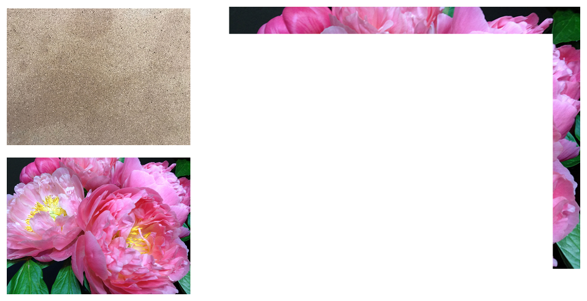

> Navigation: [Technologies](../../technologies.md) · [Core Image](../../coreimage.md) · [CIBlendKernel](../ciblendkernel.md)

# sourceOut

<sub>Type Property</sub>

A blend kernel that uses the foreground image to define what to take out of the background image.

<sub>iOS, iPadOS, Mac Catalyst, macOS, tvOS, visionOS</sub>

```swift
class var sourceOut: CIBlendKernel { get }
```

## Discussion



## See Also

### Builtin Blend Kernels

- [clear](clear.md) — A blend kernel that returns a clear color.
- [color](color.md) — A blend kernel that uses the luminance values of the background with the hue and saturation values of the foreground image.
- [colorBurn](colorburn.md) — A blend kernel that darkens the background image samples to reflect the foreground image samples.
- [colorDodge](colordodge.md) — A blend kernel that brightens the background image samples to reflect the foreground image samples.
- [componentAdd](componentadd.md) — A blend kernel that adds color components to achieve a brightening effect.
- [componentMax](componentmax.md) — A blend kernel that creates an image using the maximum values of two input images.
- [componentMin](componentmin.md) — A blend kernel that creates an image using the minimum values of two input images.
- [componentMultiply](componentmultiply.md) — A blend kernel that multiplies the color components of its input images.
- [darken](darken.md) — A blend kernel that creates an image using the darker values of two input images.
- [darkerColor](darkercolor.md) — A blend kernel that creates an image using the darker color of two input images.
- [destination](destination.md) — A blend kernel that returns the background input image.
- [destinationAtop](destinationatop.md) — A blend kernel that places the background over the foreground and crops based on the visibility of the foreground.
- [destinationIn](destinationin.md) — A blend kernel that places the background over the foreground and crops based on the visibility of both.
- [destinationOut](destinationout.md) — A blend kernel that uses the background image to define what to take out of the foreground image.
- [destinationOver](destinationover.md) — A blend kernel that places the background image over the input foreground image.
