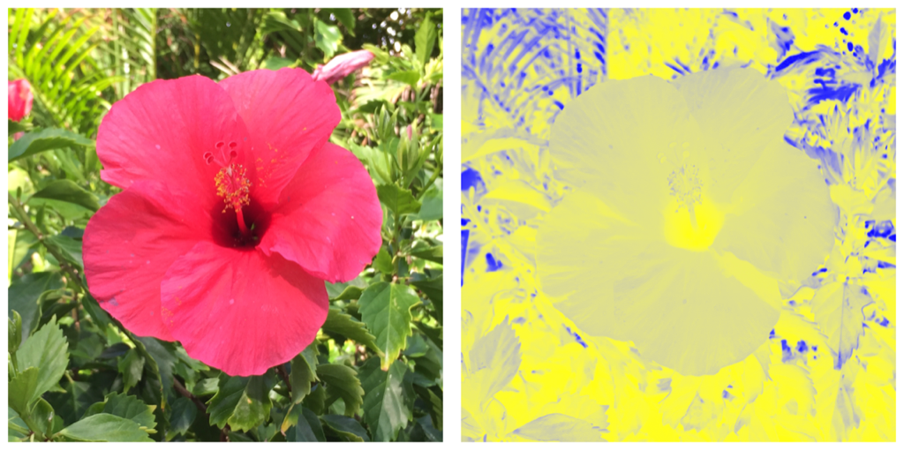

> Navigation: [Technologies](../technologies.md) · [Core Image](../coreimage.md)

# CIFilter

<sub>Class</sub>

An image processor that produces an image by manipulating one or more input images or by generating new image data.

<sub>iOS, iPadOS, Mac Catalyst, macOS, tvOS, visionOS</sub>

```swift
class CIFilter
```

## Overview

The `CIFilter` class produces a [CIImage](ciimage.md) object as output. Typically, a filter takes one or more images as input. Some filters, however, generate an image based on other types of input parameters. The par`CIFilter` swift.class` object are set and retrieved through the use of key-value pairs.

You use the `CIFilter` object in conjunction with other Core Image classes, such as  `CIImage`, [CIContext](cicontext.md), and [CIColor](cicolor.md), to take advantage of the built-in Core Image filters when processing images, creating filter generators, or writing custom filters.

`CIFilter` objects are mutable, and thus cannot be shared safely among threads. Each thread must create its own `CIFilter` objects, but you can pass a filter’s immutable input and output `CIImage` objects between threads.

To get a quick overview of how to set up and use Core Image filters, see [Core Image Programming Guide](https://developer.apple.com/library/archive/documentation/GraphicsImaging/Conceptual/CoreImaging/ci_intro/ci_intro.html#//apple_ref/doc/uid/TP30001185).

### Create type-safe filters

Core Image provides methods that create type-safe `CIFilter` instances. Use these filters to avoid run-time errors that can occur when relying on Core Image’s string-based API.

To use the type-safe API, import `CoreImage.CIFilterBuiltins`:

```swift
#import <CoreImage/CoreImage.h>
#import <CoreImage/CIFilterBuiltins.h>
```

The type-safe approach returns a non-optional filter. Because the returned filter conforms to the relevant protocol—for example, [CIFalseColor](cifalsecolor.md) in the case of [+ falseColorFilter](<cifilter-swift.class/falsecolor().md>)—the parameters are available as properties. The following creates and applies a false color filter:

```swift
- (CIImage *) falseColorImage:(CIImage*) inputImage {
    CIFilter<CIFalseColor> *falseColorFilter = CIFilter.falseColorFilter;
    falseColorFilter.color0 = [CIColor colorWithRed:1 green:1 blue:0];
    falseColorFilter.color1 = [CIColor colorWithRed:0 green:0 blue:1];
    falseColorFilter.inputImage = inputImage;
    return falseColorFilter.outputImage;
}
```

The false color filter maps luminance to a color ramp of two colors:



<sub>Two photographs showing a flower. The image on the left shows the original version of the flower. The image on the right shows the false color version of the flower.</sub>

### Subclassing notes

You can subclass `CIFilter` in order to create custom filter effects:

- By chaining together two or more built-in Core Image filters
- By using an image-processing kernel that you write

Regardless of whether your subclass provides its effect by chaining filters or implementing its own kernel, you should:

- Declare any input parameters as properties whose names are prefixed with `input`, such as `inputImage`.
- Override the [- setDefaults](<cifilter-swift.class/setdefaults().md>) methods to provide default values for any input parameters you’ve declared.
- Implement an `outputImage` method to create a new `CIImage` with your filter’s effect.

The `CIFilter` class automatically manages input parameters when archiving, copying, and deallocating filters. For this reason, your subclass must obey the following guidelines to ensure proper behavior:

- Store input parameters in instance variables whose names are prefixed with `input`.

Don’t use auto-synthesized instance variables, because their names are automatically prefixed with an underscore. Instead, synthesize the property manually. For example:

`@synthesize inputMyParameter;`

- If using manual reference counting, don’t release input parameter instance variables in your [dealloc](../objectivec/nsobject-swift.class/dealloc.md) method implementation. The [dealloc](../objectivec/nsobject-swift.class/dealloc.md) implementation in the `CIFilter` class uses [Key-value coding](https://developer.apple.com/library/archive/documentation/General/Conceptual/DevPedia-CocoaCore/KeyValueCoding.html#//apple_ref/doc/uid/TP40008195-CH25) to automatically set the values of all input parameters to `nil`.

## Relationships

- **Inherits From**: [NSObject](../objectivec/nsobject-swift.class.md)

- **Inherited By**: [CIRAWFilter](cirawfilter.md)

- **Conforms To**: [CVarArg](../swift/cvararg.md), [CustomDebugStringConvertible](../swift/customdebugstringconvertible.md), [CustomStringConvertible](../swift/customstringconvertible.md), [Equatable](../swift/equatable.md), [Hashable](../swift/hashable.md), [NSCoding](../foundation/nscoding.md), [NSCopying](../foundation/nscopying.md), [NSObjectProtocol](../objectivec/nsobjectprotocol.md), [NSSecureCoding](../foundation/nssecurecoding.md)

## Topics

### Creating a filter

- [+ filterWithName:](<cifilter-swift.class/init(name_).md>) — Creates a [CIFilter](cifilter-swift.class.md) object for a specific kind of filter.
- [init(name:withInputParameters:)](<cifilter-swift.class/init(name_withinputparameters_).md>) — Creates a [CIFilter](cifilter-swift.class.md) object for a specific kind of filter and initializes the input values.

### Configuring type-safe filters

- [CIFilterProtocol](cifilterprotocol.md) — The properties you use to configure a Core Image filter.
- [Blur Filters](blur-filters.md) — Apply blurs, simulate motion and zoom effects, reduce noise, and erode and dilate image regions.
- [Color Adjustment Filters](color-adjustment-filters.md) — Apply color transformations, including exposure, hue, and tint adjustments.
- [Color Effect Filters](color-effect-filters.md) — Apply color effects, including photo effects, dithering, and color maps.
- [Composite Operations](composite-operations.md) — Composite images by using a range of blend modes and compositing operators.
- [Convolution Filters](convolution-filters.md) — Produce effects such as blurring, sharpening, edge detection, translation, and embossing.
- [Distortion Filters](distortion-filters.md) — Apply distortion to images.
- [Generator Filters](generator-filters.md) — Generate barcode, geometric, and special-effect images.
- [Geometry Adjustment Filters](geometry-adjustment-filters.md) — Translate, scale, and rotate images in 2D and 3D.
- [Gradient Filters](gradient-filters.md) — Generate linear and radial gradients.
- [Halftone Effect Filters](halftone-effect-filters.md) — Simulate monochrome and CMYK halftone screens.
- [Reduction Filters](reduction-filters.md) — Create statistical information about an image.
- [Sharpening Filters](sharpening-filters.md) — Apply sharpening to images.
- [Stylizing Filters](stylizing-filters.md) — Create stylized versions of images by applying effects including pixelation and line overlays.
- [Tile Effect Filters](tile-effect-filters.md) — Produce tiled images from source images.
- [Transition Filters](transition-filters.md) — Transition between two images by using effects including page curl and swipe.

### Accessing registered filters

- [+ filterNamesInCategories:](<cifilter-swift.class/filternames(incategories_).md>) — Returns an array of all published filter names that match all the specified categories.
- [+ filterNamesInCategory:](<cifilter-swift.class/filternames(incategory_).md>) — Returns an array of all published filter names in the specified category.

### Registering a filter

- [+ registerFilterName:constructor:classAttributes:](<cifilter-swift.class/registername(__constructor_classattributes_).md>) — Publishes a custom filter that is not packaged as an image unit.

### Getting filter parameters and attributes

- [name](cifilter-swift.class/name.md) — A name associated with a filter.
- [enabled](cifilter-swift.class/isenabled.md) — A Boolean value that determines whether the filter is enabled. Animatable.
- [attributes](cifilter-swift.class/attributes.md) — A dictionary of key-value pairs that describe the filter.
- [inputKeys](cifilter-swift.class/inputkeys.md) — The names of all input parameters to the filter.
- [outputKeys](cifilter-swift.class/outputkeys.md) — The names of all output parameters from the filter.
- [outputImage](cifilter-swift.class/outputimage.md) — Returns a [CIImage](ciimage.md) object that encapsulates the operations configured in the filter.

### Setting default values

- [- setDefaults](<cifilter-swift.class/setdefaults().md>) — Sets all input values for a filter to default values.

### Applying a filter

- [- apply:arguments:options:](<cifilter-swift.class/apply(__arguments_options_).md>) — Produces a [CIImage](ciimage.md) object by applying arguments to a kernel function and using options to control how the kernel function is evaluated.

### Getting localized information for registered filters

- [+ localizedNameForFilterName:](<cifilter-swift.class/localizedname(forfiltername_).md>) — Returns the localized name for the specified filter name.
- [+ localizedNameForCategory:](<cifilter-swift.class/localizedname(forcategory_).md>) — Returns  the localized name for the specified filter category.
- [+ localizedDescriptionForFilterName:](<cifilter-swift.class/localizeddescription(forfiltername_).md>) — Returns the localized description of a filter for display in the user interface.
- [+ localizedReferenceDocumentationForFilterName:](<cifilter-swift.class/localizedreferencedocumentation(forfiltername_).md>) — Returns the location of the localized reference documentation that describes the filter.

### Creating a configuration view for a filter

- [- viewForUIConfiguration:excludedKeys:](<cifilter-swift.class/view(foruiconfiguration_excludedkeys_).md>) — Returns a filter view for the filter.

### Applying system tone mapping modes

- [CIDynamicRangeOption](cidynamicrangeoption.md) — An enum string type that your code can use to select different System Tone Mapping modes.

### Constants

- [Filter Attribute Keys](filter-attribute-keys.md) — Attributes for a filter and its parameters.
- [Data Type Attributes](data-type-attributes.md) — Numeric data types.
- [Vector Quantity Attributes](vector-quantity-attributes.md) — Vector data types.
- [Color Attribute Keys](color-attribute-keys.md) — Color types.
- [Image Attribute Keys](image-attribute-keys.md) — Image Types
- [Filter Category Keys](filter-category-keys.md) — Categories of filters.
- [Options for Applying a Filter](options-for-applying-a-filter.md) — Options that control the application of a custom Core Image filter.
- [User Interface Control Options](user-interface-control-options.md) — Sets of controls for various user scenarios.
- [User Interface Options](user-interface-options.md) — Keys or values for the size of the input parameter controls for a filter view.
- [Filter Parameter Keys](filter-parameter-keys.md) — Keys for input parameters to filters.
- [RAW Image Options](raw-image-options.md) — Options for creating a [CIFilter](cifilter-swift.class.md) object from RAW image data.

### Deprecated

- [init(CVPixelBuffer:properties:options:)](<cifilter-swift.class/init(cvpixelbuffer_properties_options_)-7qpsv.md>) — Creates a filter from a Core Video pixel buffer. _(deprecated)_
- [+ filterWithImageData:options:](<cifilter-swift.class/init(imagedata_options_).md>) — Creates a filter that allows the processing of RAW images. _(deprecated)_
- [+ filterWithImageURL:options:](<cifilter-swift.class/init(imageurl_options_).md>) — Creates a filter that allows the processing of RAW images. _(deprecated)_
- [CIRAWFilterOption](cirawfilteroption.md) _(deprecated)_
- [+ serializedXMPFromFilters:inputImageExtent:](<cifilter-swift.class/serializedxmp(from_inputimageextent_).md>) — Serializes filter parameters into XMP form that is suitable for embedding in an image. _(deprecated)_
- [+ filterArrayFromSerializedXMP:inputImageExtent:error:](<cifilter-swift.class/filterarray(fromserializedxmp_inputimageextent_error_).md>) — Returns an array of filter objects de-serialized from XMP data. _(deprecated)_
- [+ supportedRawCameraModels](<cifilter-swift.class/supportedrawcameramodels().md>) _(deprecated)_

### Type methods

- [+ areaAlphaWeightedHistogramFilter](<cifilter-swift.class/areaalphaweightedhistogram().md>)
- [+ areaBoundsRedFilter](<cifilter-swift.class/areaboundsred().md>)
- [+ maximumScaleTransformFilter](<cifilter-swift.class/maximumscaletransform().md>)
- [+ toneMapHeadroomFilter](<cifilter-swift.class/tonemapheadroom().md>)

### Initializers

- [init(coder:)](<cifilter-swift.class/init(coder_).md>)
- [+ filterWithCVPixelBuffer:properties:options:](<cifilter-swift.class/init(cvpixelbuffer_properties_options_)-69695.md>) — Returns a CIFilter that will in turn return a properly processed CIImage as “outputImage”. _(deprecated)_
- [+ filterWithName:withInputParameters:](<cifilter-swift.class/init(name_parameters_).md>) — Creates a new filter of type ‘name’. The filter’s input parameters are set from the dictionary of key-value pairs. On OSX, any of the filter input parameters not specified in the dictionary will be undefined. On iOS, any of the filter input parameters not specified in the dictionary will be set to default values.

### Type Methods

- [+ areaAverageMaximumRedFilter](<cifilter-swift.class/areaaveragemaximumred().md>)
- [+ blurredRoundedRectangleGeneratorFilter](<cifilter-swift.class/blurredroundedrectanglegenerator().md>)
- [+ distanceGradientFromRedMaskFilter](<cifilter-swift.class/distancegradientfromredmask().md>)
- [+ roundedQRCodeGeneratorFilter](<cifilter-swift.class/roundedqrcodegenerator().md>)
- [+ signedDistanceGradientFromRedMaskFilter](<cifilter-swift.class/signeddistancegradientfromredmask().md>)
- [+ systemToneMapFilter](<cifilter-swift.class/systemtonemap().md>)

### Default Implementations

- [CIFilter Implementations](cifilter-swift.class/cifilter-implementations.md)

## See Also

### Filters

- [CIRAWFilter](cirawfilter.md) — A filter subclass that produces an image by manipulating RAW image sensor data from a digital camera or scanner.
- [CIColor](cicolor.md) — The Core Image class that defines a color object.
- [CIVector](civector.md) — The Core Image class that defines a vector object.
