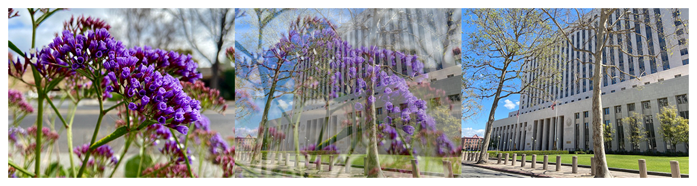

> Navigation: [Technologies](../../technologies.md) · [Core Image](../../coreimage.md) · [CIFilter](../cifilter-swift.class.md)

# accordionFoldTransition()

<sub>Type Method</sub>

Transitions by folding and crossfading an image to reveal the target image.

<sub>iOS, iPadOS, Mac Catalyst, macOS, tvOS, visionOS</sub>

```swift
class func accordionFoldTransition() -> any CIFilter & CIAccordionFoldTransition
```

## Return Value

The transition image.

## Discussion

This method applies the accordion fold transition filter to an image. The effect transitions from one image to another by unfolding and crossfading.

The accordion fold transition filter uses the following properties:

- **`inputImage`** — The starting image with the type [CIImage](../ciimage.md).
- **`targetImage`** — The ending image with the type [CIImage](../ciimage.md).
- **`time`** — A `float` representing the parametric time of the transition from start (at time 0) to end (at time 1) as an [NSNumber](../../foundation/nsnumber.md).
- **`numberOfFolds`** — A `float` representing the number of accordion folds as a [NSNumber](../../foundation/nsnumber.md).
- **`foldShadowAmount`** — A `float` representing the strength of the shadow as a [NSNumber](../../foundation/nsnumber.md).

The following code creates a filter that produces folds in the input image and fades to the target image:

```swift
func accordionFold(inputImage: CIImage, targetImage: CIImage) -> CIImage {
    let accordionFoldTransiton = CIFilter.accordionFoldTransition()
    accordionFoldTransiton.inputImage = inputImage
    accordionFoldTransiton.targetImage = targetImage
    accordionFoldTransiton.time = 0.5
    accordionFoldTransiton.numberOfFolds = 6
    accordionFoldTransiton.foldShadowAmount = 2
    return accordionFoldTransiton.outputImage!
}
```



<sub>Three photographs. In the photo on the left, multiple sets of small purple flowers are photographed close up with good lighting, and the background has a slight blur. In the photograph on the right is a tall city building with two trees directly in front of the building. In the center photo, a bar swipe transition is applied, resulting in a still photograph of the moving transition. The left photograph is overlaid on the right photo and slowly folding up to reveal the target image.</sub>

## See Also

### Filters

- [+ barsSwipeTransitionFilter](<barsswipetransition().md>) — Transitions between two images by removing rectangular portions of an image.
- [+ copyMachineTransitionFilter](<copymachinetransition().md>) — Simulates the effect of a copy machine scanner light to transiton between two images.
- [+ disintegrateWithMaskTransitionFilter](<disintegratewithmasktransition().md>) — Transitions between two images using a mask image.
- [+ dissolveTransitionFilter](<dissolvetransition().md>) — Transitions between two images with a fade effect.
- [+ flashTransitionFilter](<flashtransition().md>) — Creates a flash of light to transition between two images.
- [+ modTransitionFilter](<modtransition().md>) — Transitions between two images by applying irregularly shaped holes.
- [+ pageCurlTransitionFilter](<pagecurltransition().md>) — Simulates the curl of a page, revealing the target image.
- [+ pageCurlWithShadowTransitionFilter](<pagecurlwithshadowtransition().md>) — Simulates the curl of a page, revealing the target image with added shadow.
- [+ rippleTransitionFilter](<rippletransition().md>) — Simulates a ripple in a pond to transiton from one image to another.
- [+ swipeTransitionFilter](<swipetransition().md>) — Gradually transitions from one image to another with a swiping motion.
