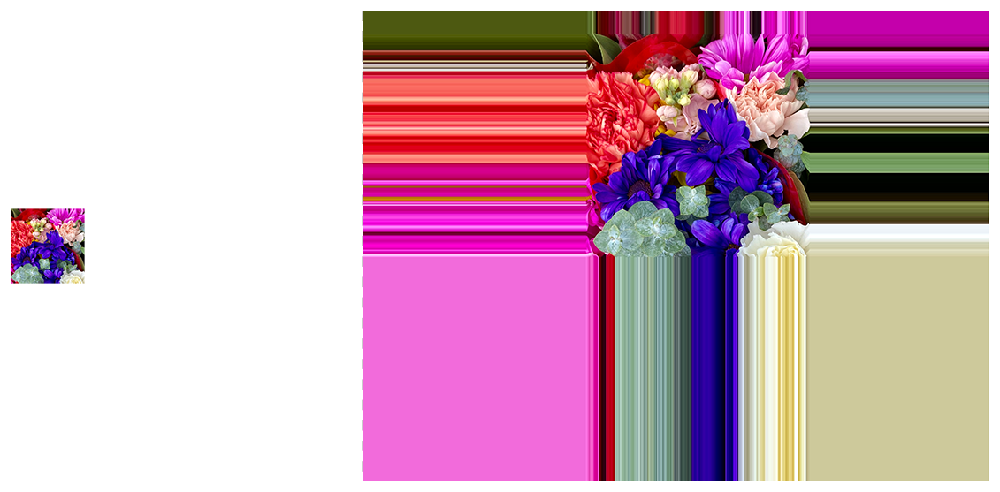

> Navigation: [Technologies](../../technologies.md) · [Core Image](../../coreimage.md) · [CIFilter](../cifilter-swift.class.md)

# affineClamp()

<sub>Type Method</sub>

Performs a transform on the image and extends the image edges to infinity.

<sub>iOS, iPadOS, Mac Catalyst, macOS, tvOS, visionOS</sub>

```swift
class func affineClamp() -> any CIFilter & CIAffineClamp
```

## Return Value

The tiled image.

## Discussion

This method applies the affine clamp filter to an image. This effect performs similarly to the affine transform filter except that it produces an infinite image. You can use this filter when you need to blur an image but you want to avoid a soft, black fringe along the edges.

The affine clamp filter uses the following properties:

- **`inputImage`** — An image with the type [CIImage](../ciimage.md).
- **`transform`** — A [CGAffineTransform](../../corefoundation/cgaffinetransform.md) to constrain to the image.

The following code creates a filter that produces a cropped image with colored edges to fill the rest of the image:

```swift
func affineClamp(inputImage: CIImage) -> CIImage {
    let affineClamp = CIFilter.affineClamp()
    affineClamp.inputImage = inputImage
    affineClamp.transform = CGAffineTransform(a: 1.0, b: 0.0, c: 0.0, d: 1.0, tx: 0.0, ty: 0.0)
    return affineClamp.outputImage!
}
```



<sub>Two photographs of a bouquet of multiple colorful flowers. The photo on the left is up close with good lighting and focus. In the photo on the right, an affine clamp filter is applied, resulting in the edges of the image colors stretching to the edge of the photo.</sub>

## See Also

### Filters

- [+ affineTileFilter](<affinetile().md>) — Performs a transform on the image and tiles the result.
- [+ eightfoldReflectedTileFilter](<eightfoldreflectedtile().md>) — Creates an eight-way reflected pattern.
- [+ fourfoldReflectedTileFilter](<fourfoldreflectedtile().md>) — Creates a four-way reflected pattern.
- [+ fourfoldRotatedTileFilter](<fourfoldrotatedtile().md>) — Creates a tiled image by rotating a tile in increments of 90 degrees.
- [+ fourfoldTranslatedTileFilter](<fourfoldtranslatedtile().md>) — Creates a tiled image by applying four translation operations.
- [+ glideReflectedTileFilter](<glidereflectedtile().md>) — Tiles an image by rotating and reflecting a tile from the image.
- [+ kaleidoscopeFilter](<kaleidoscope().md>) — Creates a 12-way kaleidoscopic image from an image.
- [+ opTileFilter](<optile().md>) — Produces an effect that mimics a style of visual art that uses optical illusions.
- [+ parallelogramTileFilter](<parallelogramtile().md>) — Warps the image to create a parallelogram and tiles the result.
- [+ perspectiveTileFilter](<perspectivetile().md>) — Tiles an image by adjusting the perspective of the image.
- [+ sixfoldReflectedTileFilter](<sixfoldreflectedtile().md>) — Produces a tiled image from a source image by applying a six-way reflected symmetry.
- [+ sixfoldRotatedTileFilter](<sixfoldrotatedtile().md>) — Creates a tiled image by rotating in increments of 60 degrees.
- [+ triangleKaleidoscopeFilter](<trianglekaleidoscope().md>) — Create a triangular kaleidoscope effect and then tiles the result.
- [+ triangleTileFilter](<triangletile().md>) — Tiles a triangular area of an image.
- [+ twelvefoldReflectedTileFilter](<twelvefoldreflectedtile().md>) — Creates a tiled image by rotating in increments of 30 degrees.
