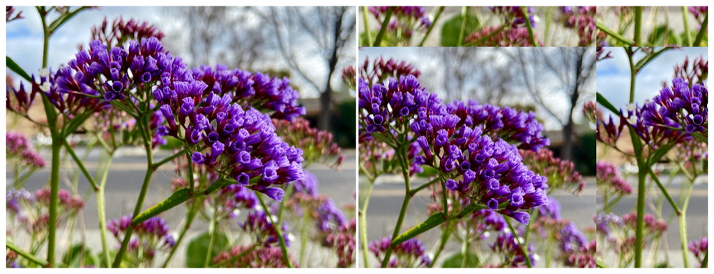

> Navigation: [Technologies](../../technologies.md) · [Core Image](../../coreimage.md) · [CIFilter](../cifilter-swift.class.md)

# affineTile()

<sub>Type Method</sub>

Performs a transform on the image and tiles the result.

<sub>iOS, iPadOS, Mac Catalyst, macOS, tvOS, visionOS</sub>

```swift
class func affineTile() -> any CIFilter & CIAffineTile
```

## Return Value

The tiled image.

## Discussion

This method applies the affine tile filter to an image. This effect performs an [CGAffineTransform](../../corefoundation/cgaffinetransform.md) and then tiles the transformed image.

The affine tile filter uses the following properties:

- **`inputImage`** — An image with the type [CIImage](../ciimage.md).
- **`transform`** — A [CGAffineTransform](../../corefoundation/cgaffinetransform.md) to apply to the image.

The following code creates a filter that results in the image becoming tiled:

```swift
func affineTile(inputImage: CIImage) -> CIImage {
    let affineTileEffect = CIFilter.affineTile()
    affineTileEffect.inputImage = inputImage
    affineTileEffect.transform = CGAffineTransform(a: 1, b: 2, c: 2, d: 3, tx: 4, ty: 4)
    return affineTileEffect.outputImage!
}
```



<sub>Two photographs. The photo on the left shows multiple sets of small purple flowers close up with good lighting, and the background has a slight blur. In the photograph on the right, an affine tile filter is applied, resulting in the flower image tiled to fill the extent of the image.</sub>

## See Also

### Filters

- [+ affineClampFilter](<affineclamp().md>) — Performs a transform on the image and extends the image edges to infinity.
- [+ eightfoldReflectedTileFilter](<eightfoldreflectedtile().md>) — Creates an eight-way reflected pattern.
- [+ fourfoldReflectedTileFilter](<fourfoldreflectedtile().md>) — Creates a four-way reflected pattern.
- [+ fourfoldRotatedTileFilter](<fourfoldrotatedtile().md>) — Creates a tiled image by rotating a tile in increments of 90 degrees.
- [+ fourfoldTranslatedTileFilter](<fourfoldtranslatedtile().md>) — Creates a tiled image by applying four translation operations.
- [+ glideReflectedTileFilter](<glidereflectedtile().md>) — Tiles an image by rotating and reflecting a tile from the image.
- [+ kaleidoscopeFilter](<kaleidoscope().md>) — Creates a 12-way kaleidoscopic image from an image.
- [+ opTileFilter](<optile().md>) — Produces an effect that mimics a style of visual art that uses optical illusions.
- [+ parallelogramTileFilter](<parallelogramtile().md>) — Warps the image to create a parallelogram and tiles the result.
- [+ perspectiveTileFilter](<perspectivetile().md>) — Tiles an image by adjusting the perspective of the image.
- [+ sixfoldReflectedTileFilter](<sixfoldreflectedtile().md>) — Produces a tiled image from a source image by applying a six-way reflected symmetry.
- [+ sixfoldRotatedTileFilter](<sixfoldrotatedtile().md>) — Creates a tiled image by rotating in increments of 60 degrees.
- [+ triangleKaleidoscopeFilter](<trianglekaleidoscope().md>) — Create a triangular kaleidoscope effect and then tiles the result.
- [+ triangleTileFilter](<triangletile().md>) — Tiles a triangular area of an image.
- [+ twelvefoldReflectedTileFilter](<twelvefoldreflectedtile().md>) — Creates a tiled image by rotating in increments of 30 degrees.
