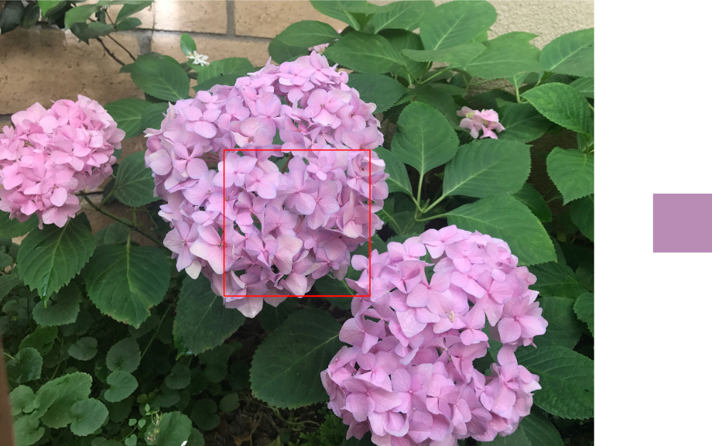

> Navigation: [Technologies](../../technologies.md) · [Core Image](../../coreimage.md) · [CIFilter](../cifilter-swift.class.md)

# areaAverage()

<sub>Type Method</sub>

Returns a 1 x 1 pixel image that contains the average color for the region of interest.

<sub>iOS, iPadOS, Mac Catalyst, macOS, tvOS, visionOS</sub>

```swift
class func areaAverage() -> any CIFilter & CIAreaAverage
```

## Return Value

A 1 x 1 pixel image containing the average color for the region of interest.

## Discussion

This filter calculates the average color of the area defined by `extent` and creates a 1 x 1 pixel image with the result. The filter processes each color component (red, green, blue, alpha) of the input image independently.

The area average filter uses the following properties:

- **`inputImage`** — The [CIImage](../ciimage.md) containing the image you want to process.
- **`extent`** — A [CGRect](../../corefoundation/cgrect.md) that specifies the region of the image that you want to process.

The following code creates a filter that calculates the average color of a 500 x 500 set of pixels from the center of the image:

```swift
func averageArea(inputImage: CIImage) -> CIImage {
    let filter = CIFilter.areaAverage()
    filter.inputImage = inputImage
    filter.extent = CGRect(
        x: inputImage.extent.width/2-250,
        y: inputImage.extent.height/2-250,
        width: 500,
        height: 500)
    return filter.outputImage!
}
```



<sub>Two images arranged horizontally. The left image contains a photograph of three hydrangea flowers with leaves in the background. A 500 x 500 pixel square in the center of the image is highlighted using a square outline. The image on the right shows the result of applying the area average filter to the 500 x 500 pixel square. The result is a 1 x 1 pixel image containing the average color from the highlighted square of the left image.</sub>

## See Also

### Filters

- [+ areaHistogramFilter](<areahistogram().md>) — Returns a histogram of a specified area of the image.
- [+ areaLogarithmicHistogramFilter](<arealogarithmichistogram().md>) — Returns a logarithmic histogram of a specified area of the image.
- [+ areaMaximumFilter](<areamaximum().md>) — Calculates the maximum color components of a specified area of the image.
- [+ areaMaximumAlphaFilter](<areamaximumalpha().md>) — Finds the pixel with the highest alpha value.
- [+ areaMinimumFilter](<areaminimum().md>) — Calculates the minimum color component values for a specified area of the image.
- [+ areaMinimumAlphaFilter](<areaminimumalpha().md>) — Calculates the pixel within a specified area that has the smallest alpha value.
- [+ areaMinMaxFilter](<areaminmax().md>) — Calculates minimum and maximum color components for a specified area of the image.
- [+ areaMinMaxRedFilter](<areaminmaxred().md>) — Calculates the minimum and maximum red component value.
- [+ columnAverageFilter](<columnaverage().md>) — Calculates the average color for a specified column of an image.
- [+ histogramDisplayFilter](<histogramdisplay().md>) — Generates a histogram map from the image.
- [+ KMeansFilter](<kmeans().md>) — Applies the k-means algorithm to find the most common colors in an image.
- [+ rowAverageFilter](<rowaverage().md>) — Calculates the average color for the specified row of pixels in an image.
