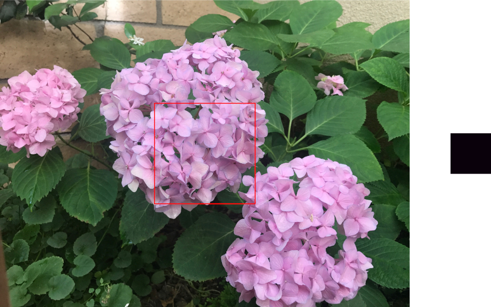

> Navigation: [Technologies](../../technologies.md) · [Core Image](../../coreimage.md) · [CIFilter](../cifilter-swift.class.md)

# areaMinimum()

<sub>Type Method</sub>

Calculates the minimum color component values for a specified area of the image.

<sub>iOS, iPadOS, Mac Catalyst, macOS, tvOS, visionOS</sub>

```swift
class func areaMinimum() -> any CIFilter & CIAreaMinimum
```

## Return Value

A 1 x 1 size image containing the minimum color component values.

## Discussion

This filter returns the minimum color components in the region defined by `extent`.

The area minimum filter uses the following properties:

- **`inputImage`** — An image with the type [CIImage](../ciimage.md).
- **`extent`** — A [CGRect](../../corefoundation/cgrect.md) that specifies the subregion of the image that you want to process.

The following code creates a filter that calculates the minimum color components of a 500 x 500 set of pixels from the center of the image:

```swift
func areaMinimum(inputImage: CIImage) -> CIImage {
    let filter = CIFilter.areaMinimum()
    filter.inputImage = inputImage
    filter.extent = CGRect(
        x: inputImage.extent.width/2-250,
        y: inputImage.extent.height/2-250,
        width: 500,
        height: 500)
    return filter.outputImage!
}
```



<sub>Two images arranged horizontally. The left image contains a photograph of three hydrangea flowers with leaves in the background. A 500 x 500 pixel square in the center of the image is highlighted using an outlined box. The image on the right shows the result of applying the area minimum filter to the 500 x 500 pixel square. The result is a 1 x 1 pixel image containing a color made up of the minimum color components from the square.</sub>

## See Also

### Filters

- [+ areaAverageFilter](<areaaverage().md>) — Returns a 1 x 1 pixel image that contains the average color for the region of interest.
- [+ areaHistogramFilter](<areahistogram().md>) — Returns a histogram of a specified area of the image.
- [+ areaLogarithmicHistogramFilter](<arealogarithmichistogram().md>) — Returns a logarithmic histogram of a specified area of the image.
- [+ areaMaximumFilter](<areamaximum().md>) — Calculates the maximum color components of a specified area of the image.
- [+ areaMaximumAlphaFilter](<areamaximumalpha().md>) — Finds the pixel with the highest alpha value.
- [+ areaMinimumAlphaFilter](<areaminimumalpha().md>) — Calculates the pixel within a specified area that has the smallest alpha value.
- [+ areaMinMaxFilter](<areaminmax().md>) — Calculates minimum and maximum color components for a specified area of the image.
- [+ areaMinMaxRedFilter](<areaminmaxred().md>) — Calculates the minimum and maximum red component value.
- [+ columnAverageFilter](<columnaverage().md>) — Calculates the average color for a specified column of an image.
- [+ histogramDisplayFilter](<histogramdisplay().md>) — Generates a histogram map from the image.
- [+ KMeansFilter](<kmeans().md>) — Applies the k-means algorithm to find the most common colors in an image.
- [+ rowAverageFilter](<rowaverage().md>) — Calculates the average color for the specified row of pixels in an image.
