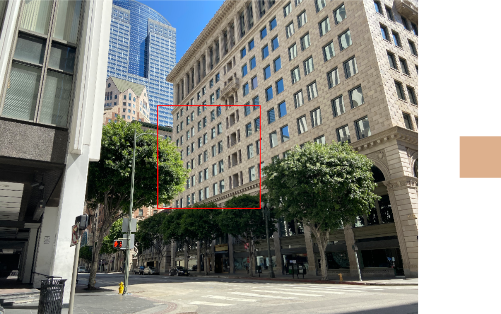

> Navigation: [Technologies](../../technologies.md) · [Core Image](../../coreimage.md) · [CIFilter](../cifilter-swift.class.md)

# areaMinimumAlpha()

<sub>Type Method</sub>

Calculates the pixel within a specified area that has the smallest alpha value.

<sub>iOS, iPadOS, Mac Catalyst, macOS, tvOS, visionOS</sub>

```swift
class func areaMinimumAlpha() -> any CIFilter & CIAreaMinimumAlpha
```

## Return Value

A 1 x 1 pixel image containing the color with the smallest alpha value.

## Discussion

This method applies the area minimum alpha filter to an image. This effect finds and returns the pixel with the lowest alpha value in the region defined by `extent`.

The area minimum alpha filter uses the following properties:

- **`inputImage`** — An image with the type [CIImage](../ciimage.md).
- **`extent`** — A [CGRect](../../corefoundation/cgrect.md) that specifies the subregion of the image that you want to process.

The following code creates a filter that results in a 1 x 1 pixel image containing the color with the lowest alpha value:

```swift
func areaMinimumAlpha(inputImage: CIImage) -> CIImage {
    let filter = CIFilter.areaMinimumAlpha()
    filter.inputImage = inputImage
    filter.extent = CGRect(
        x: inputImage.extent.width/2-250,
        y: inputImage.extent.height/2-250,
        width: 500,
        height: 500)
     return filter.outputImage!
}
```



<sub>Two images side by side arranged horizontally. The left image is a photograph of a modern brick building. An outlined square highlights a 500 x 500 pixel region in the image. The right image contains the result of running the area minimum alpha filter. It contains the color from the highlighted square that has the minimum alpha value.</sub>

## See Also

### Filters

- [+ areaAverageFilter](<areaaverage().md>) — Returns a 1 x 1 pixel image that contains the average color for the region of interest.
- [+ areaHistogramFilter](<areahistogram().md>) — Returns a histogram of a specified area of the image.
- [+ areaLogarithmicHistogramFilter](<arealogarithmichistogram().md>) — Returns a logarithmic histogram of a specified area of the image.
- [+ areaMaximumFilter](<areamaximum().md>) — Calculates the maximum color components of a specified area of the image.
- [+ areaMaximumAlphaFilter](<areamaximumalpha().md>) — Finds the pixel with the highest alpha value.
- [+ areaMinimumFilter](<areaminimum().md>) — Calculates the minimum color component values for a specified area of the image.
- [+ areaMinMaxFilter](<areaminmax().md>) — Calculates minimum and maximum color components for a specified area of the image.
- [+ areaMinMaxRedFilter](<areaminmaxred().md>) — Calculates the minimum and maximum red component value.
- [+ columnAverageFilter](<columnaverage().md>) — Calculates the average color for a specified column of an image.
- [+ histogramDisplayFilter](<histogramdisplay().md>) — Generates a histogram map from the image.
- [+ KMeansFilter](<kmeans().md>) — Applies the k-means algorithm to find the most common colors in an image.
- [+ rowAverageFilter](<rowaverage().md>) — Calculates the average color for the specified row of pixels in an image.
