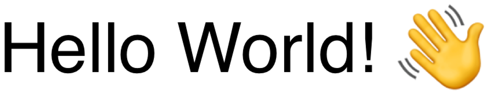

> Navigation: [Technologies](../../technologies.md) · [Core Image](../../coreimage.md) · [CIFilter](../cifilter-swift.class.md)

# attributedTextImageGenerator()

<sub>Type Method</sub>

Generates an attributed-text image.

<sub>iOS, iPadOS, Mac Catalyst, macOS, tvOS, visionOS</sub>

```swift
class func attributedTextImageGenerator() -> any CIFilter & CIAttributedTextImageGenerator
```

## Return Value

The generated image.

## Discussion

This method generates an attributed-text image. The effect takes the input string property and the scale factor to scale up the text. You commonly combine this filter with other filters to create a watermark on images.

The attributed-text image generator filter uses the following properties:

- **`text`** — An [NSAttributedString](../../foundation/nsattributedstring.md).
- **`scaleFactor`** — A `float` representing the scale of the font to use for the generated text.
- **padding** — A `float` representing the value for an additional number of pixels to pad around the text’s bounding box.

The following code creates a filter that generates an attributed-text image:

```swift
func attributedTextImage() -> CIImage {
    let attributedTextImageFilter = CIFilter.attributedTextImageGenerator()
    attributedTextImageFilter.text = NSAttributedString(string: "Hello world! 👋")
    attributedTextImageFilter.scaleFactor = 10
    attributedTextImageFilter.padding = 5
    return attributedTextImageFilter.outputImage!
}
```



## See Also

### Filters

- [+ aztecCodeGeneratorFilter](<azteccodegenerator().md>) — Generates a low-density barcode.
- [+ barcodeGeneratorFilter](<barcodegenerator().md>) — Generates a barcode as an image from the descriptor.
- [+ blurredRectangleGeneratorFilter](<blurredrectanglegenerator().md>) — Generates a blurred rectangle.
- [+ checkerboardGeneratorFilter](<checkerboardgenerator().md>) — Generates a checkerboard image.
- [+ code128BarcodeGeneratorFilter](<code128barcodegenerator().md>) — Generates a high-density, linear barcode.
- [+ lenticularHaloGeneratorFilter](<lenticularhalogenerator().md>) — Generates a lenticular halo image.
- [+ meshGeneratorFilter](<meshgenerator().md>) — Generates a pattern made from an array of line segments.
- [+ PDF417BarcodeGenerator](<pdf417barcodegenerator().md>) — Generates a high-density linear barcode.
- [+ QRCodeGenerator](<qrcodegenerator().md>) — Generates a quick response (QR) code image.
- [+ randomGeneratorFilter](<randomgenerator().md>) — Generates a random filter image.
- [+ roundedRectangleGeneratorFilter](<roundedrectanglegenerator().md>) — Generates a rounded rectangle image.
- [+ roundedRectangleStrokeGeneratorFilter](<roundedrectanglestrokegenerator().md>) — Creates an image containing the outline of a rounded rectangle.
- [+ starShineGeneratorFilter](<starshinegenerator().md>) — Generates a star-shine image.
- [+ stripesGeneratorFilter](<stripesgenerator().md>) — Generates a line of stripes as an image
- [+ sunbeamsGeneratorFilter](<sunbeamsgenerator().md>) — Generates an image resembling the sun.
