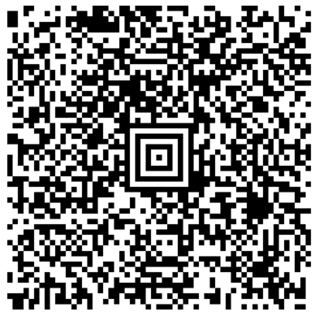

> Navigation: [Technologies](../../technologies.md) · [Core Image](../../coreimage.md) · [CIFilter](../cifilter-swift.class.md)

# aztecCodeGenerator()

<sub>Type Method</sub>

Generates a low-density barcode.

<sub>iOS, iPadOS, Mac Catalyst, macOS, tvOS, visionOS</sub>

```swift
class func aztecCodeGenerator() -> any CIFilter & CIAztecCodeGenerator
```

## Return Value

The generated image.

## Discussion

This method generates an Aztec code as an image. The Aztec barcode code is a low-density barcode defined in the ISO/IEC 24778:2008 standard. This code is commonly used for transport ticketing or boarding passes.

The Aztec code generator filter uses the following properties:

- **`message`** — The data to be encoded as an Aztec code. An [NSData](../../foundation/nsdata.md) object whose display name is Message.
- **`correctionLevel`** — A `float` representing the percentage of redundancy to add to the message data. A higher correction level allows the barcode to be correctly read even when partially damaged.
- **`layers`** — A `float` representing the number of concentric squares encoding the barcode data. When the value is zero, Core Image automatically determines the appropriate number of layers to encode the message data at the specified correction level.
- **`compactStyle`** — A `float` determining the use of compact or full-size Aztec barcode format. The compact format can store up to 44 bytes of message data in up to 4 layers. The full-size format can store up to 1914 bytes of message data in up to 32 layers. Leave unset, or set to 0 for automatic.

The following code creates a filter that generates an Aztec barcode:

```swift
func aztecCode(inputMessage: String) -> CIImage {
    let aztecCodeGenerator = CIFilter.aztecCodeGenerator()
    aztecCodeGenerator.correctionLevel = 15
    aztecCodeGenerator.compactStyle = 0
    aztecCodeGenerator.message = inputMessage.data(using: .ascii)!
    aztecCodeGenerator.layers = 10
    return aztecCodeGenerator.outputImage!
}
```



<sub>An image of a black and white Aztec code made of small squares representing the encoded data of: Filter an image, generate a barcode, what else can CoreImage do?</sub>

## See Also

### Filters

- [+ attributedTextImageGeneratorFilter](<attributedtextimagegenerator().md>) — Generates an attributed-text image.
- [+ barcodeGeneratorFilter](<barcodegenerator().md>) — Generates a barcode as an image from the descriptor.
- [+ blurredRectangleGeneratorFilter](<blurredrectanglegenerator().md>) — Generates a blurred rectangle.
- [+ checkerboardGeneratorFilter](<checkerboardgenerator().md>) — Generates a checkerboard image.
- [+ code128BarcodeGeneratorFilter](<code128barcodegenerator().md>) — Generates a high-density, linear barcode.
- [+ lenticularHaloGeneratorFilter](<lenticularhalogenerator().md>) — Generates a lenticular halo image.
- [+ meshGeneratorFilter](<meshgenerator().md>) — Generates a pattern made from an array of line segments.
- [+ PDF417BarcodeGenerator](<pdf417barcodegenerator().md>) — Generates a high-density linear barcode.
- [+ QRCodeGenerator](<qrcodegenerator().md>) — Generates a quick response (QR) code image.
- [+ randomGeneratorFilter](<randomgenerator().md>) — Generates a random filter image.
- [+ roundedRectangleGeneratorFilter](<roundedrectanglegenerator().md>) — Generates a rounded rectangle image.
- [+ roundedRectangleStrokeGeneratorFilter](<roundedrectanglestrokegenerator().md>) — Creates an image containing the outline of a rounded rectangle.
- [+ starShineGeneratorFilter](<starshinegenerator().md>) — Generates a star-shine image.
- [+ stripesGeneratorFilter](<stripesgenerator().md>) — Generates a line of stripes as an image
- [+ sunbeamsGeneratorFilter](<sunbeamsgenerator().md>) — Generates an image resembling the sun.
