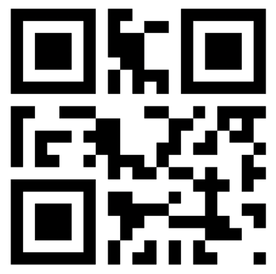

> Navigation: [Technologies](../../technologies.md) · [Core Image](../../coreimage.md) · [CIFilter](../cifilter-swift.class.md)

# barcodeGenerator()

<sub>Type Method</sub>

Generates a barcode as an image from the descriptor.

<sub>iOS, iPadOS, Mac Catalyst, macOS, tvOS, visionOS</sub>

```swift
class func barcodeGenerator() -> any CIFilter & CIBarcodeGenerator
```

## Return Value

The generated image.

## Discussion

This method generates a custom barcode as an image. The effect uses barcode descriptors to specify properties of the generated barcode.

The barcode generator uses the following property:

- **`barcodeDescriptor`** — An instance of [CIBarcodeDescriptor](../cibarcodedescriptor.md) with the input parameters supplied.

The following code creates a filter that generates a QR code containing the text _Johnny Appleseed._

```swift
func barcode(inputMessage: Data) -> CIImage {
   let barcodeGenerator = CIFilter.barcodeGenerator()
    barcodeGenerator.barcodeDescriptor = CIQRCodeDescriptor(payload: inputMessage, symbolVersion: 1, maskPattern: 4, errorCorrectionLevel: .levelL)!
    return barcodeGenerator.outputImage!
}

let johnnyAppleseed: [UInt8] = [0x41, 0x04, 0xA6, 0xF6, 0x86, 0xE6, 0xE7, 0x92, 0x04, 0x17, 0x07, 0x06, 0xC6, 0x57, 0x36, 0x56, 0x56, 0x40, 0xEC]
let data = Data(johnnyAppleseed)

let bImage = barcode(inputMessage: data)
```



## See Also

### Related Documentation

- [CIAztecCodeDescriptor](../ciazteccodedescriptor.md) — A concrete subclass the Core Image Barcode Descriptor that represents an Aztec code symbol.
- [CIDataMatrixCodeDescriptor](../cidatamatrixcodedescriptor.md) — A concrete subclass the Core Image Barcode Descriptor that represents an Data Matrix code symbol.
- [CIPDF417CodeDescriptor](../cipdf417codedescriptor.md) — A concrete subclass of Core Image Barcode Descriptor that represents a PDF417 symbol.
- [CIQRCodeDescriptor](../ciqrcodedescriptor.md) — A concrete subclass of the Core Image Barcode Descriptor that represents a square QR code symbol.

### Filters

- [+ attributedTextImageGeneratorFilter](<attributedtextimagegenerator().md>) — Generates an attributed-text image.
- [+ aztecCodeGeneratorFilter](<azteccodegenerator().md>) — Generates a low-density barcode.
- [+ blurredRectangleGeneratorFilter](<blurredrectanglegenerator().md>) — Generates a blurred rectangle.
- [+ checkerboardGeneratorFilter](<checkerboardgenerator().md>) — Generates a checkerboard image.
- [+ code128BarcodeGeneratorFilter](<code128barcodegenerator().md>) — Generates a high-density, linear barcode.
- [+ lenticularHaloGeneratorFilter](<lenticularhalogenerator().md>) — Generates a lenticular halo image.
- [+ meshGeneratorFilter](<meshgenerator().md>) — Generates a pattern made from an array of line segments.
- [+ PDF417BarcodeGenerator](<pdf417barcodegenerator().md>) — Generates a high-density linear barcode.
- [+ QRCodeGenerator](<qrcodegenerator().md>) — Generates a quick response (QR) code image.
- [+ randomGeneratorFilter](<randomgenerator().md>) — Generates a random filter image.
- [+ roundedRectangleGeneratorFilter](<roundedrectanglegenerator().md>) — Generates a rounded rectangle image.
- [+ roundedRectangleStrokeGeneratorFilter](<roundedrectanglestrokegenerator().md>) — Creates an image containing the outline of a rounded rectangle.
- [+ starShineGeneratorFilter](<starshinegenerator().md>) — Generates a star-shine image.
- [+ stripesGeneratorFilter](<stripesgenerator().md>) — Generates a line of stripes as an image
- [+ sunbeamsGeneratorFilter](<sunbeamsgenerator().md>) — Generates an image resembling the sun.
