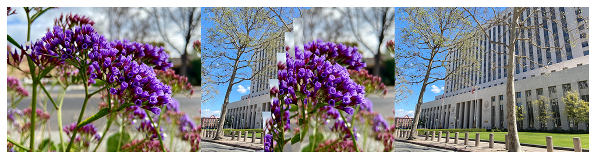

> Navigation: [Technologies](../../technologies.md) · [Core Image](../../coreimage.md) · [CIFilter](../cifilter-swift.class.md)

# barsSwipeTransition()

<sub>Type Method</sub>

Transitions between two images by removing rectangular portions of an image.

<sub>iOS, iPadOS, Mac Catalyst, macOS, tvOS, visionOS</sub>

```swift
class func barsSwipeTransition() -> any CIFilter & CIBarsSwipeTransition
```

## Return Value

The transition image.

## Discussion

This method applies the bar swipe transition filter to an image. The effect transitions from one image to another by a series of moving bars passing over the target image.

The bar swipe transition filter uses the following properties:

- **`inputImage`** — The starting image with the type [CIImage](../ciimage.md).
- **`targetImage`** — The ending image with the type [CIImage](../ciimage.md).
- **`time`** — A `float` representing the parametric time of the transition from start (at time 0) to end (at time 1) as an [NSNumber](../../foundation/nsnumber.md).
- **`angle`** — A `float` representing the angle of the motion as an [NSNumber](../../foundation/nsnumber.md).
- **`width`** — A `float` representing the width of the bars in pixels as an [NSNumber](../../foundation/nsnumber.md).
- **`barOffset`** — A `float` representing the offset of one bar in relation to others as a [NSNumber](../../foundation/nsnumber.md).

The following code creates a filter that produces falling bars from the input image to transition to the target image:

```swift
func barSwipe(inputImage: CIImage, targetImage: CIImage) -> CIImage {
    let barSwipeTranstion = CIFilter.barsSwipeTransition()
    barSwipeTranstion.inputImage = inputImage
    barSwipeTranstion.targetImage = targetImage
    barSwipeTranstion.time = 0.5
    barSwipeTranstion.angle = 0.09
    barSwipeTranstion.width = 30
    barSwipeTranstion.barOffset = 10   
    return barSwipeTranstion.outputImage!
}
```



<sub>Three photographs. In the photo on the left, multiple sets of small purple flowers are photographed close up with good lighting, and the background has a slight blur. In the photograph on the right is a tall city building with two trees directly in front of the building. The center photograph is a snapshot of the moment that the bar swipe transition creates, where the left photo slowly fades away by sized bars moving out of frame, revealing the city building.</sub>

## See Also

### Filters

- [+ accordionFoldTransitionFilter](<accordionfoldtransition().md>) — Transitions by folding and crossfading an image to reveal the target image.
- [+ copyMachineTransitionFilter](<copymachinetransition().md>) — Simulates the effect of a copy machine scanner light to transiton between two images.
- [+ disintegrateWithMaskTransitionFilter](<disintegratewithmasktransition().md>) — Transitions between two images using a mask image.
- [+ dissolveTransitionFilter](<dissolvetransition().md>) — Transitions between two images with a fade effect.
- [+ flashTransitionFilter](<flashtransition().md>) — Creates a flash of light to transition between two images.
- [+ modTransitionFilter](<modtransition().md>) — Transitions between two images by applying irregularly shaped holes.
- [+ pageCurlTransitionFilter](<pagecurltransition().md>) — Simulates the curl of a page, revealing the target image.
- [+ pageCurlWithShadowTransitionFilter](<pagecurlwithshadowtransition().md>) — Simulates the curl of a page, revealing the target image with added shadow.
- [+ rippleTransitionFilter](<rippletransition().md>) — Simulates a ripple in a pond to transiton from one image to another.
- [+ swipeTransitionFilter](<swipetransition().md>) — Gradually transitions from one image to another with a swiping motion.
