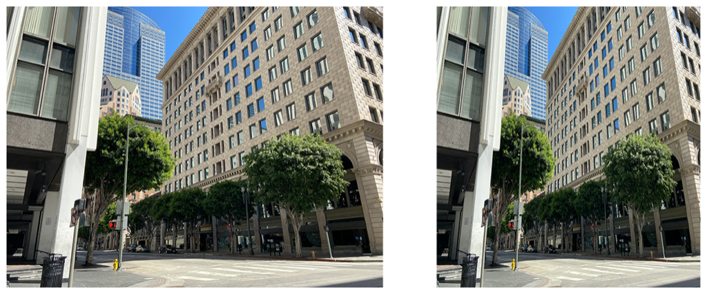

> Navigation: [Technologies](../../technologies.md) · [Core Image](../../coreimage.md) · [CIFilter](../cifilter-swift.class.md)

# bicubicScaleTransform()

<sub>Type Method</sub>

Produces a high-quality scaled version of an image.

<sub>iOS, iPadOS, Mac Catalyst, macOS, tvOS, visionOS</sub>

```swift
class func bicubicScaleTransform() -> any CIFilter & CIBicubicScaleTransform
```

## Return Value

The adjusted image.

## Discussion

This method applies the bicubic scale transform filter to an image. The effect produces a high-quality, scaled version of the input image. The parameters of `B` and `C` determine the sharpness and softness of the resampling.

The bicubic scale transform filter uses the following properties:

- **`inputImage`** — An image with the type [CIImage](../ciimage.md).
- **`aspectRatio`** — A `float` representing the aspect ratio as an [NSNumber](../../foundation/nsnumber.md).
- **`parameterB`** — A `float` representing the value of B used for cubic resampling as an [NSNumber](../../foundation/nsnumber.md).
- **`parameterC`** — A `float` representing the value of C used for cubic resampling as an [NSNumber](../../foundation/nsnumber.md).

The following code creates a filter that results in the image becoming square:

```swift
func bicubicScale(inputImage: CIImage) -> CIImage {
    let bicubicScaleFilter = CIFilter.bicubicScaleTransform()
    bicubicScaleFilter.inputImage = inputImage
    bicubicScaleFilter.aspectRatio = 0.7
    bicubicScaleFilter.parameterB = 1
    bicubicScaleFilter.parameterC = 0.75
    return bicubicScaleFilter.outputImage!
}
```



<sub>Two photographs of a large building on the corner of an intersection. The building has small windows and is made of a brick structure. The photo on the left has no modifications to size or color. In the photo on the right, a bicubic scale transform filter is applied, resulting in a square image.</sub>

## See Also

### Filters

- [+ edgePreserveUpsampleFilter](<edgepreserveupsample().md>) — Creates a high-quality upscaled image.
- [+ keystoneCorrectionCombinedFilter](<keystonecorrectioncombined().md>) — Adjusts the image vertically and horizontally to remove distortion.
- [+ keystoneCorrectionHorizontalFilter](<keystonecorrectionhorizontal().md>) — Horizontally adjusts an image to remove distortion.
- [+ keystoneCorrectionVerticalFilter](<keystonecorrectionvertical().md>) — Vertically adjusts an image to remove distortion.
- [+ lanczosScaleTransformFilter](<lanczosscaletransform().md>) — Creates a high-quality, scaled version of a source image.
- [+ perspectiveCorrectionFilter](<perspectivecorrection().md>) — Transforms an image’s perspective.
- [+ perspectiveRotateFilter](<perspectiverotate().md>) — Rotates an image in a 3D space.
- [+ perspectiveTransformFilter](<perspectivetransform().md>) — Alters an image’s geometry to adjust the perspective.
- [+ perspectiveTransformWithExtentFilter](<perspectivetransformwithextent().md>) — Alters an image’s geometry to adjust the perspective while applying constraints.
- [+ straightenFilter](<straighten().md>) — Rotates and crops an image.
