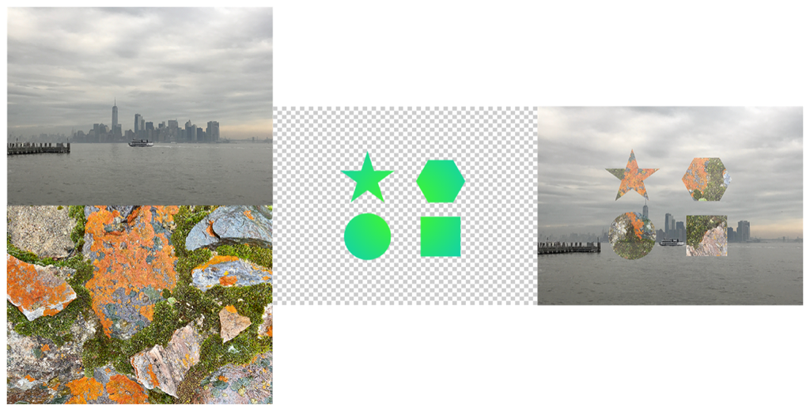

> Navigation: [Technologies](../../technologies.md) · [Core Image](../../coreimage.md) · [CIFilter](../cifilter-swift.class.md)

# blendWithMask()

<sub>Type Method</sub>

Blends two images by using a mask image.

<sub>iOS, iPadOS, Mac Catalyst, macOS, tvOS, visionOS</sub>

```swift
class func blendWithMask() -> any CIFilter & CIBlendWithMask
```

## Return Value

The modified image.

## Discussion

This method applies the blend with mask filter to an image. The effect uses values from the green mask image to interpolate between the input and background images. The mask image consists of shades of green that define the strength of the interpolation from zero (where the mask image is black) to the specified `radius` (where the mask image is green).

The blend with mask filter uses the following properties:

- **`inputImage`** — An image with the type [CIImage](../ciimage.md).
- **`maskImage`** — An image that masks an area on the background image with the type [CIImage](../ciimage.md).
- **`backgroundImage`** — An image with the type [CIImage](../ciimage.md).

The following code creates a filter that results in the replacement of green in the mask image with the detail of the input image:

```swift
func blendWithMask(inputImage: CIImage, backgroundImage: CIImage, maskImage: CIImage) -> CIImage {
    let blendWithMaskFilter = CIFilter.blendWithMask()
    blendWithMaskFilter.backgroundImage = backgroundImage
    blendWithMaskFilter.inputImage = inputImage
    blendWithMaskFilter.maskImage = maskImage
    return blendWithMaskFilter.outputImage!
}
```



<sub>A set of four photographs with two stacked on the left and two side by side on the right. The top photo on the left is of the New York City skyline taken from across the river on an overcast day, with a single boat in the center of the image. The bottom photo on the left is of multiple colorful rocks with green moss covering them. The first photograph on the right is a transparent image with a five-point triangle, hexagon, circle and square filled with a gradient of yellow to light green. The second photograph on the right is a blend with mask filter applied, resulting in the skyline photo with the detail of the moss covered rocks showing in the area that is green from the mask image.</sub>

## See Also

### Filters

- [+ blendWithAlphaMaskFilter](<blendwithalphamask().md>) — Blends two images by using an alpha mask image.
- [+ blendWithBlueMaskFilter](<blendwithbluemask().md>) — Blends two images by using a blue mask image.
- [+ blendWithRedMaskFilter](<blendwithredmask().md>) — Blends two images by using a red mask image.
- [+ bloomFilter](<bloom().md>) — Adjusts an image’s colors by applying a blur effect.
- [+ cannyEdgeDetectorFilter](<cannyedgedetector().md>) — Applies the Canny edge-detection algorithm to an image.
- [+ comicEffectFilter](<comiceffect().md>) — Creates an image with a comic book effect.
- [+ coreMLModelFilter](<coremlmodel().md>) — Filters an image with a Core ML model.
- [+ crystallizeFilter](<crystallize().md>) — Creates an image made with a series of colorful polygons.
- [+ depthOfFieldFilter](<depthoffield().md>) — Simulates a depth of field effect.
- [+ edgesFilter](<edges().md>) — Hilghlights edges of objects found within an image.
- [+ edgeWorkFilter](<edgework().md>) — Produces a black-and-white image that looks similar to a woodblock print.
- [+ gaborGradientsFilter](<gaborgradients().md>) — Highlights textures in an image.
- [+ gloomFilter](<gloom().md>) — Adjusts an image’s color by applying a gloom filter.
- [+ heightFieldFromMaskFilter](<heightfieldfrommask().md>) — Creates a realistic shaded height-field image.
- [+ hexagonalPixellateFilter](<hexagonalpixellate().md>) — Creates an image made of a series of colorful hexagons.
