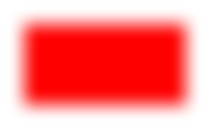

> Navigation: [Technologies](../../technologies.md) · [Core Image](../../coreimage.md) · [CIFilter](../cifilter-swift.class.md)

# blurredRectangleGenerator()

<sub>Type Method</sub>

Generates a blurred rectangle.

<sub>iOS, iPadOS, Mac Catalyst, macOS, tvOS, visionOS</sub>

```swift
class func blurredRectangleGenerator() -> any CIFilter & CIBlurredRectangleGenerator
```

## Return Value

A [CIImage](../ciimage.md) containing a blurred rectangle.

## Discussion

Creates a [CIImage](../ciimage.md) containing a blurred rectangle. The resulting image size is the extent of the rectangle plus any additional space required for the blur effect.

The blurred rectangle filter uses the following properties:

- **`extent`** — A [CGRect](../../corefoundation/cgrect.md) that defines the extent of the effect.
- **`color`** — A [CIColor](../cicolor.md) specifying the color of the rectangle.
- **`sigma`** — A `float` specifying the sigma for the Gaussian blur.

The following code creates a filter that generates a blurred red rectangle with a width of 200 x 100 pixels.

```swift
func blurredRectangle() -> CIImage {
    let filter = CIFilter.blurredRectangleGenerator()
    filter.extent = CGRect(x: 0, y: 0, width: 200, height: 100)
    filter.color = CIColor.red
    filter.sigma = 10.0
    return filter.outputImage!
}
```



## See Also

### Filters

- [+ attributedTextImageGeneratorFilter](<attributedtextimagegenerator().md>) — Generates an attributed-text image.
- [+ aztecCodeGeneratorFilter](<azteccodegenerator().md>) — Generates a low-density barcode.
- [+ barcodeGeneratorFilter](<barcodegenerator().md>) — Generates a barcode as an image from the descriptor.
- [+ checkerboardGeneratorFilter](<checkerboardgenerator().md>) — Generates a checkerboard image.
- [+ code128BarcodeGeneratorFilter](<code128barcodegenerator().md>) — Generates a high-density, linear barcode.
- [+ lenticularHaloGeneratorFilter](<lenticularhalogenerator().md>) — Generates a lenticular halo image.
- [+ meshGeneratorFilter](<meshgenerator().md>) — Generates a pattern made from an array of line segments.
- [+ PDF417BarcodeGenerator](<pdf417barcodegenerator().md>) — Generates a high-density linear barcode.
- [+ QRCodeGenerator](<qrcodegenerator().md>) — Generates a quick response (QR) code image.
- [+ randomGeneratorFilter](<randomgenerator().md>) — Generates a random filter image.
- [+ roundedRectangleGeneratorFilter](<roundedrectanglegenerator().md>) — Generates a rounded rectangle image.
- [+ roundedRectangleStrokeGeneratorFilter](<roundedrectanglestrokegenerator().md>) — Creates an image containing the outline of a rounded rectangle.
- [+ starShineGeneratorFilter](<starshinegenerator().md>) — Generates a star-shine image.
- [+ stripesGeneratorFilter](<stripesgenerator().md>) — Generates a line of stripes as an image
- [+ sunbeamsGeneratorFilter](<sunbeamsgenerator().md>) — Generates an image resembling the sun.
