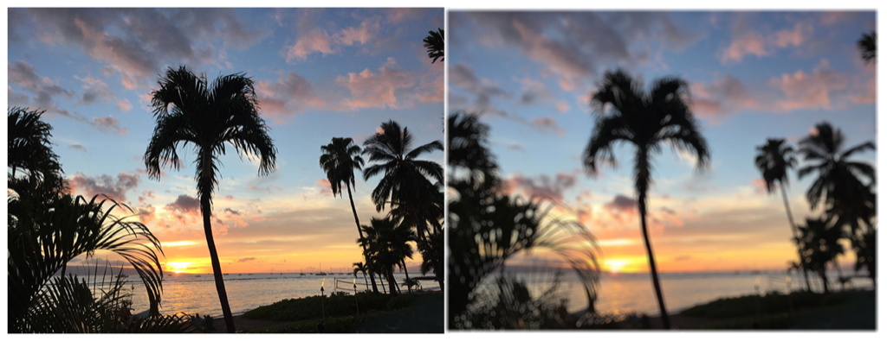

> Navigation: [Technologies](../../technologies.md) · [Core Image](../../coreimage.md) · [CIFilter](../cifilter-swift.class.md)

# bokehBlur()

<sub>Type Method</sub>

Applies a bokeh effect to an image.

<sub>iOS, iPadOS, Mac Catalyst, macOS, tvOS, visionOS</sub>

```swift
class func bokehBlur() -> any CIFilter & CIBokehBlur
```

## Return Value

The blurred image.

## Discussion

This method applies the bokeh blur filter to an image. The effect targets a circular area of pixels defined by the `radius` and blurs the area. The filter adds smaller intense blur rings.

The bokeh blur filter uses the following properties:

- **`radius`** — A `float` representing the area of effect as an [NSNumber](../../foundation/nsnumber.md).
- **`ringSize`** — A `float` representing the ring size of the bokeh as an [NSNumber](../../foundation/nsnumber.md).
- **`ringAmount`** — A `float` representing the emphasis at the ring of the bokeh as an [NSNumber](../../foundation/nsnumber.md).
- **`softness`** — A `float` representing the softness of the bokeh effect as an [NSNumber](../../foundation/nsnumber.md).
- **`inputImage`** — A [CIImage](../ciimage.md) representing the input image to apply the filter to.

The following code creates a filter that adds a softer blur to the input image:

```swift
    func bokehBlur(inputImage: CIImage) -> CIImage? {

        let bokehBlurFilter = CIFilter.bokehBlur()
        bokehBlurFilter.inputImage = inputImage
        bokehBlurFilter.ringSize = 0.1
        bokehBlurFilter.ringAmount = 0
        bokehBlurFilter.softness = 1
        bokehBlurFilter.radius = 20
        return bokehBlurFilter.outputImage
    }
```



<sub>Two photographs of a beach at sunset with multiple palm trees. The photo on the left is clear and crisp. In the photo on the right, a bokeh blur filter has been applied and the image is softer and looks slightly fuzzy or hazy.</sub>

## See Also

### Filters

- [+ boxBlurFilter](<boxblur().md>) — Applies a square-shaped blur to an area of an image.
- [+ discBlurFilter](<discblur().md>) — Applies a circle-shaped blur to an area of an image.
- [+ gaussianBlurFilter](<gaussianblur().md>) — Blurs an image with a Gaussian distribution pattern.
- [+ maskedVariableBlurFilter](<maskedvariableblur().md>) — Blurs a specified portion of an image.
- [+ medianFilter](<median().md>) — Calculates the median of an image to refine detail.
- [+ morphologyGradientFilter](<morphologygradient().md>) — Detects and highlights edges of objects.
- [+ morphologyMaximumFilter](<morphologymaximum().md>) — Blurs a circular area by enlarging contrasting pixels.
- [+ morphologyMinimumFilter](<morphologyminimum().md>) — Blurs a circular area by reducing contrasting pixels.
- [+ morphologyRectangleMaximumFilter](<morphologyrectanglemaximum().md>) — Blurs a rectangular area by enlarging contrasting pixels.
- [+ morphologyRectangleMinimumFilter](<morphologyrectangleminimum().md>) — Blurs a rectangular area by reducing contrasting pixels.
- [+ motionBlurFilter](<motionblur().md>) — Creates motion blur on an image.
- [+ noiseReductionFilter](<noisereduction().md>) — Reduces noise by sharpening the edges of objects.
- [+ zoomBlurFilter](<zoomblur().md>) — Creates a zoom blur centered around a single point on the image.
