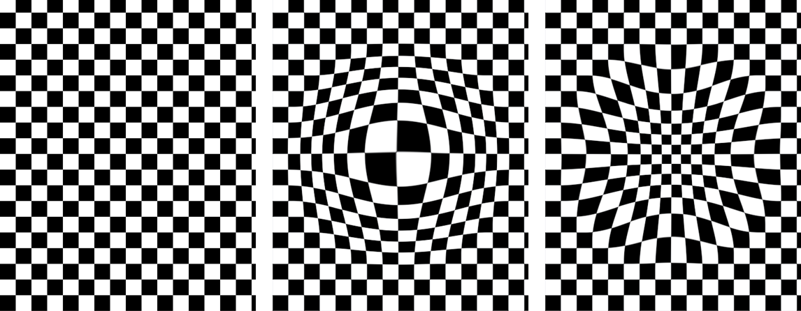

> Navigation: [Technologies](../../technologies.md) · [Core Image](../../coreimage.md) · [CIFilter](../cifilter-swift.class.md)

# bumpDistortion()

<sub>Type Method</sub>

Distorts an image with a concave or convex bump.

<sub>iOS, iPadOS, Mac Catalyst, macOS, tvOS, visionOS</sub>

```swift
class func bumpDistortion() -> any CIFilter & CIBumpDistortion
```

## Return Value

The distorted image.

## Discussion

This method applies the bump distortion filter to an image. This effect creates a concave or convex bump defined by the `scale`. A value of 0.0 has no effect, while a positive value creates an outward curvature and a negative value creates an inward curvature.

The bump distortion filter uses the following properties:

- **`inputImage`** — An image with the type [CIImage](../ciimage.md).
- **`radius`** — A `float` representing the amount of pixels the filter uses to create the distortion as an [NSNumber](../../foundation/nsnumber.md).
- **`center`** — A [CGPoint](../../corefoundation/cgpoint.md) representing the center of the effect.
- **`scale`** — A `float` representing the curvature of the bump effect as an [NSNumber](../../foundation/nsnumber.md).

The following code creates a filter that results in a concave bump distorting the image:

```swift
func bump(inputImage: CIImage) -> CIImage {
    let filter = CIFilter.bumpDistortion()
    filter.inputImage = inputImage
    filter.center = CGPoint(x: 500, y: 500)
    filter.radius = 1200
    filter.scale = 2
    return filter.outputImage!
}
```



<sub>Three images arranged horizontally. On the left, an image with a checkerboard pattern. In the middle, the checkerboard image with a positive scale bump distortion applied, the image appears to bulge out. On the right, the checkerboard image with a negative scale bump distortion applied, the image appears pushed in.</sub>

## See Also

### Filters

- [+ bumpDistortionLinearFilter](<bumpdistortionlinear().md>) — Linearly distorts an image with a concave or convex bump.
- [+ circleSplashDistortionFilter](<circlesplashdistortion().md>) — Distorts an image with radiating circles to the periphery of the image.
- [+ circularWrapFilter](<circularwrap().md>) — Distorts an image by increasing the distance of the center of the image.
- [+ displacementDistortionFilter](<displacementdistortion().md>) — Applies the grayscale values of the second image to the first image.
- [+ drosteFilter](<droste().md>) — Stylizes an image with the Droste effect.
- [+ glassDistortionFilter](<glassdistortion().md>) — Distorts an image by applying a glass-like texture.
- [+ glassLozengeFilter](<glasslozenge().md>) — Creates a lozenge-shaped lens and distorts the image.
- [+ holeDistortionFilter](<holedistortion().md>) — Distorts an image with a circular area that pushes the image outward.
- [+ lightTunnelFilter](<lighttunnel().md>) — Distorts an image by generating a light tunnel.
- [+ ninePartStretchedFilter](<ninepartstretched().md>) — Distorts an image by stretching it between two breakpoints.
- [+ ninePartTiledFilter](<nineparttiled().md>) — Distorts an image by tiling portions of it.
- [+ pinchDistortionFilter](<pinchdistortion().md>) — Distorts an image by creating a pinch effect with stronger distortion in the center.
- [+ stretchCropFilter](<stretchcrop().md>) — Distorts an image by stretching or cropping to fit a specified size.
- [+ torusLensDistortionFilter](<toruslensdistortion().md>) — Creates a torus-shaped lens to distort the image.
- [+ twirlDistortionFilter](<twirldistortion().md>) — Distorts an image by rotating pixels around a center point.
