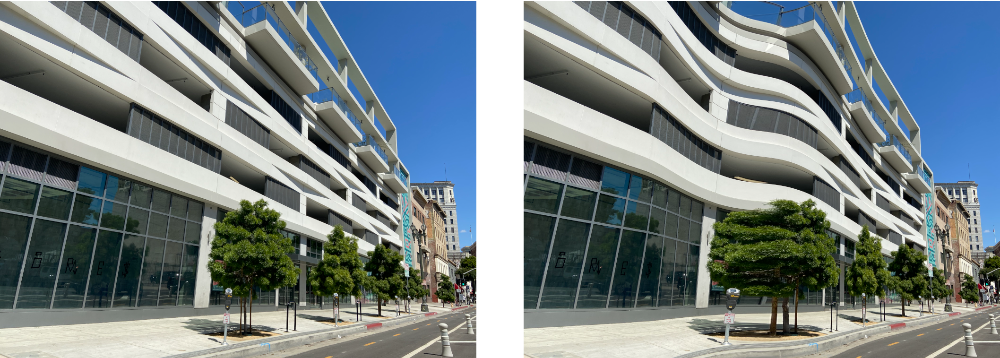

> Navigation: [Technologies](../../technologies.md) · [Core Image](../../coreimage.md) · [CIFilter](../cifilter-swift.class.md)

# bumpDistortionLinear()

<sub>Type Method</sub>

Linearly distorts an image with a concave or convex bump.

<sub>iOS, iPadOS, Mac Catalyst, macOS, tvOS, visionOS</sub>

```swift
class func bumpDistortionLinear() -> any CIFilter & CIBumpDistortionLinear
```

## Return Value

The distorted image.

## Discussion

This method applies the bump distortion linear filter to an image. This effect creates a concave or convex bump to a linear portion of the image. The curvature of the bump is defined by the `scale` property. A value of 0.0 has no effect, while a positive value creates an outward curvature and a negative value creates an inward curvature.

The bump distortion linear filter uses the following properties:

- **`inputImage`** — An image with the type [CIImage](../ciimage.md).
- **`radius`** — A `float` representing the amount of pixels the filter uses to create the distortion as an [NSNumber](../../foundation/nsnumber.md).
- **`center`** — A set of coordinates marking the center of the image as a [CGPoint](../../corefoundation/cgpoint.md).
- **`scale`** — A `float` representing the curvature of the bump effect as an [NSNumber](../../foundation/nsnumber.md).
- **`angle`** — A `float` representing the angle of the distortion, in radians, as an [NSNumber](../../foundation/nsnumber.md).

The following code creates a filter that results in a vertical bump distorting the image:

```swift
func bumpDistortionLinear(inputImage: CIImage) -> CIImage {
    let filter = CIFilter.bumpDistortionLinear()
    filter.inputImage = inputImage
    filter.center = CGPoint(x: inputImage.extent.midX, y: inputImage.extent.midY)
    filter.radius = 500
    filter.scale = 0.2
    filter.angle = .pi/2
    return filter.outputImage!
}
```



<sub>Two images arranged horizontally. The left image contains a photograph of a modern building with light colored concrete set against a clear sky. The image on the right shows the result of applying the bump distortion linear filter. The straight lines of the building appear to curve in and out of the image.</sub>

## See Also

### Filters

- [+ bumpDistortionFilter](<bumpdistortion().md>) — Distorts an image with a concave or convex bump.
- [+ circleSplashDistortionFilter](<circlesplashdistortion().md>) — Distorts an image with radiating circles to the periphery of the image.
- [+ circularWrapFilter](<circularwrap().md>) — Distorts an image by increasing the distance of the center of the image.
- [+ displacementDistortionFilter](<displacementdistortion().md>) — Applies the grayscale values of the second image to the first image.
- [+ drosteFilter](<droste().md>) — Stylizes an image with the Droste effect.
- [+ glassDistortionFilter](<glassdistortion().md>) — Distorts an image by applying a glass-like texture.
- [+ glassLozengeFilter](<glasslozenge().md>) — Creates a lozenge-shaped lens and distorts the image.
- [+ holeDistortionFilter](<holedistortion().md>) — Distorts an image with a circular area that pushes the image outward.
- [+ lightTunnelFilter](<lighttunnel().md>) — Distorts an image by generating a light tunnel.
- [+ ninePartStretchedFilter](<ninepartstretched().md>) — Distorts an image by stretching it between two breakpoints.
- [+ ninePartTiledFilter](<nineparttiled().md>) — Distorts an image by tiling portions of it.
- [+ pinchDistortionFilter](<pinchdistortion().md>) — Distorts an image by creating a pinch effect with stronger distortion in the center.
- [+ stretchCropFilter](<stretchcrop().md>) — Distorts an image by stretching or cropping to fit a specified size.
- [+ torusLensDistortionFilter](<toruslensdistortion().md>) — Creates a torus-shaped lens to distort the image.
- [+ twirlDistortionFilter](<twirldistortion().md>) — Distorts an image by rotating pixels around a center point.
