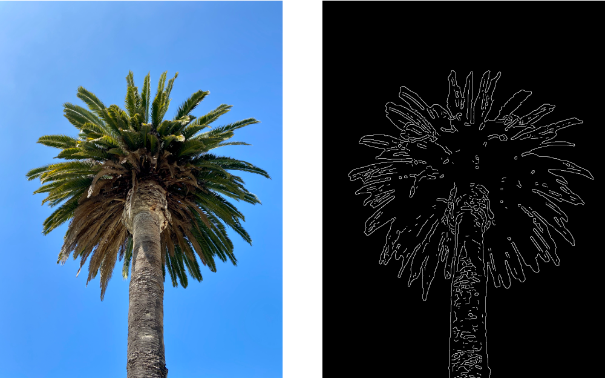

> Navigation: [Technologies](../../technologies.md) · [Core Image](../../coreimage.md) · [CIFilter](../cifilter-swift.class.md)

# cannyEdgeDetector()

<sub>Type Method</sub>

Applies the Canny edge-detection algorithm to an image.

<sub>iOS, iPadOS, Mac Catalyst, macOS, tvOS, visionOS</sub>

```swift
class func cannyEdgeDetector() -> any CIFilter & CICannyEdgeDetector
```

## Return Value

A [CIImage](../ciimage.md) with the detected edges.

## Discussion

This filter performs a Canny edge-detection on the input image, producing a black-and-white image with the detected edges. White pixels indicate an edge, and black pixels indicate no edge.

The Canny edge-detection filter uses the following properties:

- **`inputImage`** — The [CIImage](../ciimage.md) to use as an input for the effect.
- **`gaussianSigma`** — A `float` specifying the sigma of the Gaussian blur to apply, reducing high-frequency noise. Defaults to `1.6`.
- **`perceptual`** — A `Boolean` specifying whether to use a perceptual color space to compute the edge thresholds. Defaults to `false`.
- **`thresholdLow`** — A `float` specifying the threshold for weak edges. Defaults to `0.02`.
- **`thresholdHigh`** — A `float` specifying the threshold for strong edges. Defaults to `0.05`.
- **`hysteresisPasses`** — The number of hysteresis passes to apply to promote weak edge pixels. Minimum value is `0`, maximum value is `20`, and defaults to `1`.

The following code applies Canny edge-detection to an image:

```swift
func cannyEdgeDetector(inputImage: CIImage) -> CIImage {
    let filter = CIFilter.cannyEdgeDetector()
    filter.inputImage = inputImage
    filter.gaussianSigma = 5
    filter.perceptual = false
    filter.thresholdLow = 0.02
    filter.thresholdHigh = 0.05
    filter.hysteresisPasses = 1
    return filter.outputImage!
}
```



<sub>Two images arranged horizontally. The left image contains a palm tree against a clear sky. The right image contains the result of running the Canny edge-detection filter. The result image contains the outline of the palm tree.</sub>

## See Also

### Filters

- [+ blendWithAlphaMaskFilter](<blendwithalphamask().md>) — Blends two images by using an alpha mask image.
- [+ blendWithBlueMaskFilter](<blendwithbluemask().md>) — Blends two images by using a blue mask image.
- [+ blendWithMaskFilter](<blendwithmask().md>) — Blends two images by using a mask image.
- [+ blendWithRedMaskFilter](<blendwithredmask().md>) — Blends two images by using a red mask image.
- [+ bloomFilter](<bloom().md>) — Adjusts an image’s colors by applying a blur effect.
- [+ comicEffectFilter](<comiceffect().md>) — Creates an image with a comic book effect.
- [+ coreMLModelFilter](<coremlmodel().md>) — Filters an image with a Core ML model.
- [+ crystallizeFilter](<crystallize().md>) — Creates an image made with a series of colorful polygons.
- [+ depthOfFieldFilter](<depthoffield().md>) — Simulates a depth of field effect.
- [+ edgesFilter](<edges().md>) — Hilghlights edges of objects found within an image.
- [+ edgeWorkFilter](<edgework().md>) — Produces a black-and-white image that looks similar to a woodblock print.
- [+ gaborGradientsFilter](<gaborgradients().md>) — Highlights textures in an image.
- [+ gloomFilter](<gloom().md>) — Adjusts an image’s color by applying a gloom filter.
- [+ heightFieldFromMaskFilter](<heightfieldfrommask().md>) — Creates a realistic shaded height-field image.
- [+ hexagonalPixellateFilter](<hexagonalpixellate().md>) — Creates an image made of a series of colorful hexagons.
