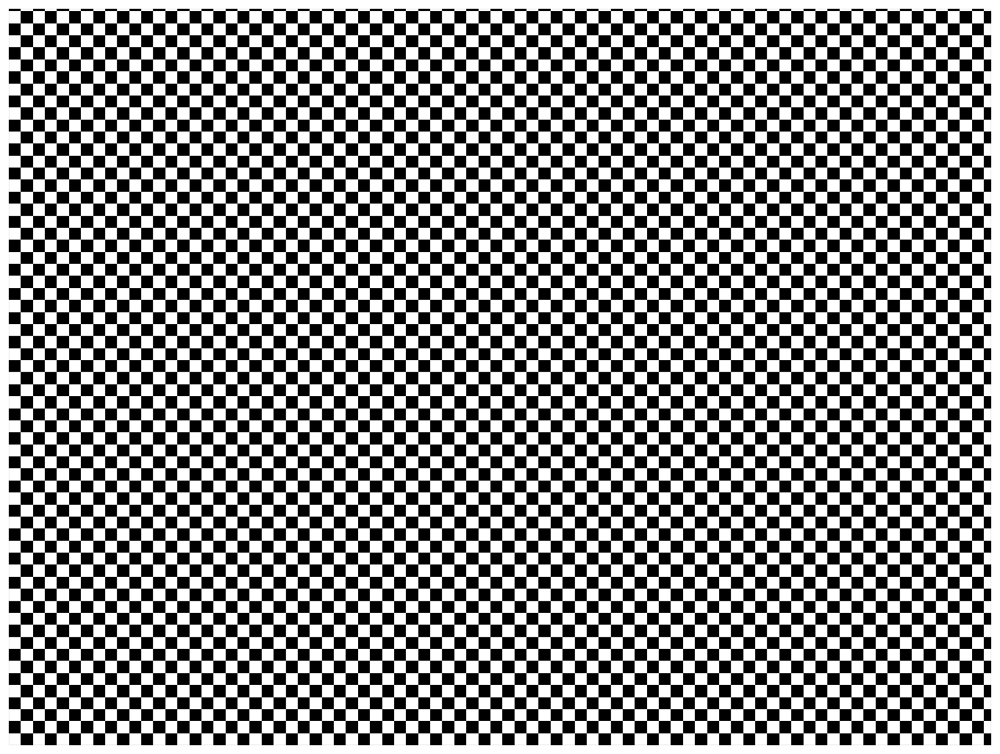

> Navigation: [Technologies](../../technologies.md) · [Core Image](../../coreimage.md) · [CIFilter](../cifilter-swift.class.md)

# checkerboardGenerator()

<sub>Type Method</sub>

Generates a checkerboard image.

<sub>iOS, iPadOS, Mac Catalyst, macOS, tvOS, visionOS</sub>

```swift
class func checkerboardGenerator() -> any CIFilter & CICheckerboardGenerator
```

## Return Value

The generated image.

## Discussion

This method generates a checkerboard pattern as an image. The effect requires the size, sharpness, and color properties to create the pattern.

The checkerboard generator filter uses the following properties:

- **`center`** — A `vector` representing the center of the image as a [CIVector](../civector.md).
- **`color0`** — A [CIColor](../cicolor.md) representing the first color of the pattern.
- **`color1`** — A [CIColor](../cicolor.md) representing the second color of the pattern.
- **`sharpness`** — A `float` representing the sharpness of the pattern as an [NSNumber](../../foundation/nsnumber.md).
- **`width`** — A `float` representing the width of the checkerboard squares as an [NSNumber](../../foundation/nsnumber.md).

The following code creates a filter that generates a black-and-white checkered pattern:

```swift
func checkerBoard() -> CIImage {
    let checkerBoardGenerator = CIFilter.checkerboardGenerator()
    checkerBoardGenerator.setDefaults()
    checkerBoardGenerator.center = CGPoint(x: 0, y: 0)
    checkerBoardGenerator.color0 = .white
    checkerBoardGenerator.color1 = .black
    checkerBoardGenerator.width = 40
    checkerBoardGenerator.sharpness = 1
    return checkerBoardGenerator.outputImage!
}
```



## See Also

### Filters

- [+ attributedTextImageGeneratorFilter](<attributedtextimagegenerator().md>) — Generates an attributed-text image.
- [+ aztecCodeGeneratorFilter](<azteccodegenerator().md>) — Generates a low-density barcode.
- [+ barcodeGeneratorFilter](<barcodegenerator().md>) — Generates a barcode as an image from the descriptor.
- [+ blurredRectangleGeneratorFilter](<blurredrectanglegenerator().md>) — Generates a blurred rectangle.
- [+ code128BarcodeGeneratorFilter](<code128barcodegenerator().md>) — Generates a high-density, linear barcode.
- [+ lenticularHaloGeneratorFilter](<lenticularhalogenerator().md>) — Generates a lenticular halo image.
- [+ meshGeneratorFilter](<meshgenerator().md>) — Generates a pattern made from an array of line segments.
- [+ PDF417BarcodeGenerator](<pdf417barcodegenerator().md>) — Generates a high-density linear barcode.
- [+ QRCodeGenerator](<qrcodegenerator().md>) — Generates a quick response (QR) code image.
- [+ randomGeneratorFilter](<randomgenerator().md>) — Generates a random filter image.
- [+ roundedRectangleGeneratorFilter](<roundedrectanglegenerator().md>) — Generates a rounded rectangle image.
- [+ roundedRectangleStrokeGeneratorFilter](<roundedrectanglestrokegenerator().md>) — Creates an image containing the outline of a rounded rectangle.
- [+ starShineGeneratorFilter](<starshinegenerator().md>) — Generates a star-shine image.
- [+ stripesGeneratorFilter](<stripesgenerator().md>) — Generates a line of stripes as an image
- [+ sunbeamsGeneratorFilter](<sunbeamsgenerator().md>) — Generates an image resembling the sun.
