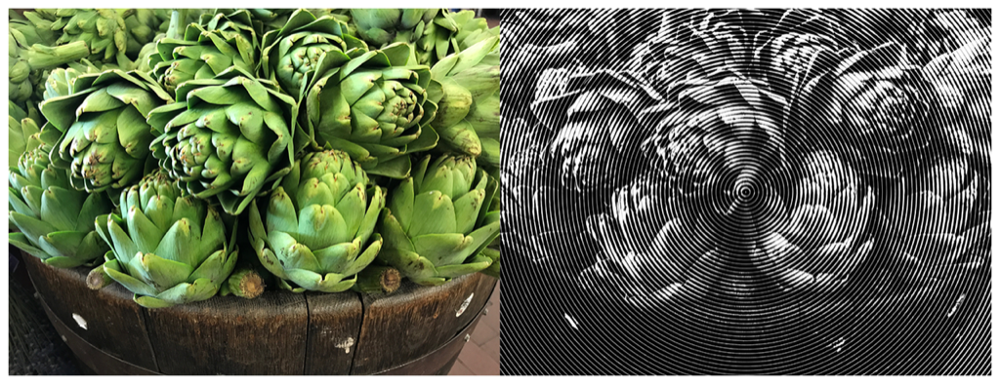

> Navigation: [Technologies](../../technologies.md) · [Core Image](../../coreimage.md) · [CIFilter](../cifilter-swift.class.md)

# circularScreen()

<sub>Type Method</sub>

Adds a circular overlay to an image.

<sub>iOS, iPadOS, Mac Catalyst, macOS, tvOS, visionOS</sub>

```swift
class func circularScreen() -> any CIFilter & CICircularScreen
```

## Return Value

The modified image.

## Discussion

This method applies a circular screen filter to an image. The effect generates a monochrome image containing a series of circular rings. The halftone effect is a set of lines, dots, or circles that contain detail. When viewing the image from a distance, the markings blend together, creating the illusion of continuous lines and shapes. Print media commonly uses this effect.

The circular screen filter uses the following properties:

- **`inputImage`** — An image with the type [CIImage](../ciimage.md).
- **`center`** — A set of coordinates marking the center of the image as a [CGPoint](../../corefoundation/cgpoint.md).
- **`width`** — A `float` representing the distance between each circle in the pattern as an [NSNumber](../../foundation/nsnumber.md).
- **`sharpness`** — A `float` representing the sharpness of the circles in the pattern as an [NSNumber](../../foundation/nsnumber.md).

The following code creates a filter that results in a monochrome image with a large circular pattern overlaying the image:

```swift
func circular(inputImage: CIImage) -> CIImage {
    let circularHalftone = CIFilter.circularScreen()
    circularHalftone.inputImage = inputImage
    circularHalftone.center = CGPoint(x: 2016, y: 1512)
    circularHalftone.width = 35
    circularHalftone.sharpness = 0.70
    return circularHalftone.outputImage!
}
```



<sub>Two photographs of wooden barrel of green artichokes. The artichokes are crisp with good lighting. The photo on the left has no modifications to color or detail. In the photo on the right, a circular screen filter is applied, resulting in the image becoming monochrome with an overlay of circular lines radiating from the center of the image out to the periphery.</sub>

## See Also

### Filters

- [+ CMYKHalftone](<cmykhalftone().md>) — Adds a series of colorful dots to an image.
- [+ dotScreenFilter](<dotscreen().md>) — Creates a monochrome image with a series of dots to add detail.
- [+ hatchedScreenFilter](<hatchedscreen().md>) — Creates a monochrome image with a series of lines to add detail.
- [+ lineScreenFilter](<linescreen().md>) — Creates a monochrome image with a series of small lines to add detail.
