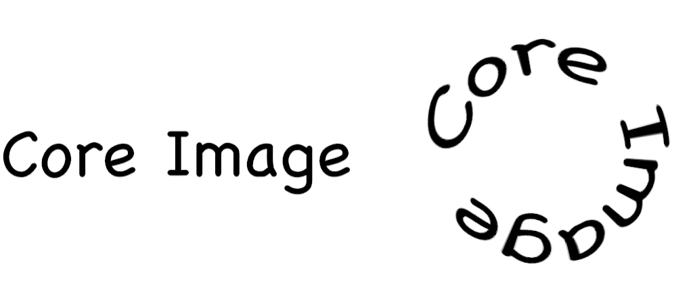

> Navigation: [Technologies](../../technologies.md) · [Core Image](../../coreimage.md) · [CIFilter](../cifilter-swift.class.md)

# circularWrap()

<sub>Type Method</sub>

Distorts an image by increasing the distance of the center of the image.

<sub>iOS, iPadOS, Mac Catalyst, macOS, tvOS, visionOS</sub>

```swift
class func circularWrap() -> any CIFilter & CICircularWrap
```

## Return Value

The distorted image.

## Discussion

This method applies the circular wrap filter to an image. This effect wraps an image around a transparent circle. The distortion of the image increases with the distance from the center of the circle.

The circular wrap filter uses the following properties:

- **`inputImage`** — An image with the type [CIImage](../ciimage.md).
- **`angle`** — A `float` representing the angle of the wrap, in radians, as an [NSNumber](../../foundation/nsnumber.md).
- **`radius`** — A `float` representing the amount of pixels the filter uses to create the distortion as an [NSNumber](../../foundation/nsnumber.md).
- **`center`** — A set of coordinates marking the center of the image as a [CGPoint](../../corefoundation/cgpoint.md).

The following code creates a filter that results in a circular image generated from the input image:

```swift
func circularWrap(inputImage: CIImage) -> CIImage {    let filter = CIFilter.circularWrap()
    filter.inputImage = inputImage
    filter.center = CGPoint(
        x: inputImage.extent.size.width/2,
        y: inputImage.extent.size.height/2
    )
    filter.angle = .pi
    filter.radius = 90
    return filter.outputImage!
}

let text = CIFilter.textImageGenerator()
text.text = "Core Image"
text.fontSize = 100
text.fontName = "Chalkboard"
text.outputImage!
circularWrap(inputImage: text.outputImage!)
```



## See Also

### Filters

- [+ bumpDistortionFilter](<bumpdistortion().md>) — Distorts an image with a concave or convex bump.
- [+ bumpDistortionLinearFilter](<bumpdistortionlinear().md>) — Linearly distorts an image with a concave or convex bump.
- [+ circleSplashDistortionFilter](<circlesplashdistortion().md>) — Distorts an image with radiating circles to the periphery of the image.
- [+ displacementDistortionFilter](<displacementdistortion().md>) — Applies the grayscale values of the second image to the first image.
- [+ drosteFilter](<droste().md>) — Stylizes an image with the Droste effect.
- [+ glassDistortionFilter](<glassdistortion().md>) — Distorts an image by applying a glass-like texture.
- [+ glassLozengeFilter](<glasslozenge().md>) — Creates a lozenge-shaped lens and distorts the image.
- [+ holeDistortionFilter](<holedistortion().md>) — Distorts an image with a circular area that pushes the image outward.
- [+ lightTunnelFilter](<lighttunnel().md>) — Distorts an image by generating a light tunnel.
- [+ ninePartStretchedFilter](<ninepartstretched().md>) — Distorts an image by stretching it between two breakpoints.
- [+ ninePartTiledFilter](<nineparttiled().md>) — Distorts an image by tiling portions of it.
- [+ pinchDistortionFilter](<pinchdistortion().md>) — Distorts an image by creating a pinch effect with stronger distortion in the center.
- [+ stretchCropFilter](<stretchcrop().md>) — Distorts an image by stretching or cropping to fit a specified size.
- [+ torusLensDistortionFilter](<toruslensdistortion().md>) — Creates a torus-shaped lens to distort the image.
- [+ twirlDistortionFilter](<twirldistortion().md>) — Distorts an image by rotating pixels around a center point.
